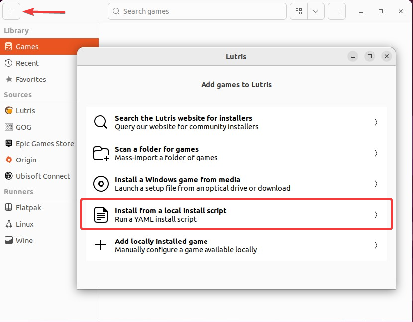

::important
Streamer.bot on Linux is considered **experimental** and not officially supported.
::

::danger{to=/get-started/installation/linux/uiautomationcore}
If you are using Streamer.bot v1.0.5 or later and experiencing crashes due to `UIAutomationCore.dll`, please follow the instructions in the [UIAutomationCore Fix](uiautomationcore) guide.
::

## Prerequisites

::card{title="Lutris" to="https://lutris.net" icon=simple-icons:lutris}
Install [Lutris](https://lutris.net){target=_blank rel=noopener} on your Linux distribution if you haven't already.
::

## Installation

::steps{level=3}

### Download the Lutris Script

::callout{icon=i-mdi-github to="https://raw.githubusercontent.com/Streamerbot/sb-linux-installer/main/lutris/streamerbot.yaml"}
Download `lutris/streamerbot.yaml` from the [Streamer.bot GitHub](https://raw.githubusercontent.com/Streamerbot/sb-linux-installer)
::

### Install Streamer.bot with Lutris

Click the `+` in Lutris and select `Install from a local install script`

{width=500}

Select the `streamerbot.yaml` file you downloaded in the steps above.

Follow the installation steps to install Streamer.bot to your location of choice.

### Launch Streamer.bot

You can launch Streamer.bot from Lutris by selecting it in your library and clicking the :icon{name=i-mdi-play} `Run` button.

::
