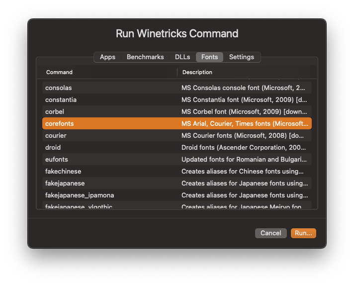
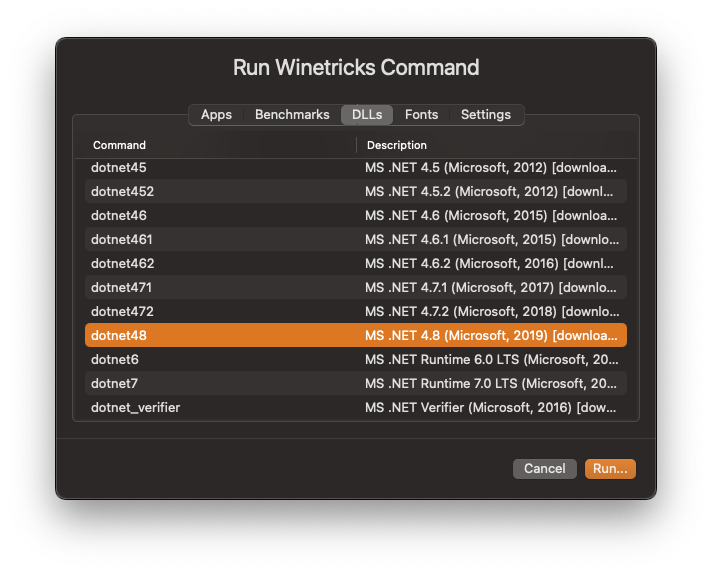
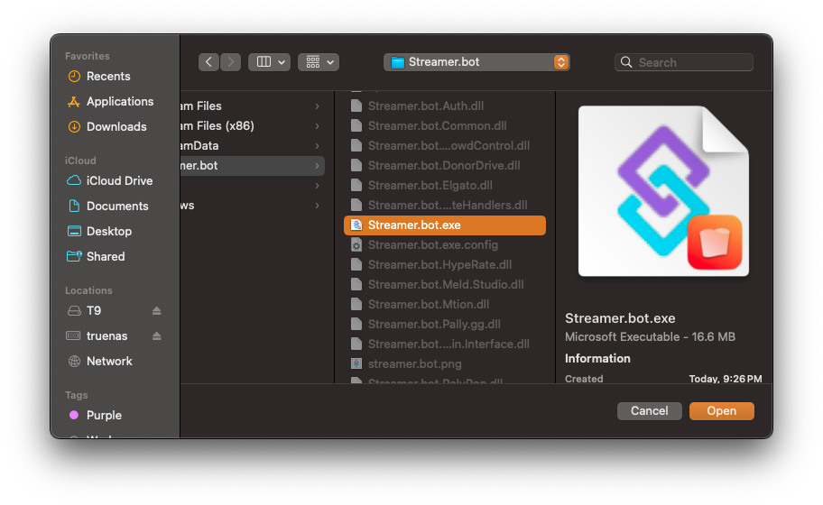
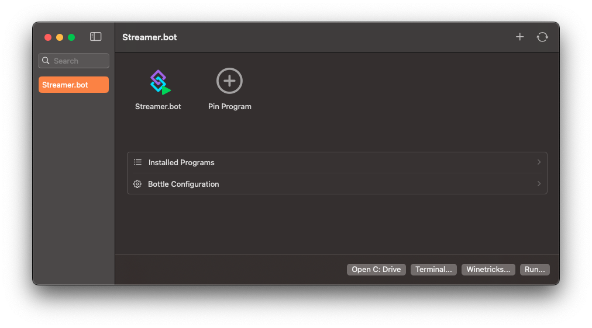

::important
Streamer.bot on MacOS is considered **experimental** and not officially supported.
::

::warning
**Deprecated**
 
Whisky is now in [maintenance mode](https://docs.getwhisky.app/maintenance-notice.html) and no longer actively maintained.
 
This guide may or may not work with Streamer.bot v0.2.8 and below
::

Streamer.bot can be installed on MacOS using [Whisky](https://getwhisky.app)

Whisky requires MacOS 14.0 or later

## Prerequisites

::steps{level=3}

### Install Whisky

::read-more{to="https://getwhisky.app"}
Download and run the latest version of Whisky [here](https://getwhisky.app)
::

### Run Winetricks Commands

::navigate
In Whisky, navigate to **Winetricks > Fonts**
::

Select `corefonts` and click `Run`

{width="500" caption-alt}

::navigate
In Whisky, navigate to **Winetricks > DLLs**
::

Select each of the following, one by one, and `Run` each:

- `sapi`
- `dxvk`
- `d3dcompiler_47`
  - Should auto install with `dxvk` but doesn't hurt to run this run just in case
- `dotnet48`
  - This will take a bit to install...

  {width="500"}

::

## Install Streamer.bot in Whisky

::steps{level=3}

### Download Streamer.bot

::callout{icon="i-mdi-cloud-download" to="https://streamer.bot/api/releases/streamer.bot/latest/download"}
Download the latest version of Streamer.bot [here](https://streamer.bot/api/releases/streamer.bot/latest/download) and MacOS should unpack it automatically.
::

### Move files to C: Drive

Click `Open C: Drive` and drag the Streamer.bot folder into `drive_c`

### Pin Program

Click `Pin Program` and set `Pin name:` as Streamer.bot and select the Streamer.bot executable under `Program path:` by clicking `Browse`

{width="500" caption-alt}

### Launch!

:::success
You should now see Streamer.bot in Whisky and be able to double click the icon to run it.
:::

{width="500" caption-alt}

::

## Updating

::important{to=/get-started/installation#updating}
Streamer.bot [Automatic Updates](/get-started/installation#updating) should work as usual.
::

You can manually update your Streamer.bot installation by downloading the latest version and copying the files into your existing install overwriting everything but the folders.

## Uninstalling

You can remove the Streamer.bot installation by right clicking the `Bottle` name and selecting `Remove`.

## Known Issues

### Groups

[Action](/guide/actions) and [Command](/guide/commands) lists do not render any configured group names or groupings.

All actions and commands are listed in the order they have been added.

### Streamer.bot Chat

The built-in chat and event feed windows will not work due to missing `WebView2`.
