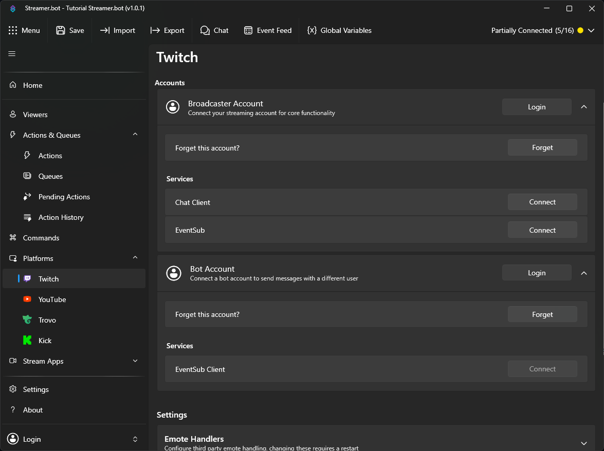
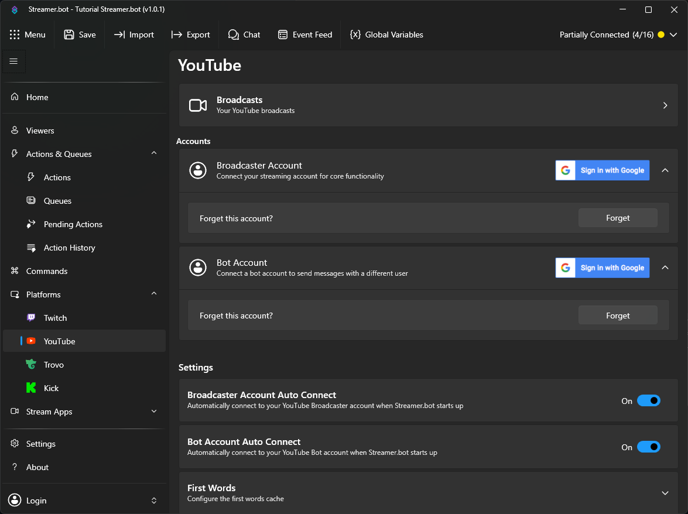
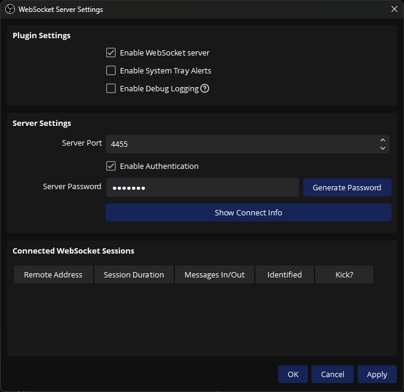
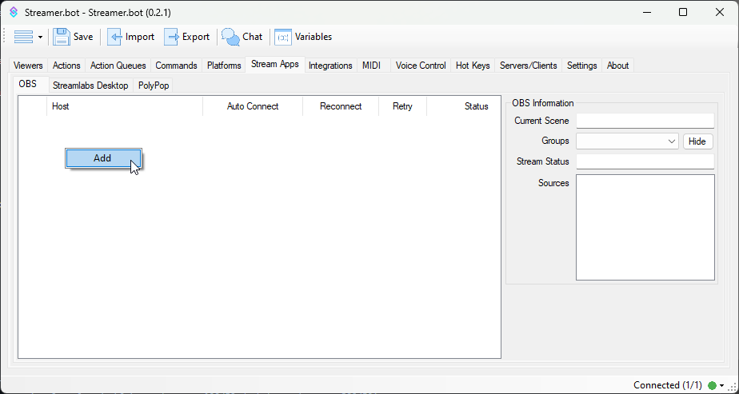
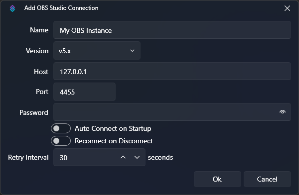
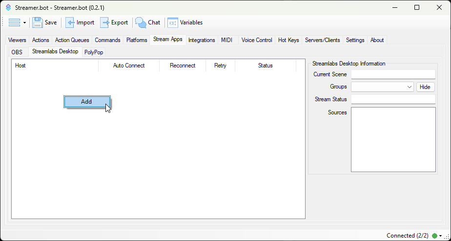
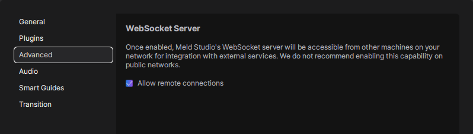
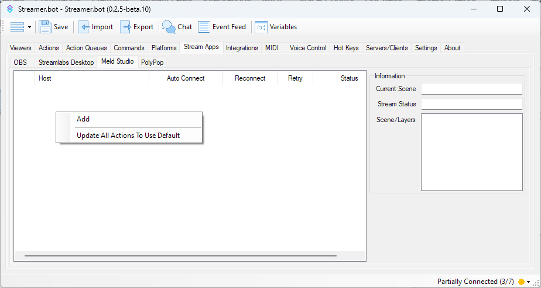
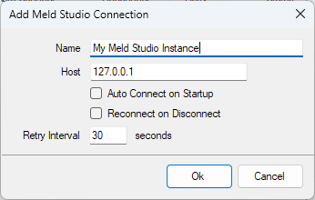

## Overview

This guide covers the basics of the following initial setup of Streamer.bot:

- Connect to your streaming **platform**, such as [Twitch](https://twitch.tv) or [YouTube](https://youtube.com)
- Connect your **broadcaster** software, such as [OBS Studio](https://obsproject.com) or [Streamlabs Desktop](https://streamlabs.com)

## Platforms
Connect your streaming platform account(s) to enable Streamer.bot to receive events and perform actions such as sending messages to your chat.

Streamer.bot supports both **Twitch** and **YouTube** as streaming platforms.

::card-group
  ::card{icon="i-mdi-twitch" to="#twitch-setup" title=Twitch}
  Connect your Twitch account to Streamer.bot
  ::
  ::card{icon="i-mdi-youtube" to=#youtube-setup title=YouTube}
  Connect your YouTube account to Streamer.bot
  ::
::

---

### Twitch Setup
Connect your Twitch account to Streamer.bot

::collapsible{name="Video Tutorial"}
  :youtube-embed{id="zCRK9ePxTKI"}
::

::navigate
Navigate to **Platforms > Twitch > Accounts**
::

#### Broadcaster Account
The `Broadcaster Account` is your primary Twitch account where you host your stream. This connection is **required** for Streamer.bot to monitor your chat and receive Twitch events.

1. Login to Twitch with your primary account

    Press `Login` to launch the Twitch OAuth screen

2. Grant permissions

    Review all scopes granted to Streamer.bot and allow access to proceed

::success
Streamer.bot will automatically connect to this account on startup.
::

#### Bot Account
The `Bot Account` is an **optional** second connection if you wish to send chat messages from another account.

1. Login to Twitch with a secondary account

    Press `Login` to launch the Twitch OAuth screen

2. Grant permissions

    Review all scopes granted to Streamer.bot and allow access to proceed

::warning
The `Bot Account` has limited permission scope and can only send chat messages or whispers.
::

::read-more{to=/guide/platforms/twitch}
Explore the full [Twitch Configuration Guide](/guide/platforms/twitch) to learn more about all available options.
::

---

### YouTube Setup
Connect your YouTube account with Streamer.bot

::collapsible{name="Video Tutorial"}
  :youtube-embed{id="aFHoUZS1XWA"}
::

::navigate
Navigate to **Platforms > YouTube > Accounts**
::

If asked, you must click `I Agree` to continue to the YouTube configuration screen.

#### Broadcaster Account
The `Broadcaster Account` is your primary YouTube account where you host your stream. This connection is **required** for Streamer.bot to monitor your chat and receive YouTube events.

1. Login to YouTube with your primary account

    Click `Sign in with Google` to launch the Google OAuth screen

2. Grant permissions

    Review all scopes granted to Streamer.bot and allow access to proceed

3. Auto Connect

    Enable `Auto Connect` to automatically connect to your YouTube account when Streamer.bot starts up

::note
**The username field is read-only**. Your authenticated username will display here once you have signed in.
::

::warning
**If you stream from a brand account:** the proper permissions will not be granted if you select the brand account on the first screen.
You must first sign in to the primary YouTube account which has **ownership** of the brand account.
You will then be able to select from owned brand accounts on the following screen.
::

#### Bot Account
The `Bot Account` is an **optional** second connection if you wish to send chat messages from another account.

1. Login to YouTube with a secondary account

    Click `Sign in with Google` to launch the Google OAuth screen

2. Grant permissions

    Review all scopes granted to Streamer.bot and allow access to proceed

3. Auto Connect

    Enable `Auto Connect` to automatically connect to your YouTube account when Streamer.bot starts up

::read-more{to=/guide/platforms/youtube}
Explore the full [YouTube Configuration Guide](/guide/platforms/youtube) to learn more about all available options.
::

---

## Broadcasters
Set up your broadcasting software to work with Streamer.bot

::card-group
  ::card{icon="i-simple-icons-obsstudio" title="OBS Studio" to=#obs-studio}
  Take control of your OBS Studio instance(s) with Streamer.bot
  ::
  ::card{icon="i-mdi-desktop-mac" title="Streamlabs Desktop" to=#streamlabs-desktop}
  Control Streamlabs Desktop with Streamer.bot
  ::
  ::card{icon="i-mdi-desktop-mac" title="Meld Studio" to=#meld-studio}
  Control Meld Studio with Streamer.bot
  ::
::

::tip{color=primary}
[OBS Studio](#obs-studio) is **highly recommended** and provides the most functionality
::

### OBS Studio
Configure Streamer.bot to remotely control your [OBS Studio](https://obsproject.com) instance(s).

::collapsible{name="Video Tutorial"}
  :youtube-embed{id="sfWICqWF5JM"}
::

::warning
This guide assumes you are running **OBS Studio** version `28.0.0` or later
::

1. Enable OBS WebSocket Server

    ::navigate
    In OBS Studio, navigate to **Tools > WebSocket Server Settings** from the menu bar 
    ::

    {width=600}

    ::warning
    If you don't see the WebSocket settings, and you have verified you are on version `28.0.0` or later, navigate to **Help > Verify Files** from the menu bar.
    ::

    - Ensure the `Enable WebSocket server` setting is **enabled** (checked)
    - Change the `Server Settings` as desired
        - You will enter these values in Streamer.bot in the next steps

2. Set up your OBS Studio connection in Streamer.bot

    ::navigate
    Navigate to **Stream Apps > OBS**
    ::

    

    To add a new connection, <kbd>Right-Click</kbd> anywhere in the panel area and select `Add`
    

    - Enter a name for this OBS connection
    - Select version `v5.x`
    - If OBS Studio is running on the same machine, keep `127.0.0.1` for the `Host` field
        - For multi-pc setups you can configure this with another LAN IP address
    - Configure `Port` and `Password` to match the `WebSocket Server Settings` setup in OBS Studio
    - Click `OK` when you have finished configuration
    - <kbd>Right-Click</kbd> the new instance and select `Connect` to force an immediate connection attempt

    ::warning
    If you are having trouble connecting, double-check the **Host, Port, Password, and Version** to ensure it matches your OBS Studio instance.
    ::

    ::read-more{to=/guide/broadcasters/obs-studio}
    Explore the full [OBS Studio Configuration Guide](/guide/broadcasters/obs-studio) to learn more about all available options.
    ::

---
### Streamlabs Desktop
Set up Streamer.bot to remotely control your Streamlabs Desktop instance

::collapsible{name="Video Tutorial"}
  :youtube-embed{id="Vpcjfh1_IEE"}
::

1. Get Streamlabs API Settings

    Obtain your **API Token** and **Port** from your Streamlabs Desktop settings.

    ::navigate
    Navigate to **Settings > Remote Control** in Streamlabs Desktop
    ::

    

    Save these settings for the next steps.

2. Add Streamlabs Desktop connection to Streamer.bot

    ::navigate
    Navigate to **Stream Apps > Streamlabs Desktop**
    ::

    

    To add a new connection, <kbd>Right-Click</kbd> anywhere in the panel area and select `Add`

    ::read-more{to=/guide/broadcasters/streamlabs-desktop}
    Explore the full [Streamlabs Desktop Configuration Guide](/guide/broadcasters/streamlabs-desktop) to learn more about all available options.
    ::

---
### Meld Studio
Set up Streamer.bot to remotely control your Meld Studio instance

1. Enable Remote Connections

    ::navigate
    In Meld Studio, navigate to **File > Preferences > Advanced** in Meld Studio 
    ::

    {width=600}

    - Ensure the `Allow remote connections` is **enabled** (checked)

2. Setup your Meld Studio connection in Streamer.bot

    ::navigate
    Navigate to **Stream Apps > Meld Studio**
    ::

    

    To add a new connection, <kbd>Right-Click</kbd> anywhere in the panel area and select `Add`
    

    - Enter a name for this Meld Studio connection
    - If Meld Studio is running on the same machine, keep `127.0.0.1` for the `Host` field
        - For multi-pc setups you can configure this with another LAN IP address
    - Click `OK` when you have finished configuration
    - <kbd>Right-Click</kbd> the new instance and select `Connect` to force an immediate connection attempt

    :read-more{to=/guide/broadcasters/meld-studio}
