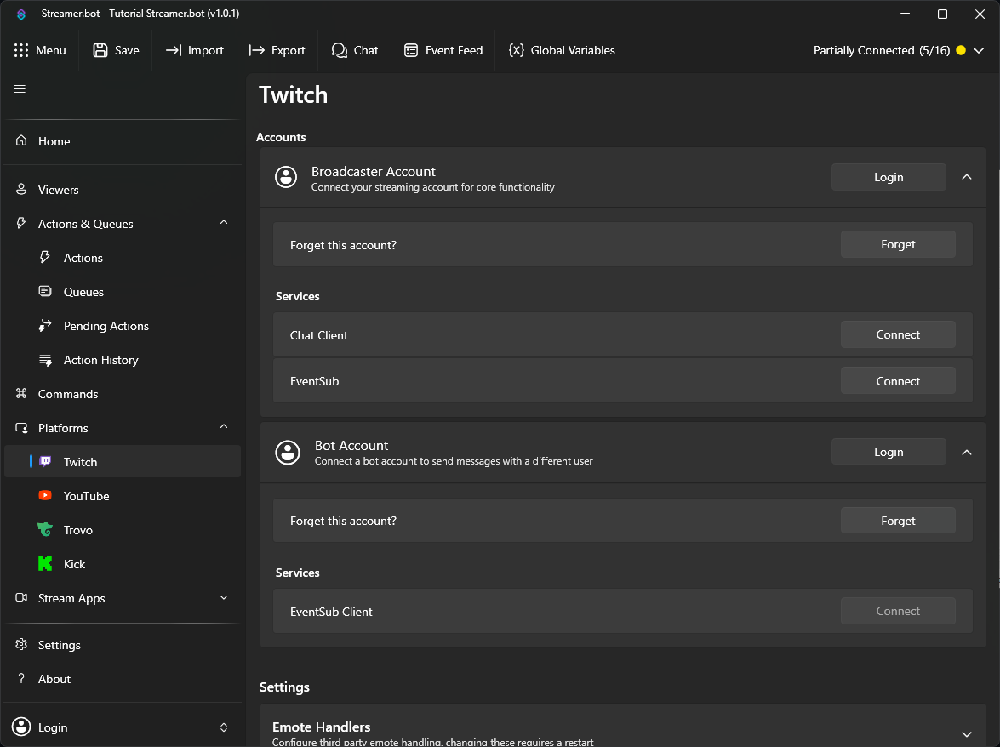
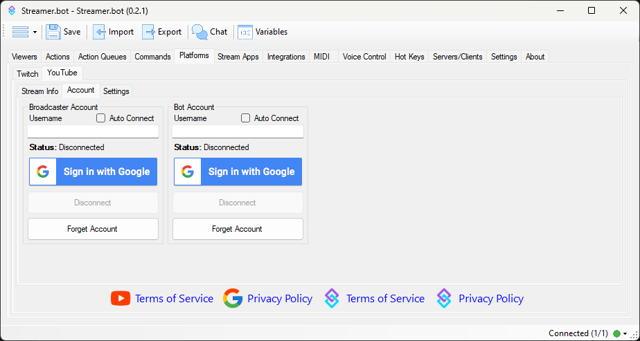

Connect your streaming platform account(s) to enable Streamer.bot to receive events and perform actions such as sending messages to your chat.

Streamer.bot supports both **Twitch** and **YouTube** as streaming platforms.

::card-group
::card{icon="i-mdi-twitch" to="#twitch-setup" title=Twitch}
Connect your Twitch account to Streamer.bot
::
::card{icon="i-mdi-youtube" to=#youtube-setup title=YouTube}
Connect your YouTube account to Streamer.bot
::
::

---

### Twitch Setup

Connect your Twitch account to Streamer.bot

::collapsible{name="Video Tutorial"}
:youtube-embed{id="zCRK9ePxTKI"}
::

::navigate
Navigate to **Platforms > Twitch > Accounts**
::

#### Broadcaster Account

The `Broadcaster Account` is your primary Twitch account where you host your stream. This connection is **required** for Streamer.bot to monitor your chat and receive Twitch events.

1. Login to Twitch with your primary account

   Press `Login` to launch the Twitch OAuth screen

2. Grant permissions

   Review all scopes granted to Streamer.bot and allow access to proceed

::success
Streamer.bot will automatically connect to this account on startup.
::

#### Bot Account

The `Bot Account` is an **optional** second connection if you wish to send chat messages from another account.

1. Login to Twitch with a secondary account

   Press `Login` to launch the Twitch OAuth screen

2. Grant permissions

   Review all scopes granted to Streamer.bot and allow access to proceed

::warning
The `Bot Account` has limited permission scope and can only send chat messages or whispers.
::

::read-more{to=/guide/platforms/twitch}
Explore the full [Twitch Configuration Guide](/guide/platforms/twitch) to learn more about all available options.
::

---

### YouTube Setup

Connect your YouTube account with Streamer.bot

::collapsible{name="Video Tutorial"}
:youtube-embed{id="aFHoUZS1XWA"}
::

::navigate
Navigate to **Platforms > YouTube > Accounts**
::

If asked, you must click `I Agree` to continue to the YouTube configuration screen.

#### Broadcaster Account

The `Broadcaster Account` is your primary YouTube account where you host your stream. This connection is **required** for Streamer.bot to monitor your chat and receive YouTube events.

1. Login to YouTube with your primary account

   Click `Sign in with Google` to launch the Google OAuth screen

2. Grant permissions

   Review all scopes granted to Streamer.bot and allow access to proceed

3. Auto Connect

   Enable `Auto Connect` to automatically connect to your YouTube account when Streamer.bot starts up

::note
**The username field is read-only**. Your authenticated username will display here once you have signed in.
::

::warning
**If you stream from a brand account:** the proper permissions will not be granted if you select the brand account on the first screen.
You must first sign in to the primary YouTube account which has **ownership** of the brand account.
You will then be able to select from owned brand accounts on the following screen.
::

#### Bot Account

The `Bot Account` is an **optional** second connection if you wish to send chat messages from another account.

1. Login to YouTube with a secondary account

   Click `Sign in with Google` to launch the Google OAuth screen

2. Grant permissions

   Review all scopes granted to Streamer.bot and allow access to proceed

3. Auto Connect

   Enable `Auto Connect` to automatically connect to your YouTube account when Streamer.bot starts up

::read-more{to=/guide/platforms/youtube}
Explore the full [YouTube Configuration Guide](/guide/platforms/youtube) to learn more about all available options.
::

---
