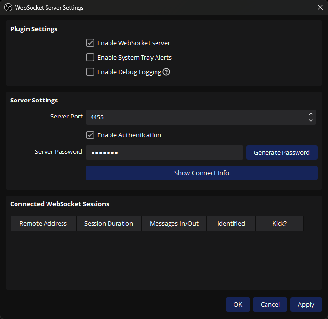
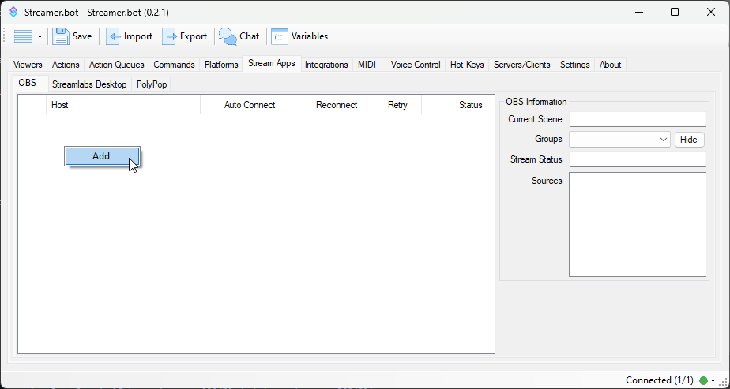
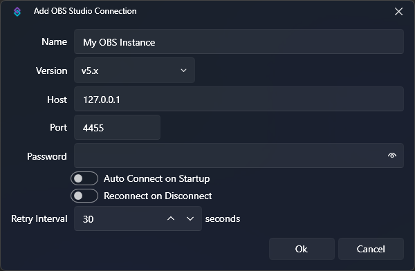
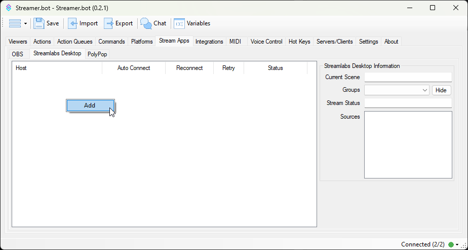
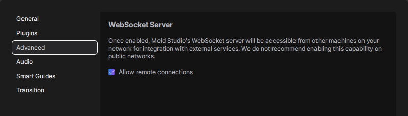
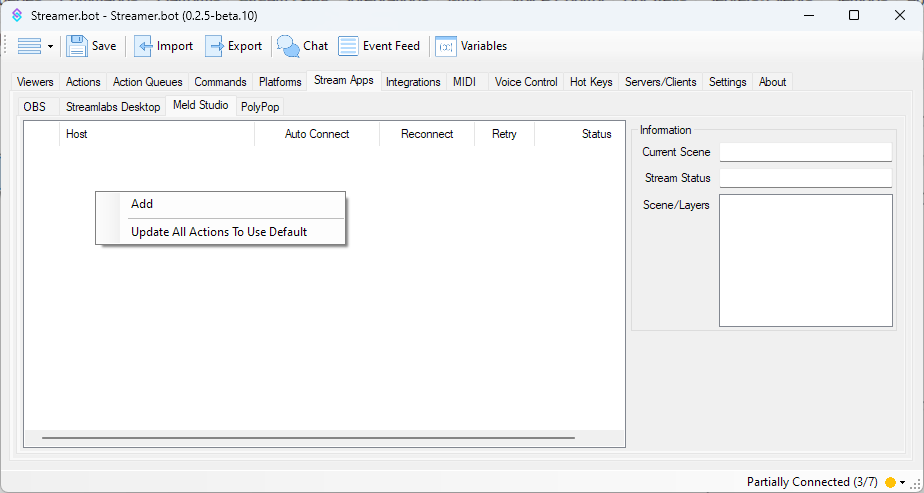
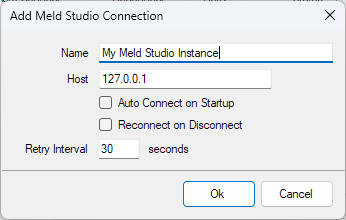

Set up your broadcasting software to work with Streamer.bot

::important
[OBS Studio](#obs-studio) is **highly recommended** and provides the most functionality
::

::card-group
:::card{icon="i-simple-icons-obsstudio" title="OBS Studio" to=#obs-studio class=col-span-full}
Take control of your OBS Studio instance(s) with Streamer.bot
:::
:::card{icon="i-mdi-desktop-mac" title="Streamlabs Desktop" to=#streamlabs-desktop}
Control Streamlabs Desktop with Streamer.bot
:::
:::card{icon="i-mdi-desktop-mac" title="Meld Studio" to=#meld-studio}
Control Meld Studio with Streamer.bot
:::
::

## OBS Studio

Configure Streamer.bot to remotely control your [OBS Studio](https://obsproject.com) instance(s).

::collapsible{name="Video Tutorial"}
:youtube-embed{id="sfWICqWF5JM"}
::

::warning
This guide assumes you are running **OBS Studio** version `28.0.0` or later
::

1. Enable OBS WebSocket Server

   ::navigate
   In OBS Studio, navigate to **Tools > WebSocket Server Settings** from the menu bar 
   ::

   {width=600}

   ::warning
   If you don't see the WebSocket settings, and you have verified you are on version `28.0.0` or later, navigate to **Help > Verify Files** from the menu bar.
   ::

   - Ensure the `Enable WebSocket server` setting is **enabled** (checked)
   - Change the `Server Settings` as desired
     - You will enter these values in Streamer.bot in the next steps

2. Set up your OBS Studio connection in Streamer.bot

   ::navigate
   Navigate to **Stream Apps > OBS**
   ::

   

   To add a new connection, :kbd{value="Right-Click"} anywhere in the panel area and select `Add`
   

   - Enter a name for this OBS connection
   - Select version `v5.x`
   - If OBS Studio is running on the same machine, keep `127.0.0.1` for the `Host` field
     - For multi-pc setups you can configure this with another LAN IP address
   - Configure `Port` and `Password` to match the `WebSocket Server Settings` setup in OBS Studio
   - Click `OK` when you have finished configuration
   - :kbd{value="Right-Click"} the new instance and select `Connect` to force an immediate connection attempt

   ::warning
   If you are having trouble connecting, double-check the **Host, Port, Password, and Version** to ensure it matches your OBS Studio instance.
   ::

   ::read-more{to=/guide/stream-apps/obs-studio}
   Explore the full [OBS Studio Configuration Guide](/guide/stream-apps/obs-studio) to learn more about all available options.
   ::

---

## Streamlabs Desktop

Set up Streamer.bot to remotely control your Streamlabs Desktop instance

::collapsible{name="Video Tutorial"}
:youtube-embed{id="Vpcjfh1_IEE"}
::

1. Get Streamlabs API Settings

   Obtain your **API Token** and **Port** from your Streamlabs Desktop settings.

   ::navigate
   Navigate to **Settings > Remote Control** in Streamlabs Desktop
   ::

   

   Save these settings for the next steps.

2. Add Streamlabs Desktop connection to Streamer.bot

   ::navigate
   Navigate to **Stream Apps > Streamlabs Desktop**
   ::

   

   To add a new connection, :kbd{value="Right-Click"} anywhere in the panel area and select `Add`

   ::read-more{to=/guide/stream-apps/streamlabs-desktop}
   Explore the full [Streamlabs Desktop Configuration Guide](/guide/stream-apps/streamlabs-desktop) to learn more about all available options.
   ::

---

## Meld Studio

Set up Streamer.bot to remotely control your Meld Studio instance

1. Enable Remote Connections

   ::navigate
   In Meld Studio, navigate to **File > Preferences > Advanced** in Meld Studio 
   ::

   {width=600}

   - Ensure the `Allow remote connections` is **enabled** (checked)

2. Setup your Meld Studio connection in Streamer.bot

   ::navigate
   Navigate to **Stream Apps > Meld Studio**
   ::

   

   To add a new connection, :kbd{value="Right-Click"} anywhere in the panel area and select `Add`
   

   - Enter a name for this Meld Studio connection
   - If Meld Studio is running on the same machine, keep `127.0.0.1` for the `Host` field
     - For multi-pc setups you can configure this with another LAN IP address
   - Click `OK` when you have finished configuration
   - :kbd{value="Right-Click"} the new instance and select `Connect` to force an immediate connection attempt

   :read-more{to=/guide/stream-apps/meld-studio}
