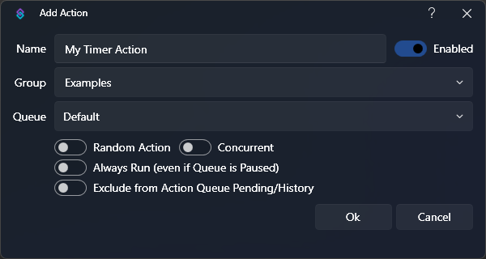
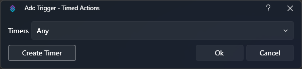
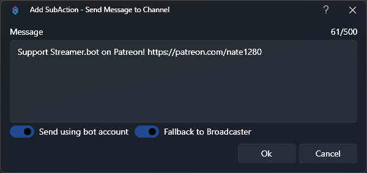

You can easily execute any of your actions in Streamer.bot at a given interval with **Timed Actions**.

:read-more{to="/guide/settings/timed-actions"}

In this example, we are going to create a simple timer to send a chat message every 5 minutes.

## Instructions

1. Create a new action

    :shortcut{value=Right-Click} the Actions pane in Streamer.bot and select `Add` to create a new action.

    

2. Create a timer trigger

    With your new action selected, :shortcut{value=Right-Click} in the Triggers pane and select `Core > Timed Actions` to add a timer trigger.

    

    Click the `Create Timer` button to create a new timer.

3. Configure your timer settings

    - `Enabled` is checked
      - This turns the timer on or off, which can be easily changed later in `Settings > Timed Actions`
    - `Repeat` is checked
      - This tells the timer to repeat at the configured interval
    - `Interval` is set to `600` seconds (5 minutes)

    

    Click `Ok` to save your timer. Click `Ok` again to save your trigger with your new timer.

    

    ::success
    Now we have a timer executing our action every 5 minutes!
    ::

4. Send a message to chat

    The [Send Message to Channel](/api/sub-actions/twitch/chat/send-message-to-channel) sub-action allows us to easily send text to our Twitch chat.

    ::navigate
      :shortcut{value=Right-Click} in the sub-actions pane and select **Twitch > Chat > Send Message to Channel**
    ::

    You will then see the sub-action dialog:

    

    - Change the `Preferred Account` if you wish to change the account to send the message from
    - Type your desired message content  into the `Message` box

5. Done!

    ::success
    Your custom message will be sent to Twitch chat every 5 minutes!
    ::

## Tips & Tricks

You can create dynamic messages by utilizing `%variables%` in the message box
::read-more{to=/guide/variables}