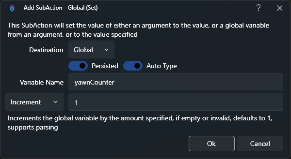
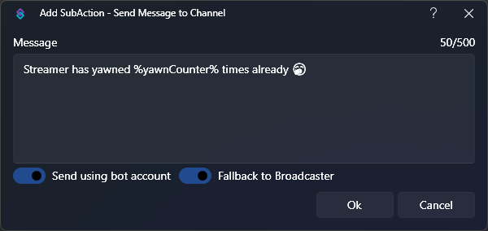
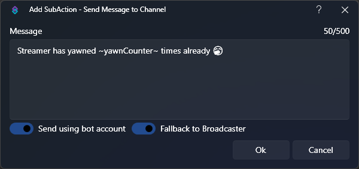

Counters can be used in various ways, for example:
- Death counters in video games
- Counting how many times the streamer has yawned
- Keep track of how many times a specific command has been used.

While commands and Twitch Channel Point Rewards offer their own built-in counters, they're not as versatile as the following example which utilizes **global variables**.
:read-more{to="/guide/variables#global-variables"}

## Instructions

1. Creating a new action

    First off, we create a new action and assign the trigger that we want to use for the counter to go up. In this example, we'll create a yawn counter and want it to add `+1` to the counter when a `!yawn` command has been used.

    

2. Creating the global variable

    Now we create our actual global variable. This is done by the **Global (Set)**  subaction that we can find under `Core -> Globals -> Global (Set)`. We can give it any name we want and choose **Increment** in the dropdown menu, because we want to **add** a value. We can now type `1` in here to add 1 to the value each time we trigger the action. If we leave it empty, it will also default to 1.

    

3. Bring the global variable into the action

    Global variables work a little different than regular variables that we use in our actions, because they don't just disappear into the void once the action has finished. So by default they're not available within the action (even after creating it in that very same action), unless we **call** them. For that we create a **Global (Get)** subaction to bring our newly created global variable from above as a regular variable into our action.

    

    So `Variable Name` is the actual name of our global variable (the name in our **Global (Set)** subaction). In our case, it's `yawnCounter`.

    The `Destination Variable` is its new name that we can use as a variable in our action. It can have a different name like `yawnCounterVariable`, but for sake of simplicity we can just give it the same name.

    The `Default Value` assigns a value if the variable doesn't exist at the time we are calling it. But since we created it before with our **Global (Set)** subaction, this is technically redundant.

4. Using our new variable

    We're pretty much done! Now each time we use our `!yawn` command, it will increment the `yawnCounter` global variable by `+1` and we can then for instance use that in a Twitch Message subaction:

    `Streamer has yawned %yawnCounter% times already 🥱`

    

    You can also create a second action and choose `Decrement` on the **Global (Set)** subaction instead to lower the counter with each trigger.

5. Done!

## Tips & Tricks

::note
**Quickly Access Persisted Global Variables**
 
Did you know you can access [Persisted Global (Non-User) Variables](/guide/variables#global-variables) immediately, without using a [Global (Get)](/api/sub-actions/core/globals/global-get) sub-action?
  
To do this, we can wrap the name of the global variable with tilde `~` symbols instead of percent `%` symbols.
  
For example, instead of `%yawnCounter%`, we simply write `~yawnCounter~`
  
_This only works for this specific kind of global variables. 
Any non-persisted and/or user variables still require a preceding [Global (Get)](/api/sub-actions/core/globals/global-get) sub-action._
::

