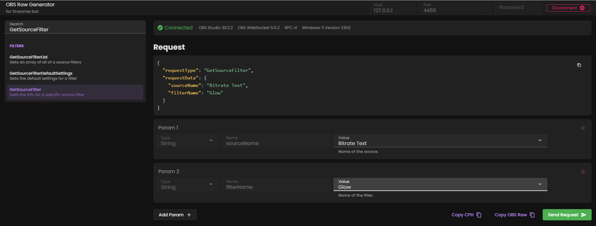

You are probably already familiar with sending OBS Raw requests with Streamer.bot's [OBS Raw Generator](https://obs-raw.streamer.bot/) or the Raw subaction that you find under `OBS -> Raw`. Sending it vía the subaction then populates variables that you can further use in your action. Sending Raw requests in C# however works a little different.


## Instructions

1. Retrieve info from **GetSourceFilterSettings**

   Before we dip into the actual C# code, we first take a closer look on our objective – what we actually want to change. In this example, we are trying to set a color for a **Glow filter** on one of our OBS GDI Text sources.

   

   So the request we need is a `SetSourceFilterSettings` request. But before we get that, we need to know which filter setting parameters are actually available for this filter, so we do a `GetSourceFilter` request first:

   

   This gives us the following response:

    ```json
    {
      "filterEnabled": true,
      "filterIndex": 0,
      "filterKind": "obs_glow_filter",
      "filterSettings": {
        "blur_type": 1,
        "glow_fill_color": 4278255360,
        "glow_size": 5
      }
    }
    ```

    So what we need for our `SetSourceFilter` request is `glow_fill_color`.


2. **SetSourceFilterSettings**

   Now it's time to go to the **SetSourceFilterSettings** request and paste our settings in there:

   


   But we don't hit **Send Request**, we click on **Copy CPH** instead. This will copy the exact request with the correct C# format into our clipboard.

   

3. Create the C# Code subaction

   With that method in our clipboard, we can now create a C# subaction under `Core -> C# -> Execute C# Code` and paste it in there.

   ```cs
   using System;

    public class CPHInline
    {
    	public bool Execute()
    	{
    		CPH.ObsSendRaw("SetSourceFilterSettings", "{\"sourceName\":\"Bitrate Text\",\"filterName\":\"Glow\",\"filterSettings\":{\"glow_fill_color\":4278255360},\"overlay\":true}", 0);
    		return true;
    	}
   }
   ```
