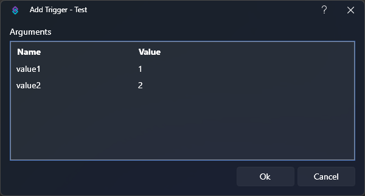
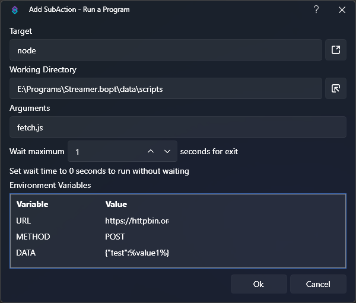

You can utilize the [Run a Program](/api/sub-actions/core/system/run-a-program) sub-action to execute scripts on the fly.

:read-more{to="/api/sub-actions/core/system/run-a-program"}

This can be great if you are more comfortable in another language, such as Python or Javascript, and less comfortable in C#.

Streamer.bot's built-in [C# Code](/api/sub-actions/core/csharp/execute-csharp-code) sub-actions are much more powerful, as a first-class integration, but you can still do a lot with some quick scripts in other languages!

Be;pw, we are going to showcase some basic ways you can use this functionality.

## Basic Math

With `node` you can quickly evaluate inline scripts using `node -e`

Similarly, in `python` you can use `python -c`

In this example, we are going to use `node` to do a basic addition of two Streamer.bot [variables](/guide/variables)

::note
This is for example purposes, and you should probably utilize [Inline Functions](/guide/variables#inline-functions) for quick math operations!
::

1. Add a Test trigger

    You can use any variables you want, but for this example we are going to populate `%value1%`{lang=cs} and `%value2%`{lang=cs}:
    

1. Configure your sub-action

    To add together the two variables, we will use Javascript.

    

    - Target: `node`{lang=bash}
    - Arguments: `-e "console.log(%value1% + %value2%)"`{lang=bash}
    - Wait: `1`{lang=bash}

    ::warning
    You must set the `Wait` parameter to a value **greater than zero** in order to get output from scripts
    ::

2. Run the action

    Execute the test trigger to run the action

3. Read Output

    If you browse to `Action Queues > Action History` and inspect the variables for the action execution, you will see `output#` variables were populated from the executed script.

    ::success
    The result of our simple math equation will be available in `%output0%`{lang=cs}!
    ::

## HTTP POST Requests

Streamer.bot ships with a [Fetch URL](/api/sub-actions/core/network/fetch-url) sub-action, but it can only send `GET` requests.

In this example, we will use `node`{lang=bash} to send `POST` requests with variable data.

1. Create your script

    We are going to place the following script, `fetch.js`, inside the `<YOUR_STREAMERBOT_DIR>/data/scripts`{lang=cs} directory.

    If you don't already have a `scripts` directory, feel free to create it place your scripts whereever you'd like!

    ```js [fetch.js]
    const url = process.env.URL;
    fetch(url, {
      // Default to GET, override if provided in environment variables
      method: process.env.METHOD || 'GET',
      headers: {
        // Default to applicaton/json, override if provided in environment variables
        'Content-Type': process.env.CONTENT_TYPE || 'application/json',
      },
      body: process.env.BODY,
    }).then(response => {
      // Send the response status code to %output0%
      console.log(response.status);

      // Send the response body to %output1%
      // If the response is not JSON, you can use .text() instead of .json()
      // We are just making sure we un-prettyify the JSON response to place it on a single line of output
      response.json().then(data => console.log(JSON.stringify(data)));
    });
    ```
2. Configure your sub-action

    

    - Target: `node`{lang=bash}
    - Working Directory: `<path/to/your/scripts/directory>`{lang=bash}
    - Arguments: `fetch.js`{lang=bash}
    - Wait: `1`{lang=bash}
    - Environment Variables:

        This is where we will pass any data, including variables, to our script.

        | Name | Value | Description |
        | ---- | ----- | ----------- |
        | `URL` | `https://httpbin.org/post` | Example URL, useful for testing |
        | `METHOD` | `POST` | Send a HTTP POST request |
        | `DATA` | `{ "test": %value1% }` | Example JSON data containing variables |

3. Run the action

    Execute the test trigger to run the action

4. Read Output

    If you browse to `Action Queues > Action History` and inspect the variables for the action execution, you will see `output#` variables were populated from the executed script.

    ::success
    If successful, the status code `200` be available in `%output0%`{lang=cs}
    Any response data, in this case a JSON string, will be available in `%output1%`{lang=cs}
    ::

## Discord Webhook Embeds

By extending the HTTP POST request example, you can create custom Discord Webhooks with your own embeds.

1. Create your script

    ```js [discord-webhook.js]
    const data = {
      "embeds": [
        {
          "title": "Hello, world!",
          "description": "This is an embed, sent from Streamer.bot, via a NodeJS sub-action!",
          "color": 36863,
          "fields": [
            {
              "name": process.env.FIELD_1_NAME,
              "value": process.env.FIELD_1_VALUE,
            },
            {
              "name": process.env.FIELD_2_NAME,
              "value": process.env.FIELD_2_VALUE,
            }
          ],
          "author": {
            "name": "Streamer.bot",
            "url": "https://streamer.bot",
            "icon_url": "https://streamer.bot/logo-transparent.png"
          }
        }
      ],
    };

    const url = process.env.WEBHOOK_URL;
    fetch(url, {
      method: 'POST',
      headers: {
        'Content-Type': 'application/json',
      },
      body: JSON.stringify(data),
    }).then(response => {
      // Send the response status code to %output0%
      console.log(response.status);
    });
    ```

2. Configure your sub-action

    

    - Target: `node`{lang=bash}
    - Working Directory: `<path/to/your/scripts/directory>`{lang=bash}
    - Arguments: `fetch.js`{lang=bash}
    - Wait: `1`{lang=bash}
    - Environment Variables:

        This is where we will pass any data, including variables, to our script.

        | Name | Value | Description |
        | ---- | ----- | ----------- |
        | `FIELD_1_NAME` | `value1` | Label for embed field 1 |
        | `FIELD_1_VALUE` | `%value1%` | Value of embed field 1, loaded from variable |
        | `FIELD_2_NAME` | `value2` | Label for embed field 2 |
        | `FIELD_2_VALUE` | `%value2%` | Value of embed field 2, loaded from variable |
        | `WEBHOOK_URL` | `<secret webhook url>` | Find in Discord channel settings -> Integrations |

3. Run the action

    Execute the test trigger to run the action

4. Read Output

    If you browse to `Action Queues > Action History` and inspect the variables for the action execution, you will see `output#` variables were populated from the executed script.

    ::success
    If successful, the status code `204` be available in `%output0%`{lang=cs}
    ::

    This is a very basic example and could be expanded further to allow variable customization over the entire webhook structure.