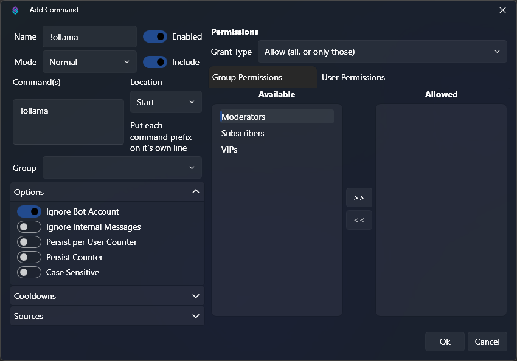
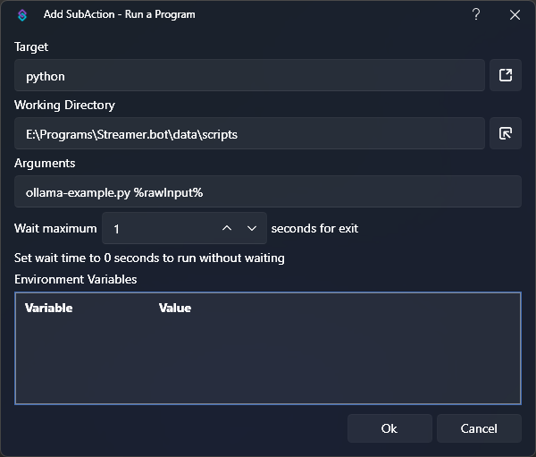
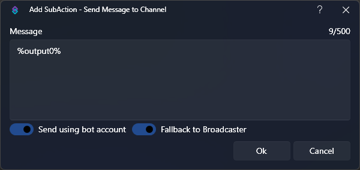

You can utilize the [Run a Program](/api/sub-actions/core/system/run-a-program) sub-action to execute scripts with Streamer.bot

:read-more{to="/api/sub-actions/core/system/run-a-program"}

## Prerequisites

1. Install Python

    Ensure you have the latest version of [Python 3](https://apps.microsoft.com/detail/9ncvdn91xzqp?hl=en-US&gl=US) installed on Windows

2. Add Python to $PATH

    Make sure you have added python to your PATH environment variable and you are able to execute `python` from cmd.

    If you installed Python through the Windows Store, this should be done automatically.

3. Install Ollama

    Ensure you have the latest version of [Ollama](https://ollama.com/download/windows) installed on Windows

## Instructions

1. Download llama3.1 model

    For this example, we are going to load up the latest `llama3.1` model in `ollama`:

    ```bash [Command Prompt]
    ollama run llama3.1
    ```

2. Create our Python script

    In our Streamer.bot folder, navigate to `data` and then create a `scripts` directory.

    ```python [Streamer.bot\data\scripts\ollama-example.py]
    import sys
    import ollama

    # Load the prompt from args
    prompt = " ".join(sys.argv[1:])

    # Generate text using llama3.1 model
    response = ollama.generate(model="llama3.1", prompt=prompt)

    # Print the response in a single line
    print(response["response"].replace("\n", " "))
    ```

3. Install the ollama python package

    From our `scripts` directory in Windows Explorer, <kbd>Right-Click</kbd> and open the current location in terminal.

    ```bash [Command Prompt]
    pip install ollama
    ```

    This will install the ollama python package to allow our script to interact with ollama.

4. Create a Chat Command

    ::navigate
    In Streamer.bot, navigate to the **Commands** tab
    ::

    1. Set the `Name` to anything you'd like, such as `!ollama`
    2. Add a command to the `Commands` list: `!ollama`
    3. Uncheck the `Ignore Internal Messages` option
        - This will allow us to use our command from the Streamer.bot chat window!

    {caption-alt}

5. Create our Action

    ::navigate
    In Streamer.bot, navigate to the **Actions** tab
    ::

    1. Create a new action, we are going to name ours `Ollama Example`
    2. Add a Trigger, `Core > Commands > Command Triggered`
    3. Select the `!ollama` command we just created

6. Configure Sub-Actions

    1. Add a [Run a Program](/api/sub-actions/core/system/run-a-program) sub-action

        - `Core > System > Run a Program`
        - `Target`: `python`{lang=bash}
        - `Working Directory`: `path\to\Streamer.bot\data\scripts`{lang=bash}
        - `Arguments`: `ollama-example.py %rawInput%`{lang=bash}
            - Note that we are adding the `%rawInput%`{lang=cs} variable as a python argument.

                This contains the command input from the user, and will allow our python script to read it!
        - `Wait`: `1`
            - **This must be set to a value greater than 0!**

        {caption-alt}

    2. Add a [Send Message to Channel](/api/sub-actions/twitch/chat/send-message-to-channel) sub-action
        - `Twitch > Chat > Send Message to Channel`
        - Choose whether you want to send the message from your `Bot` or `Broadcaster` account
        - Set the `Message` value to `%output0%`{lang=cs}
            - This variable will contain the first line of output from our python script!

        {caption-alt}

7. Done!

    When you are finished, everything should look something like this:

    {caption-alt}

    ::success
    You can now test out the `!ollama` command in chat!
    ::

    {caption-alt}