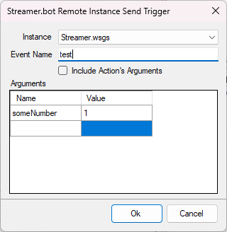
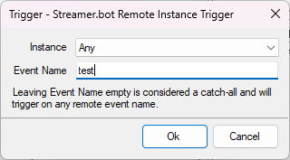

You can use **Remote Triggers** to easily send data or execute actions on **multiple** Streamer.bot instances. It even works over remote networks!

::read-more{to="/api/sub-actions/streamerbot/remote/send-remote-trigger"}
To **send** events to another instance, we utilize the **Send Remote Trigger** sub-action
::

::read-more{to="/api/triggers/integrations/streamerbot-remote/remote-instance-trigger"}
To **receive** events on another instance, we uitlize the **Remote Instance Trigger**
::

## Prerequisites

1. Multiple Streamer.bot Instances

    - If you don't already have two Streamer.bot instances, this tutorial is likely of no use to you! 😊
    - Remote triggers work great with two instances on the same PC, separate PCs, or even in completely separate locations.

2. Enable Streamer.bot Website Integration

    All instances must have the [Streamer.bot Website Integration](/guide/integrations/streamerbot) configured and enabled in order to communicate with eachother

    ::read-more{to=/guide/integrations/streamerbot}
      Read more about setting up the [Streamer.bot Website Integration](/guide/integrations/streamerbot)
    ::

## Instructions

1. Send a trigger

    ::navigate
    Navigate to **Actions** in Streamer.bot **Instance #1**
    ::

    1. Create a new action
        - _Use an existing action if you know what you are doing!_
    2. Add any trigger you want to execute this action
        - We are going to use a **Test** trigger
        - You can use anything you want, e.g. Commands, Chat Messages, etc.
    2. Add a **Streamer.bot > Remote > Send Remote Trigger** sub-action
    3. Select the destination instance
        - Any instances connected to your Streamer.bot website account will show up here
    4. Enter an event name
        - We are going to enter `"test"`{lang=cs}
    5. Add any arguments you would like to send to the other instance

    {caption-alt}

2. Receive a trigger

    ::navigate
    Navigate to **Actions** in Streamer.bot **Instance #2**
    ::

    1. Create a new action
        - _Use an existing action if you know what you are doing!_
    2. Add a trigger: **Integrations > Streamer.bot Remote > Remote Instance Trigger**
    3. Select `Any`, or select the specific instance which is **sending** the remote trigger
    4. Set the event name to the same name you used on the sending side
        - We used `"test"`{lang=cs}
    5. Add any sub-actions to perform when this action is triggered!

    

3. Done!

    Since we used the **Test** trigger on our sending action, we can <kbd>Right-Click</kbd> the trigger on **Instance #1**, and click `Test`. This will execute our action and then execute the action configured on **Instance #2**!

    ::success
    You have successfully enabled communications across multiple Streamer.bot instances!
    ::

## Tips & Tricks

- You can use the `Include Action's Arguments` option to send **all** variables from a trigger on one instance, over to the second instance.
- You can use the `Arguments` table entry to include any arbitrary data you wish to send to the second instance