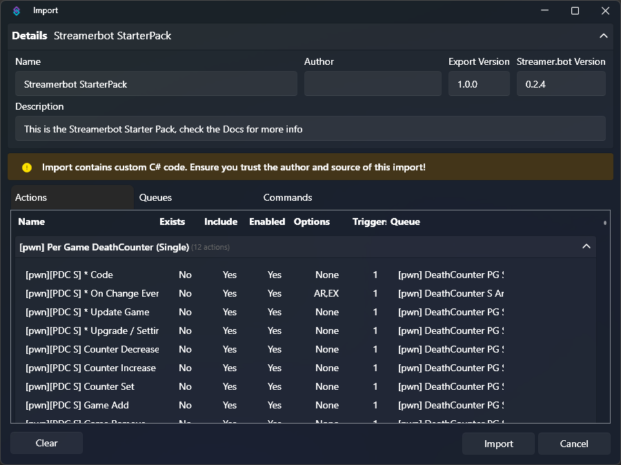

## Introduction

This is a starter pack for anyone wanting to get started using Streamer.bot. It contains a wide range of extensions for you to use, including alerts, a point system, a death counter and many other features.

This package was built as a part of a raid train streamed live on Twitch, in celebration of Streamer.bot's 3rd birthday on August 24, 2024.

::callout{title="YouTube Playlist" icon="i-simple-icons-youtube" color="red" to="https://www.youtube.com/playlist?list=PLkgvJ3pG_SXecWjdobzkTWcADFC8h3wkQ"}
You can view the full recordings of the original stream on **YouTube**!
::

Each person who took part was able to contribute something to the package and we are now making this avaliable to you.

## Setup

1. Download Import File

    ::callout{icon="i-mdi-cloud-download" to="https://r2.streamer.bot/public/imports/2024-starter-pack.sb"}
      **Click here to download** `2024-starter-pack.sb`
    ::

2. Import into Streamer.bot

    1. Click `Import` in Streamer.bot
    2. Drag the `2024-starter-pack.sb` file onto the `Import String` input box

        Alternatively, you can copy and paste the contents of the file directly into the input

        

    3. Click `Import` to complete the import process

    ::warning
    All imported [Commands](/guide/commands) will be **disabled** by default
    ::

3. StreamUP Library Updater (Optional)

    ::tip
    This step is **optional** for those who wish to use the included **Points System** extension
    ::

    The StreamUP Library Updater is essential for the Points System, however this step is completely optional if you don't wish to use this Points System.

    ::read-more{to="https://streamup.notion.site/How-to-Install-StreamUP-Products-b1425ba0c90d4390b7ebb6904fb88df4#b4155e9dda61431ab55322f04795231d"}
    You can find detailed installation instructions from **StreamUP** here
    ::

## Contributions

Below, you'll find a list of all contributions by each member of the raid train

---

### Lyfesaver74
:social-links{twitch="lyfesaver74" twitter="lyfesaver74" website="https://lyfesaver.tv"}

::changelog-list{type=new}
- Added **basic chat commands**
- Added a **Discord barker** action
::

#### Commands

The following basic chat [commands](/guide/commands) were added:

| Command | Description |
| ------- | ----------- |
| `!followage` | Check the follow age of a user by username |
| `!shoutout` | Shout out a user by username |
| `!socials` | Post your socials to chat |

---

### nutty
:social-links{twitch=nutty youtube=nuttylmao}

::changelog-list{type=new}
- Added **Discord Logger**
- Added **Title Changer**
::

---

### MarkusOoOo
:social-links{twitch="MarkusOoOo" website="https://hellp.markuso.ooo"}

::changelog-list{type=new}
- Added **Wheel of Fortune**
::

> During the Raid Train 2024 dedicated to Streamer.bot's (SB) birthday, I added the extension called 'Wheel of Fortune' into the SB instance.
It is fully customizable and allows users to modify everything from size, colours, and number of items on the wheel itself to functionality/reward/response of each item.
It uses Vue.js for the wheel functionality and WebSockets protocol for the communication between SB and the wheel.

#### Setup
The whole setup was shown during the raid train on my Twitch live-stream.
It consists of the retrieving HTML, CSS and JS files for the wheel and allowing WebSockets within the SB on the correct port.
Also, here is the link to my own documentation page, where I will post updated version*s of this extension.

::read-more{to="https://hellp.markuso.ooo/books/extensions-made-during-raid-trains/chapter/wheel-of-fortune-raid-train-2024"}
Read more about the **Wheel of Fortune** extension
::

> If you need more help, feel free to reach out to me on the SB discord server or comment your issue on the documentation page linked above.

---

### ConfuzzedCat
:social-links{twitch="confuzzedcat"}

::changelog-list{type=new}
- Added **Walk-on Message and Sound** action
::

> My entry to Raid Train Bot is a 'Walk-on Message and Sound' using C#.
This will play both a sound and send a message when some joins your stream, if they have one.
If a sound is found but no message, then it will only play the sound.
If a message is found but no sound, then it will only send the message.
If both is found then it play the sound and send the message.

#### Configuration
There is 4 variables you can change.

| Variable | Type | Description |
| -------- | ---- | ----------- |
| `enableSound`{lang=cs} | `bool`{lang=cs} | Controls globally if Walk-on Sound should play. If true it will play the sound (if found), and false wont play anything (even if the file exist). |
| `enableMessage`{lang=cs} | `bool`{lang=cs} | Controls globally if Walk-on Message should be sent. If true it will send the message (if found), and false wont send anything (even if the file exist). |
| `rootPath`{lang=cs} | `string`{lang=cs} | The file system path where all the sounds and messages for each should be stored.   Example: `C:\users\<user>\Desktop\WalkOnSoundsAndMessages`{lang=cs}    Note: It will look for a folder, with the username as name, eg. `C:\users\<user>\Desktop\WalkOnSoundsAndMessages\ConfuzzedCat`{lang=cs}, it uses `%user%`{lang=cs} or the display name of the twitch user.    Note 2: To add a sound and/or message for a given user, got to you selected root path, create a folder with the given user's display name, and add the sound and message and rename them to `sound.mp3` and `message.txt`. |
| `excludedUsers`{lang=cs} | `string`{lang=cs} | Comma separated list of all the users you want to exlcude from the Walk-on, e.g. bots and yourself.  Example: `ConfuzzedCat,Confuzzedbot`{lang=cs} |

> If you need more help, check first Streamer.bot's Discord, if someone doesn't already had the same issue, else create a post in support and @ me (@ConfuzzedCat).

---

### TerrierDarts
:social-links{twitch="terrierdarts" website="https://terrierdarts.co.uk"}

::changelog-list{type=new}
- Added **StreamUP Currency System**
- Added **Dice Game**
::

> In my part of the raid train I added the StreamUP Currency System built by myself and a really cool dice game that uses no C# to demonstrate that you can build really cool things without the need of C#.
>
> The dice game allows you to gamble points and win if you roll is over X amount or if you've rolled doulbles.

::read-more{to="https://streamup.tips/product/currency-core"}
Read more about the **StreamUP Currency System**
::

::read-more{to="https://streamup.tips/product/freebie/dice-game"}
Read more about the **Dice Game**
::

---

### pwnyyTV
:social-links{twitch="pwnyytv"}

::changelog-list{type="new"}
- Added **Death Counter** extension
::

> During the Raidtrain we've added my death counter to the bundle.
>
> This death counter enables you to track your deaths per game, it relies on the current Twitch Category you are in and updates accordingly when you switch categories.
>
> In case you are downloading the SB Raid Train Starter pack to get certain actions, you can select the group "[pwn] Per Game DeathCounter (Single), make sure all actions are selected, then right-click on the group or an action and "Add to Export" and then copy the export text into the import box of your Streamer.bot instance.

::read-more{to="https://extensions.streamer.bot/docs?topic=169"}
Read more about the **Death Counter** extension
::

---

### Mustached_Maniac
:social-links{twitch="mustached_maniac" website="https://www.mustachedmaniac.com"}

::changelog-list{type="new"}
- Added **BRB Clip Player**
- Added **Video Shoutouts**
- Added **Chat Lockdown**
::

> I added 3 different tools to the Streamer.bot raid train, a 'BRB Clip Player', 'Video Shoutouts', and a 'Chat Lockdown' function.

#### BRB Clip Player
Functions as the name implies, but has some customization options as well.  Can be set to play when a certain scene is active and/or with a a command `!brb` & `!brb stop`.  The 'Test' Trigger will automagically add the OBS Scene/Source for you and then you just have to nest it where you'd like to use it.

::read-more{to="https://www.mustachedmaniac.com/twitch-extensions/brb-clip-player"}
A full installation guide and walkthrough can be found here
::

#### Video Shoutouts
Like the 'BRB Clip Player' Add-On, the 'Test' Trigger will add the necessary assets.  Once the Scene/Source are in OBS, you only need to nest the scene wherever you'd like to use it.  It will work out of the box, or offers customization options for videos, length, even the chat message.

::read-more{to="https://www.mustachedmaniac.com/twitch-extensions/video-shoutouts"}
A full installation guide and walkthrough can be found here
::

#### Chat Lockdown
This is a very simple inclusion that simply prevents users from typing things in your chat when you're offline by enabling Slow Mode, Emote Only, Subscriber Only, and Shield Mode once the broadcast ends.  On `Broadcast Start`, they are all disabled and the chat functions as it normally would.

---

### GoWMan
:social-links{twitch="gowman"}

::changelog-list{type="new"}
- Added **Birthday Shoutouts**
::

---

### Phlare
:social-links{twitch="phlare"}

::changelog-list{type="new"}
- Added **Ad Management** triggers
- Added **Link Protection** module
- Added **Title/Category Management**
- Added **Shield Mode** commands
- Added some additional fun commands
::

#### Ad Management Triggers
Set of triggers and actions to help monitor and notify both streamer and viewers about upcoming ads, include actions where things can be fire when ads run and when they finish, automatically adjusts based on ad management settings

#### Link Protection Module
Basic streamer.bot module for blocking links and deleting messages that have them.  Includes whitelist of allowed domains and settings to allow vips/mods/bots to post links

#### Title/Category Management
Basic mod commands to view/edit the stream's title and category with a command.

#### Shield Mode Commands
add !panic and !relax commands for moderators to trigger shield mode and some other things if things go crazy on stream, as well as turning shield mode on at stream end for offline protection.

#### Some fun commands
!dadjoke   - sends random dadjoke to chat
!wyr - sends "would you rather" question to chat
!hug - hug another chatter
!8ball - magic 8ball fun

---

### OSUPhoenix
:social-links{twitch="osuphoenix"}

::changelog-list{type="new"}
- Added **OSUPhoenix Alerts**
- Added **Retro Game Alerts**
- Added **QR Code Generator**
::

> At the end of the Raid Train, I added two different alert packages and my QR Code Generator.

#### OSUPhoenix Alerts
For OSUPhoenix's Alerts (OBS Standard Alert), You will need to import the General OBS Alert json file to OBS to import the scene. Then in Streamer.bot, simply enable all the triggers you wish to use for this alert. Easy peasy!

#### Retro Game Alerts
For the Retro Game Alerts, these come with video files. Save the video files somewhere on your PC. I recommend adding a folder named "assets" into your OBS Studio folder for safe keeping. Next, import the "All Retro Game Alerts" json into OBS. It should install 4 scenes. For SNES, NES, and Genesis Scenes, find the [V] (name) Cart source and change each to the cooresponding video file you saved to your PC (i.e. NES to NES) to load the proper path. The ]I] YOUR LOGO HERE source, double click and change the image file to your logo.
In Streamer.bot, enable the triggers you wish to use under each. If you want all randomly triggered by anything, enable all triggers under All Random. If you want your follower alert to be just the SNES Cart, enable only the follow only under the SNES cart. BE CAREFUL NOT TO DUPLICATE ENABLED TRIGGERS! If two actions have the same trigger enabled, it will not function properly. Make sure you double check when picking and choosing your triggers.

::callout{icon="i-simple-icons-youtube" color=red to="https://youtu.be/zONhdQdUcZU"}
**Retro Game Alerts Tutorial**
::

#### QR Code Generator
This is an action that can be used for Shoutouts, Alerts, or anything else you might want to use it with. Each setting has a description above it helping you to set up how you want. When setting the %savePath%, make sure you have the address correct and the file name with extension (.png) at the end.
Add an image source in OBS Studio that points to where your QR Code image is saved. Everytime the image is updated, the source should change the displaying image.
To add this to a shoutout action, simply add a sub-action CORE>ACTIONS>RUN ACTION and select the QR Code Generator and place it at the beginning of your sub-actions.
NOTE: This is currently set for shoutouts! This is due to "Twitch Add target info from input" that requires a name from your chat. If you are wanting to use this for alerts, you will need to double click, change source type from "From Input" to "User" to properly ensure the information is populating correctly. If done correctly, it should continue to change the QR Code when run.

::callout{icon="i-simple-icons-youtube" color=red to="https://youtu.be/lu-X6t5H2PE"}
**QR Code Generator Tutorial**
::