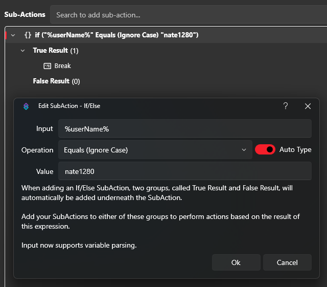

For the most cases, this can be accomplished by an if/else-subaction (`Core -> Logic -> If/Else`). The goal is to check for the username and if it matches, break the action (`if user equals (Ignore Case) TheUserName break, else continue`). You can also make use of groups (`Settings -> Groups`) and check if a user is in a group (e.g. `Twitch -> User Groups -> User In Group`) and break the action if they are.

