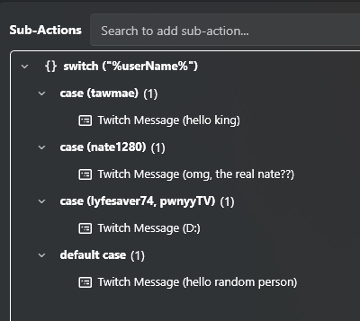

A `Core -> Logic -> Switch` subaction takes an input (such as a variable) and compares it against multiple cases. If the input matches one of the cases, the subactions inside that case will run. It works similarly to an *If/Else* subaction, but instead of being limited to just `True` or `False`, it allows for many different options.  

In this example, we use `%userName%` as the input, with individual usernames defined as cases.  

To add a new case, right-click the subaction and select **Add Case**. Enter the desired value, then click **Add** and **OK** when you’re finished. You can include multiple values within a single case, or just keep one — it’s up to you. Add as many cases as you need.  

Next, add the subactions to each case. In our example, we use `Send Message` subactions to give specific users a personalized welcome message.  

The **Default** case acts as a *catch-all*: if none of the cases above it match, the default case will be used instead.

