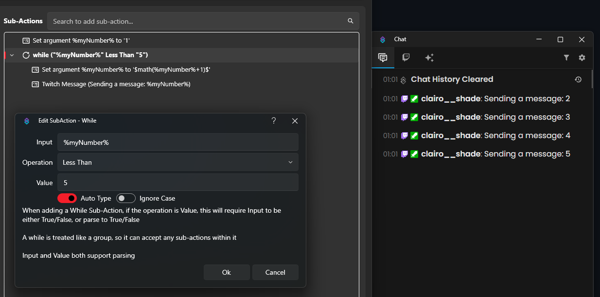

A `Core -> Logic -> While` subaction allows you to create a loop that runs until a certain condition is met. Once the condition is no longer true, the loop stops executing.  

In this example, we create a numeric variable `%myNumber%` and set it to `1`. With each loop cycle, we increment this variable by `1` using a math-inline operation, then post a message. We want to repeat this process until the variable reaches the value `5`.  

For the configuration, we use `%myNumber%` as the **Input**, `Less Than` as the **Operation**, and `5` as the **Value**. This means that as long as the variable is less than `5`, the loop will continue to run. Once it reaches `5`, the loop ends and execution continues with any subactions that follow.  

**⚠️ Note:** A misconfigured *While* subaction can cause an infinite loop. In such a case, you can rightclick the **While** subaction and click **Break Running** . Be careful when setting up loops and always ensure you have valid break conditions.
 

