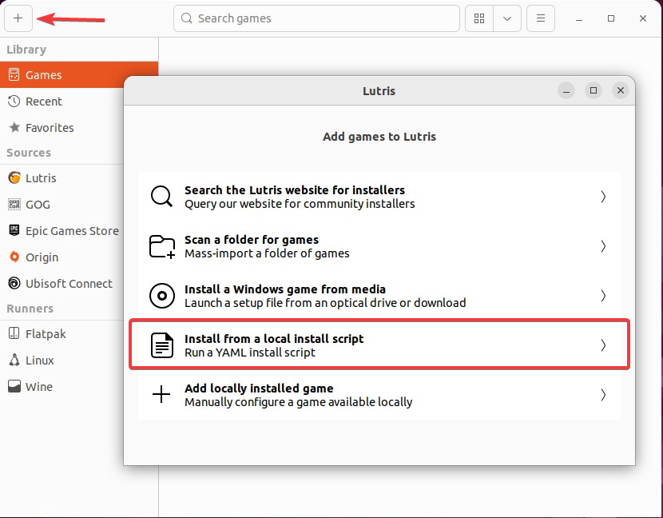

::callout{icon=i-mdi-alert color=amber}
Streamer.bot on Linux is **experimental** and not officially supported.
::

## Introduction
Streamer.bot can be installed on Linux using `wine` and `winetricks`

- `wine` `>= 6.19`{lang=bash}
- `winetricks` `>= 20210206`{lang=bash}
  - `dotnet48`
  - `d3dcompiler_47`
  - `dxvk`
  - `corefonts` *optional*
    - May be needed if you have issues launching Streamer.bot
  - `sapi` *optional*
    - Needed for Speaker.bot support

## Installation
Select an installation method below:

::card-group
  ::card{title="Install Script" to=#install-script icon=i-mdi-bash}
  Install Streamer.bot and its Wine dependencies using a `bash` script
  ::
  ::card{title="Lutris" to=#lutris icon=i-simple-icons-lutris}
  Install Streamer.bot with Lutris
  ::
::

### Install Script

::callout{icon=i-mdi-github to="https://github.com/Streamerbot/sb-linux-installer"}
View [Streamerbot/sb-linux-installer](https://github.com/Streamerbot/sb-linux-installer) on GitHub
::

#### Prerequisites

::tabs
  ::div
  ---
  label: Ubuntu
  icon: i-simple-icons-ubuntu
  ---
    1. Install `wine`

    ::callout{icon=i-mdi-bookmark to="https://wiki.winehq.org/Ubuntu"}
    Follow the instructions [here](https://wiki.winehq.org/Ubuntu) to install Wine on your version of Ubuntu
    ::

    2. Install `winetricks`
    ```bash
    sudo apt install winetricks
    sudo winetricks --self-update
    ```

    3. Install remaining dependencies
    ```bash
    sudo apt install git curl
    ```
  ::

  ::div
  ---
  label: Arch
  icon: i-simple-icons-archlinux
  ---
    1. Install `Wine`
    ```bash
    sudo pacman -S wine
    ```

    2. Install `winetricks`
    ```bash
    sudo pacman -S winetricks
    ```

    3. Install remaining dependencies
    ```bash
    sudo pacman -S git
    ```
  ::
::

#### Install

```bash [sb-linux-installer]
# Clone the repository
git clone https://github.com/Streamerbot/sb-linux-installer

# Change directory
cd ./sb-linux-installer

# Execute the installer
./install.sh
```

#### Update
Streamer.bot [Automatic Updates](/get-started/installation#automatic-updates) should work as usual.

You can manually update your Streamer.bot installation using the installation script with `UPDATE=1`{lang=bash}

```bash [sb-linux-installer]
UPDATE=1 ./install.sh
```

#### Uninstall
You can remove the Streamer.bot installation by executing the script with `UNINSTALL=1`{lang=bash}

```bash [sb-linux-installer]
UNINSTALL=1 ./install.sh
```

### Lutris
::callout{icon=i-mdi-github to="https://raw.githubusercontent.com/Streamerbot/sb-linux-installer/main/lutris/streamerbot.yaml"}
Download `lutris/streamerbot.yaml` from GitHub
::

1. Click the `+` in Lutris and select `Install from a local install script`

{width=600}

2. Select the `streamerbot.yaml` file (download link above)
3. Follow the installer steps to install Streamer.bot to your location of choice.
4. Launch Streamer.bot from Lutris!

## Known Issues

### Groups
[Action](/guide/actions) and [Command](/guide/commands) lists do not render any configured group names or groupings.

All actions and commands are listed in the order they have been added.

### Viewer Context Menu
The :shortcut{value="Right-Click"} context menu on users within the viewers tab may not render correctly. You need to move the mouse over the opening context menu to let it fully ppear.

::callout{icon=i-mdi-check color=green}
This issue has been resolved in Wine 7 and later
::

::callout{icon=i-mdi-lightbulb color=amber}
  The speed with which the context menu appears can be improved by redirecting `stdout` to `/dev/null`

  ```bash
  wine Streamer.bot.exe >/dev/null 2>&1
  ```
::

### Streamer.bot Chat
The built-in chat window will crash the application due to missing `WebView2` executable