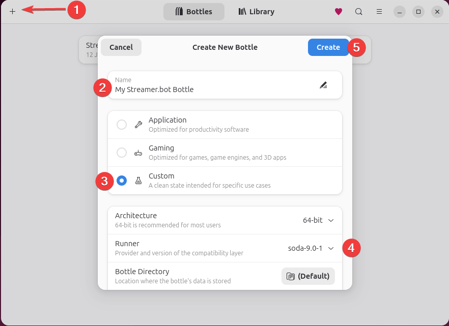
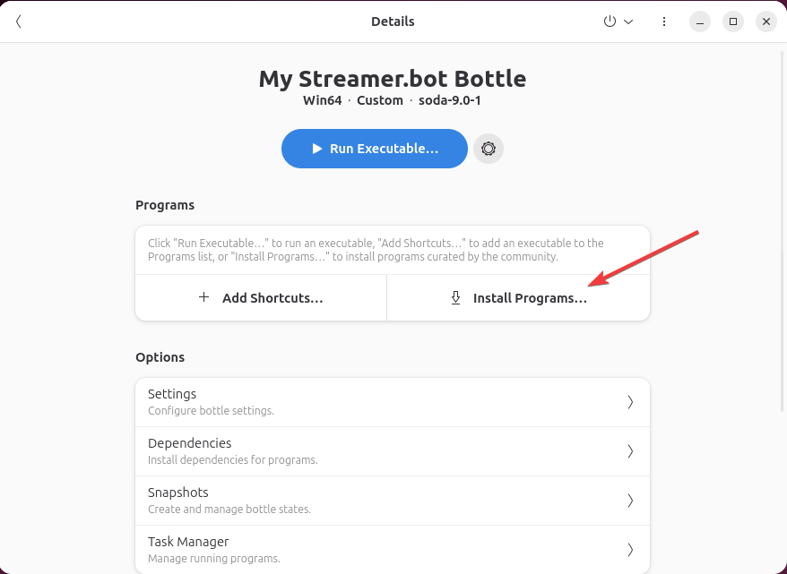
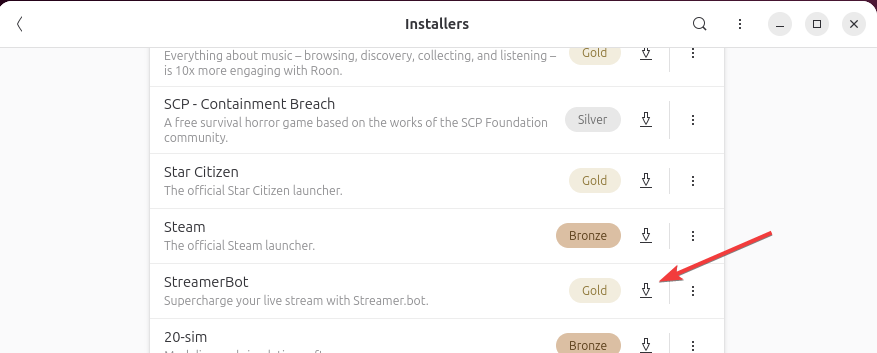
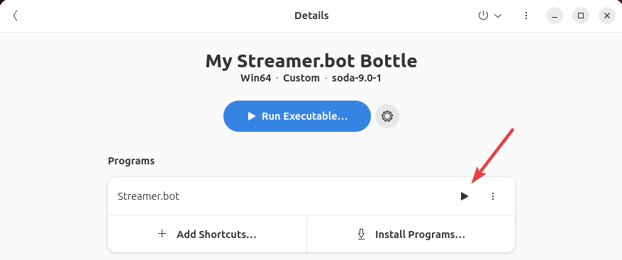

In this guide, we'll walk through the steps to install **Streamer.bot** on Linux using [Bottles](https://usebottles.com/){target=_blank rel=noopener}.

Streamer.bot is preconfigured via Bottles' built-in program installers, making the installation process straightforward.

::callout{icon=i-mdi-github to="https://github.com/bottlesdevs/programs/blob/main/Software/streamerbot.yml"}
You can inspect the preconfigured Bottles installer, `streamerbot.yml`, on GitHub.
::

## Prerequisites

::card{title="Bottles" to="https://usebottles.com/" icon=i-mdi-bottle-wine}
Install [Bottles](https://usebottles.com/){target=_blank rel=noopener} on your Linux distribution if you haven't already.
::

## Installation

::steps{level=3}
### Create a new Bottle

1. Click the `+` icon in the top left corner to create a new Bottle.
2. Enter a name for your Bottle, e.g. `"Streamer.bot"`{lang=cs}
3. Select `Custom` configuration
4. Ensure `soda` is selected as the runner
5. Click `Create` (leave everything else as-is)

    {width=500}

### Install Streamer.bot

1. Select your newly created Bottle from the list
2. Click on `Install Programs...`

    {width=500}

3. Select `"StreamerBot"`{lang=cs} from the list of available programs

    {width=500}

    It may take some time for the installation to complete.

### Launch Streamer.bot

Click the :icon{name=i-mdi-play} `Run` button to launch Streamer.bot from your Bottle

{width=500}
::

::success
You now have **Streamer.bot** installed on Linux via Bottles!
::

## Tips & Tricks

#### Improve WebView2 Performance
- You can optionally change the runner to `Proton-GE` or `Proton-CachyOS` to improve the performance of the **Streamer.bot Chat** window, **C# Code editor** and any other **WebView2** content.
    - *Note that this may cause some graphical glitches in Streamer.bot*
