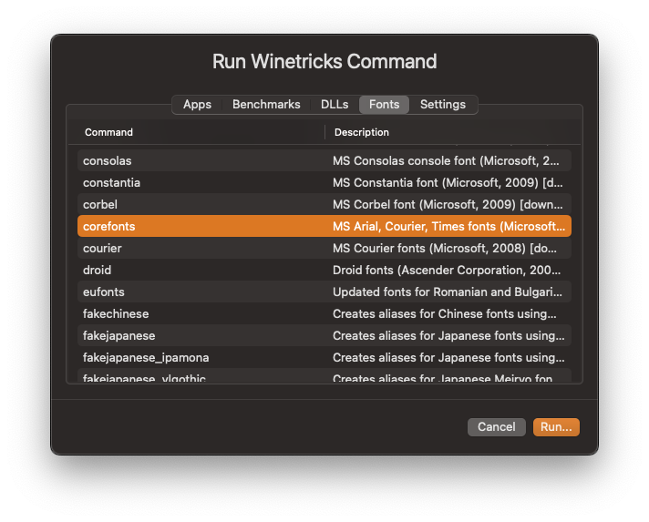
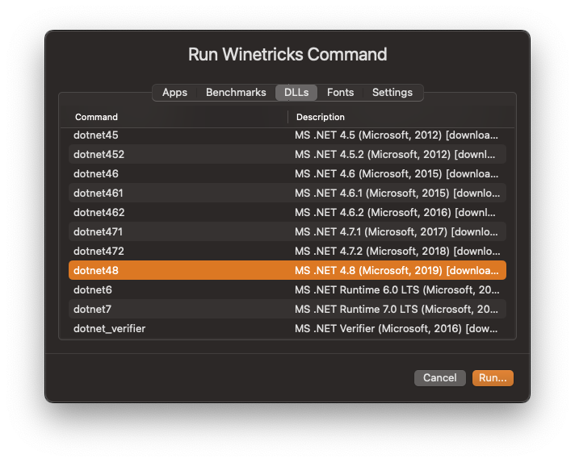
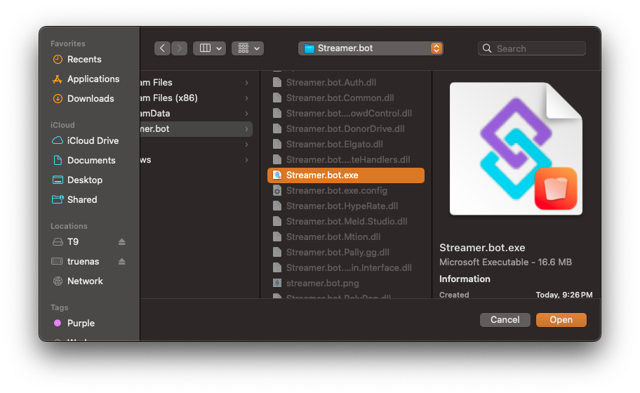
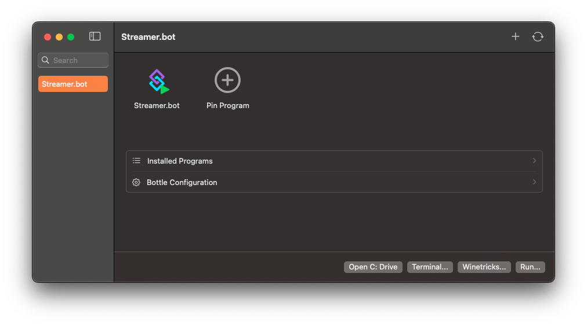

::callout{icon=i-mdi-alert color=amber}
Whiskey is now in [maintenance mode](https://docs.getwhisky.app/maintenance-notice.html) and no longer actively maintained. This guide may or may not work with 0.2.8 and below and will more than likely be deprecated with future releases of Streamer.bot.
::

Streamer.bot can be installed on MacOS using [Whisky](https://getwhisky.app)

::callout{icon=i-mdi-alert color=amber}
Streamer.bot on MacOS is **experimental** and not officially supported.
Whisky requires MacOS 14.0 or later.
::

## Prerequisites

1. Install Whiskey

    ::read-more{to="https://getwhisky.app"}
    Download and run the latest version of Whisky [here](https://getwhisky.app)
    ::

2. Run Winetricks Commands

    ::navigate
    In Whiskey, navigate to **Winetricks > Fonts**
    ::

    Select `corefonts` and click `Run`

    {width="500" caption-alt}

    ::navigate
    In Whiskey, navigate to **Winetricks > DLLs**
    ::

    Select each of the following, one by one, and `Run` each:

    - `sapi`
    - `dxvk`
    - `d3dcompiler_47`
      - Should auto install with `dxvk` but doesn't hurt to run this run just in case
    - `dotnet48`
      - This will take a bit to install...

      {width="500"}

## Install

1. Download Streamer.bot

    ::callout{icon="i-mdi-cloud-download" to="https://streamer.bot/api/releases/streamer.bot/latest/download"}
    Download the latest version of Streamer.bot [here](https://streamer.bot/api/releases/streamer.bot/latest/download) and MacOS should unpack it automatically.
    ::

2. Move files to C: Drive

    Click `Open C: Drive` and drag the Streamer.bot folder into `drive_c`

3. Pin Program

    Click `Pin Program` and set `Pin name:` as Streamer.bot and select the Streamer.bot executable under `Program path:` by clicking `Browse`

    {width="500" caption-alt}

4. Launch!

    ::success
    You should now see Streamer.bot in Whisky and be able to double click the icon to run it.
    ::

    {width="500" caption-alt}

## Updating

::success
Streamer.bot [Automatic Updates](/get-started/installation#automatic-updates) should work as usual.
::

You can manually update your Streamer.bot installation by downloading the latest version and copying the files into your existing install overwriting everything but the folders.

## Uninstalling
You can remove the Streamer.bot installation by right clicking the `Bottle` name and selecting `Remove`.

## Known Issues

### Groups
[Action](/guide/actions) and [Command](/guide/commands) lists do not render any configured group names or groupings.

All actions and commands are listed in the order they have been added.

### Viewer Context Menu
The :shortcut{value="Right-Click"} context menu on users within the viewers tab may not render correctly. You need to move the mouse over the opening context menu to let it fully appear.

::callout{icon=i-mdi-check color=green}
This issue has been resolved in Wine 7 and later
::

### Streamer.bot Chat
The built-in chat and event feed windows will not work due to missing `WebView2`.
