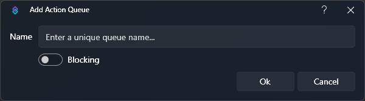
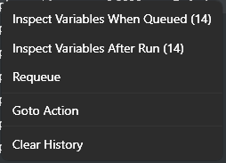

## Introduction
Perhaps the most important piece of Streamer.bot, actions are at the center of everything you do.

You can configure actions for anything from basic alerts and shoutouts to extremely complex integrations such as TerrierDart's [Leaderboard Points System](https://extensions.streamer.bot/docs?topic=67){target=_blank}

Actions consist of configurable sets of [sub-actions](#sub-actions) that can be executed by Streamer.bot's event sources, such as [Triggers](/guide/triggers), [Commands](/guide/commands), various integrations such as [Elgato Stream Deck](/guide/integrations/elgato-stream-deck), and even [your own voice](/guide/voice-control)!

Sub-actions even have the ability to trigger other actions, giving you the ability to **organize** significant pieces of your setup into consolidated sections, and share logic across multiple event sources.

As sub-actions are executed, another important feature of Streamer.bot comes into play, the **argument stack**, which consists of all [variables](/guide/variables) available at a given time.

Each sub-action has the ability to populate new variables for upcoming sub-actions, read existing variables from earlier sub-actions, or even modify them on the fly!

::collapsible{name="Video Tutorial"}
  :youtube-embed{id="-3xjllgAeAw"}
::

## Actions

::navigate
To get started, navigate to **Actions** in Streamer.bot
::

The actions tab is split into 3 main parts:

1. `Actions` - All of your configured actions are listed here, sorted by group
2. `Triggers` - All triggers configured for the selected action will be listed here
3. `Sub-Actions` - All sub-actions configured for the selected action will be listed here

::read-more{to=/guide/import-export}
Explore the [Import & Export Guide](/guide/import-export) to learn how to import actions shared by the community!
::

#### Configuration
To create your first action, :kbd{value="Right-Click"} in the actions pane and select `Add` to open the configuration dialog

{caption-alt}

#### Options
::field-group
  ::field{name=Name type=Text required}
    The friendly name the action will be referred as throughout the bot
  ::
  ::field{name=Group type=Text default=None}
    Optionally type or select a group name.

    This is used to organize similar actions into collapsible sections to keep the interface clean if you have a large number of actions
  ::
  ::field{name=Queue type=Select required default=Default}
    Assign this action to an [Action Queue](#action-queues)

    ::warning
    The `Default` queue is configured as a **non-blocking** queue, meaning actions will execute immediately on request and are allowed to run concurrently.
    ::
    ::read-more{to=#action-queues}
    Learn more about [Action Queues](#action-queues) below
    ::
  ::
  ::field{name=Enabled type=Toggle default=true}
    Toggle this action on or off
  ::
  ::field{name="Random Action (RA)" type=Toggle default=true}
    Randomly execute a single sub-action from within this action
    ::warning
    Sub-action groups will be treated as a **single entity** and will execute as if they were a standalone action.
    ::
    ::tip
    This option enables the `Weight` configuration on sub-actions, allowing you to adjust the probability that specific sub-actions will be chosen.
    ::
  ::
  ::field{name="Concurrent (CC)" type=Toggle default=true}
    Execute all sub-actions in this action simultaneously, rather than waiting for each step to complete.
    ::warning
    This will also **ignore** the [Delay](/api/sub-actions/core/delay) sub-action
    ::
  ::
  ::field{name="Always Run" type=Toggle default=true}
    Force this action to execute even if the queue is in a `Paused` state
  ::
  ::field{name="Exclude from Action Queue Pending/History" type=Toggle default=true}
    Exclude this action from being logged to the action history.
    ::tip
    This option is recommended for frequently executed actions to improve performance of your bot
    ::
  ::
::

#### Context Menu
:kbd{value="Right-Click"} any existing action to reveal the context menu:

{caption-alt}

Many of the action [configuration](#configuration) options outlined above can be quickly modified here.

Additional context menu options are outlined below:

#### Options
::field-group
  ::field{name="Add" type=Dialog}
  Create a new action. Opens the `Add Action` dialog.
  ::

  ::field{name="Edit" type=Dialog}
  Open the [configuration](#configuration) dialog for the selected action
  ::

  ::field{name="Delete" type=Action}
    Delete the selected action

    By default, you will be asked for confirmation with the option to hide all future confirmations.

    _You can reinstate delete confirmations in the `Settings` tab_
  ::

  ::field{name="Duplicate" type=Action}
  Create a copy of the selected action, including all of its sub-actions.
  ::

  ::field{name="Copy Action ID" type=Action}
  Copy the unique `ID` of the selected action to your clipboard.
  ::

  ::field{name="Collapse All" type=Action}
  Collapse all action groups in the action pane
  ::

  ::field{name="Expand All" type=Action}
  Expand all action groups in the action pane
  ::
::

## Sub-Actions

To activate the sub-actions pane, you must first **select an action** via :kbd{value="Left-Click"} in the **actions pane**.

With an action selected, you can then :kbd{value="Right-Click"} anywhere in the **sub-actions pane**, on the right, to browse available [sub-actions](/api/sub-actions) and add them to your selected action.

{caption-alt}

::read-more{color=green to=/api/sub-actions}
Explore all available sub-actions and their configuration options in the [Sub-Actions API References](/api/sub-actions)
::

#### Context Menu

- :kbd{value="Right-Click"} anywhere in the sub-actions pane to browse and add a new sub-action
- :kbd{value="Right-Click"} any existing sub-action to reveal additional context menu options

{caption-alt class="inline-block"}
{caption-alt class="inline-block"}

#### Options

::field-group
  ::field{name="Favorite Sub-Actions" type=Select}
    Opens the list of sub-actions you have marked as favorites.

    You can toggle any sub-action as a favorite by using :kbd{value="Right-Click"} on any item in the hierarchical sub-action menus.
  ::

  ::field{name="Edit Sub-Action" type=Dialog}
    Open the configuration dialog for the selected sub-action

    _This is the same as using :kbd{value="Double-Click"} on the sub-action itself_
  ::

  ::field{name="Copy Sub-Action" type=Action}
    Copy the selected sub-action, including its configuration, to the clipboard
  ::

  ::field{name="Paste Sub-Action" type=Action}
    Paste a copied sub-action into the selected action
  ::

  ::field{name="Duplicate Sub-Action" type=Action}
    Clones the selected sub-action into the currently open action
  ::

  ::field{name="Delete Sub-Action" type=Action}
    Delete the selected sub-action

    By default, you will be asked for confirmation with the option to hide all future confirmations.

    _You can reinstate delete confirmations in the `Settings` tab_
  ::

  ::field{name="Add Group" type=Action}
    Create a sub-action group

    - If the action contains any groups the `Move to Group` sub menu will also display below this option
  ::

  ::field{name="Delete Group" type=Action}
    Delete the selected group

    - Only displays if current selection is a group folder
  ::

  ::field{name="Rename Group" tpe=Action}
    Rename the selected group

    - Only displays if current selection is a group folder
  ::

  ::field{name="Enabled" type=Toggle}
    Boolean flag for disabling a sub-action for diagnostic purposes

    - Disabled sub-actions will be highlighted with [red text]{.text-red-400}
  ::

  ::field{name="Random" type=Toggle}
    Boolean flag to set a group folder as `Random Execution`

    This will only execute a single, random sub-action from within the group.
  ::

  ::field{name="Weight" type=Dialog}
    The weight of the Sub-Action when the Action/Group is set on Random.

    ::tip
    Setting a group to Random will also enable the `Weight` options on sub-actions inside that group.
    Weighting is used to make a sub-action more or less likely to be chosen
    ::
  ::

  ::field{name="Delete all sub-actions" type=Action}
    Remove all sub-actions from this action

    By default, you will be asked for confirmation with the option to hide all future confirmations.

    _You can reinstate delete confirmations in the `Settings` tab_
  ::

  ::field{name="Move" type=Action}
    Change the order of your sub-actions

    This has the same effect as keyboard shortcuts :kbd{value="meta"} :kbd{value="↑"} and :kbd{value="meta"} :kbd{value="↓"}
     
    Valid options are `Up`, `Down`, `Top`, `Bottom`

    ::tip
    You can also drag and drop items both up and down the list and into and out of group folders
    ::
  ::
::

## Action Queues
In Streamer.bot, all actions exist within a queue. The `Default` queue is created automatically and will contain all action executions unless specified otherwise.

### Queues
::navigate
To get started, navigate to **Action Queues > Queues** in Streamer.bot
::

{caption="Action Queues > Queues View"}

In this section, you will find all the queues that have been created.

At a glance, you can view the status of several queue properties:

- `Pending Count`: Number of actions waiting to be executed within the respective queue
- `Completed Count`: Number of actions that have completed execution within the respective queue
  - This includes actions that have been cancelled - learn more in [Action History](#action-history)
- `Paused`: Shows the current paused status of this queue
- `Blocking`: Shows whether the queue is configured as a `Blocking` queue

#### Context Menu
You can :kbd{value="Right-Click"} within the Queues pane to reveal the context menu:

{caption-alt}

#### Options
::field-group
  ::field{name=Add type=Action}
  Create a new Queue, [configuration detailed below](#configuration-1)

  - Available if you :kbd{value="Right-Click"} on a specific queue
  - Available if you :kbd{value="Right-Click"} an empty space within the Queues pane
  ::

  ::field{name="Pause/Resume" type=Action}
  This option displays the current action you can perform on the queue.

  - Available if you :kbd{value="Right-Click"} on a specific queue
  - If the queue is currently `Paused`, you can select `Resume` to restart a queue and trigger any pending actions.
  - If the queue is currently `Active`, you can select `Pause` to temporarily stop new actions from being triggered in that queue. Once resumed, pending actions will be processed.
  ::

  ::field{name=Blocking type=Toggle}
  Toggle the `Blocking` state of the selected queue.

  If selected, check mark will appear beside `Blocking`, indicating that the queue will execute actions in sequence.

  - Available if you :kbd{value="Right-Click"} on a specific queue
  ::

  ::field{name=Clear type=Action}
  Clears the selected queue of any pending actions.

  - Available if you :kbd{value="Right-Click"} on a specific queue
  ::

  ::field{name="Pause All Queues" type=Action}
  Immediately pause all queues.
  - Available if you :kbd{value="Right-Click"} on a specific queue
  - Available if you :kbd{value="Right-Click"} an empty space of Queues area
  ::

  ::field{name="Resume All Queues" type=Action}
  Immediately resume any queues which are currently paused.
  - Available if you :kbd{value="Right-Click"} on a specific queue
  - Available if you :kbd{value="Right-Click"} an empty space of Queues area
  ::
::

#### Configuration
To create a new queue, :kbd{value="Right-Click"} within the queues pane and select `Add`

{caption="Add/Edit Queue Dialog"}

#### Options
::field-group
  ::field{name=Name type=Text required}
  Enter a descriptive name for your new queue
  ::

  ::field{name=Blocking type=Toggle default=false}
    By default, all queues execute actions immediately, with no wait.

    To execute actions in sequence, waiting for each previous action to complete, you can enable the `Blocking` option.

    ::tip
    It's especially useful to have a blocking queue for **alerts**, to allow them to execute one at a time!
    ::
  ::
::

### Pending Actions
The pending actions view will display any queued actions which are waiting to run.

::tip
When utilizing blocking queues, as all currently blocked actions will show here.
::

### Action History

The action history view will display a log of all actions that have been executed by Streamer.bot

::tip
Action History is the best place to discover what [variables](/guide/variables) are available within your action!
::

{caption-alt}

At a glance, you can view the following properties:

- `Name`: The name of the executed action
- `State`: The current status of the executed action
  - e.g. `Completed`, `Cancelled`, `Pending`
- `Variables`: The number of variables populated by this action
- `Duration`: Time, in milliseconds, the action took to finish execution
- `Queue`: The name of the queue this action was executed in
- `Queued At`: The date and time the action was initially queued for execution
- `Started At`: The date and time the action began execution
- `Completed At`: The date and time the action finished execution

#### Context Menu
You can :kbd{value="Right-Click"} on any entry to open the context menu:

{caption-alt}

::field-group
  ::field{name="Inspect Variables When Queued" type="Dialog"}
    Open a dialog which shows all variables, and their values, available to the action when it was initially queued
    ::collapsible{name="Inspect Variables Dialog"}
      {caption-alt}
    ::
  ::
  ::field{name="Inspect Variables After Run" type="Dialog"}
    Open a dialog which shows all variables, and their values, available at the end of action execution

    ::collapsible{name="Inspect Variables Dialog"}
      {caption-alt}
    ::
  ::
  ::field{name="Requeue" type=Action}
  Re-add the completed action to the queue to be executed again
  ::
  ::field{name="Clear History" type=Action}
  Remove all current records from the Action History view
  ::
::