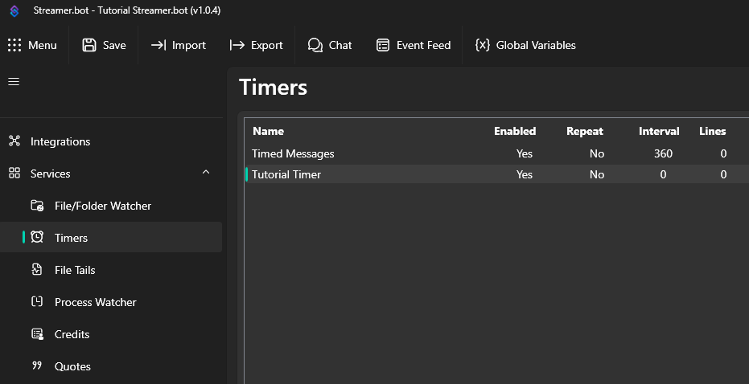
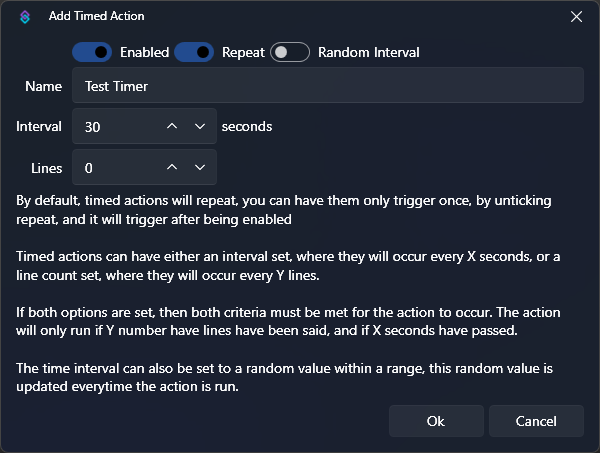

## Setup

::navigate
In Streamer.bot, navigate to **Settings > Timers**
::

To create a new timer, :kbd{value="Right-Click"} anywhere in the list pane and select `Add` from the context menu.

You can now specify the settings of your Timed Action:

## Configuration

::field-group
:::field{name=Enabled type=Toggle default=True}
If checked, the Timer is enabled. It will not trigger any action if it's disabled. The countdown and line count only start once it's been enabled.
:::
:::field{name=Repeat type=Toggle default=True}
If checked, the Timer will run again after it has fired. If unchecked, the Timer will just run once and disable itself afterwards.
:::
:::field{name=Name type=Text}
The name of your Timer. It has no direct impact and it just for your own organisation.
:::
:::field{name=Interval type=Number}
The time, in seconds, that has to pass for the Timer to trigger.
:::
:::field{name=Random type=Toggle default=False}
If checked, you can specify an interval for the interval. So the Timer fires randomly between x and y seconds.
:::
:::field{name=Lines type=Number default=0}
If lines is greater than 0, then x many chat messages need to be posted before the Timed Action fires. If the Interval is set to 30 seconds and Lines to 5, then it will trigger after 30 seconds have passed **and** 5 different messages have been posted to chat. If one requirement is fulfilled, it will wait for the other requirement.
::::warning
The Lines requirement does not work if you have multiple streaming platforms connected (like Twitch **and** YouTube). In that case, leave it at 0.
::::
:::
::

## Usage

:read-more{to=/api/sub-actions/core/timers/set-timer-state}
:read-more{to=/api/triggers/core/timed-actions}
