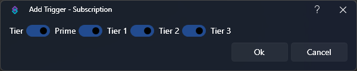
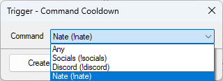
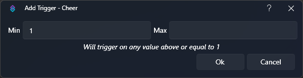
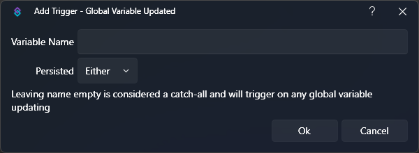
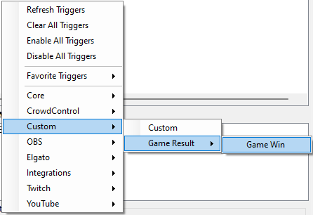
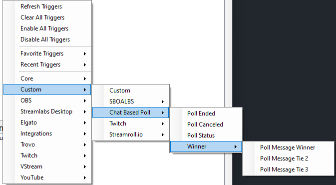

## Introduction
The release of Streamer.bot `0.2.0` included a large overhaul to the events system, with the introduction of `Triggers`.

You now have more control over events and their execution through Trigger [configuration](#configuration) options, and events can now trigger more than one action.

Triggers also introduced the ability to easily [test your actions!](#testing)

::collapsible{name="Video Tutorial"}
  :youtube-embed{id="wr25E38oAYs"}
::

## Configuration
To activate the triggers pane, you must first **select an action** by clicking on it in the main actions pane.

<kbd>Right-Click</kbd> anywhere in the triggers pane (or click the `+` icon in the top right) to browse triggers and add them to your selected action.

::callout{icon=i-mdi-bookmark color=green to=/api/triggers}
Explore all available triggers and their configuration options in the [Triggers API References](/api/triggers)
::

### Types
You will notice several core types of configuration options when setting up your triggers, outlined below:

#### Basic
These triggers require no additional configuration.

For example, the [Streamer.bot Started Trigger](/api/triggers/core) always executes on initial startup of Streamer.bot with no additional configuration needed.

#### Toggle
Checkbox configuration can be used to filter incoming triggers based on multiple event types, which can be toggled on or off.



For example, the [Twitch Subscription Trigger](/api/triggers/twitch/subscriptions/subscription) allows you to toggle incoming trigger events for each subscription tier.

#### Select
Dropdown configuration can be used to filter incoming triggers based on preexisting values.



For example, the [Command Cooldown Trigger](/api/triggers/core) allows you to filter incoming trigger events for specific commands.

These triggers also include the option `Any`, which allows events to trigger on **any** of the included options.

#### Range
Range configuration is used for filtering incoming numeric triggers based on minimum and maximum values.



For example, the [Twitch Cheer Trigger](/api/triggers/twitch/chat/cheer) allows you to filter incoming trigger events for a specified bit range.

::tip{color=amber}
`Min` and `Max` values are **inclusive**
::

::callout{icon=i-mdi-alert color=amber}
If only a `Max` is set, the trigger will execute on **exact values** matching the configured `Max`
::

Leave both `Min` and `Max` blank to trigger on all values.

::callout{icon=i-mdi-bookmark color=green to=#always-run}
Learn about the [Always Run](#always-run) option for range triggers below
::

#### Text
Text field configuration can be used to filter incoming triggers based on arbitrary text values.



For example, the [Global Variable Updated Trigger](/api/triggers/core) allows you to filter incoming trigger events based on a specified variable name.

This field can be left empty to trigger on all values.

### Context Menu

<Kbd>Right-Click</kbd> any existing trigger to reveal additional context menu options:

#### `Test Trigger`
Send a test execution of the selected trigger

::callout{icon=i-mdi-bookmark color=green to="#testing"}
Read more about [Testing Actions](#testing) below
::

#### `Edit Trigger`
Open the configuration dialog for the selected trigger

#### `Copy Trigger`
Copy the selected trigger to the clipboard

::tip{color=amber}
This creates a `Base64` string intended to be pasted into other actions, but it can also be sent to notepad or any other computer to be imported into another instance of Streamer.bot
::

#### `Paste Trigger`
Paste a copied trigger into the selected action

#### `Delete Trigger`
Delete the selected trigger

This will show a confirmation dialog by default

#### `Enabled`
Toggle this trigger on or off.

#### `Refresh Triggers`
Reload criteria data for all triggers

::tip{color=amber}
This is useful if you have modified data elsewhere in Streamer.bot, and it is not showing up in the trigger dialog
::

#### `Clear All Triggers`
Remove all triggers from the selected action

### `Enable All Triggers`
Enable all triggers for the selected action

#### `Disable All Triggers`
Disable all triggers for the selected action

#### `Always Run`
Always execute this trigger, even if another matching trigger has been configured elsewhere with an overlapping range.

::tip{color=amber}
This is a special option that only applies to [range triggers](#range)
::

For example, if you have a [Twitch Cheer Trigger](/api/triggers/twitch/chat/cheer) setup to execute on **any** value, and another setup to execute on **exactly 100 Bits**:

- Enabling `Always Run` will allow both triggers to execute
- Disabling `Always Run` will **only** execute the `Any` trigger if the bit value does not equal 100 Bits

::tip{color=amber}
You can quickly recognize triggers configured to `Always Run` by their blue color
::

## Viewer
You can click the `?` icon in the top-right of the triggers panel to open the **Trigger Viewer**

This window gives you a quick overview of all your configured triggers and their action mappings.

## Testing
You can use triggers to easily test your [actions](/guide/actions) and their behavior against various [arguments](/guide/variables).

The quickest way to execute a trigger is by selecting [Test Trigger](#test-trigger) from the context menu.

For more control over [variables](/guide/variables) while testing, you can use the [Core > Test Trigger](/api/triggers/core/test) utility to define custom arguments, or send [Simulated Events](#simulated-events)

### Simulated Events
::wip
Simulated Events documentation needed (Coming in Streamer.bot v0.2.2)
::

## Advanced
### Custom Triggers

::callout{icon=i-mdi-alert color=amber}
Custom Triggers **require C# Code** to register and execute
::

You can define your own triggers using C# Code. These will then show up in the trigger menu UI under `Custom` once the C# code defining them has been run once.

::tip{color=amber}
Since custom triggers need to be re-defined on every boot of StreamerBot, it is encouraged to define these in your C# module's `public void Init()` method and enable `Precompile on Application start`.
::



::code-group
  ```cs [Register Trigger]
  // Register a new trigger labeled "Game Win" in the "Game Result" category
  //                           Label         Name                 Category
  CPH.RegisterCustomTrigger("Game Win", "gameResultWin", new[]{"Game Result"});
  ```
  ```cs [Execute Trigger]
  // Trigger the "Game Win" trigger using its name
  CPH.TriggerCodeEvent("gameResultWin", true);
  ```
::

The category parameter of the `RegisterCustomTrigger` function *always* has to be an array, allowing to nest sub-categories.

This is only for user convenience and does not change the process of triggering a custom trigger by name.



::code-group
  ```cs [Register Nested Triggers]
  // Register three top level triggers in category `Chat Based Poll`
  CPH.RegisterCustomTrigger("Poll Ended", "poll_ended", new[] {"Chat Based Poll"});
  CPH.RegisterCustomTrigger("Poll Canceled", "poll_canceled", new[] {"Chat Based Poll"});
  CPH.RegisterCustomTrigger("Poll Status", "poll_status", new[] {"Chat Based Poll"});
  
  // Register three nested triggers in category `Winner`, which is in category `Chat Based Poll`
  CPH.RegisterCustomTrigger("Poll Message Winner", "poll_winner_one", new[] {"Chat Based Poll", "Winner"});
  CPH.RegisterCustomTrigger("Poll Message Tie 2", "poll_winner_two", new[] {"Chat Based Poll", "Winner"});
  CPH.RegisterCustomTrigger("Poll Message Tie 3", "poll_winner_three", new[] {"Chat Based Poll", "Winner"});
  ```
  ```cs [Execute Nested Triggers]
  // Call a trigger from any nested level solely by their name
  CPH.TriggerCodeEvent("poll_ended", true);
  CPH.TriggerCodeEvent("poll_winner_three", true);
  ```
::

:read-more{to="/api/csharp/core/triggers"}