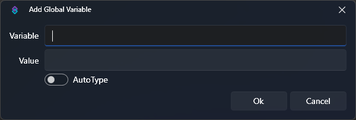

## Introduction
When a trigger executes an action, it will automatically generate a set of variables specific to that event source and type, and make them available to that action via the **argument stack**. You can use subsequent sub-actions to populate additional arguments, or even to manipulate existing arguments on the stack.

Arguments only exist within the scope of the current action. Once the action finishes execution, they can not be referenced by any other action. To share variables across multiple actions, or to persist them across restarts, you can store them as [Global Variables](#global-variables).

::read-more{to=/api/triggers}
Explore all available triggers and their variables in the [Triggers API References](/api/triggers)
::

::read-more{to=/api/sub-actions}
Explore all available sub-actions and their variables in the [Sub-Actions API References](/api/sub-actions)
::

## Types
### Arguments
The argument stack contains all local variables accessible by an action and its sub-actions.

These variables can be utilized in most [sub-action](/guide/actions#sub-actions) configuration text fields.

{caption-alt}

To replace a variable name with its value from the current argument stack, wrap the variable name with `%` symbols:

`%userName%`{lang=cs}

::tip
Variables are added to the argument stack by each sub-action, which execute sequentially. If you are testing and a variable seems to be missing, ensure that the sub-action which sets it runs *before* you're attempting to access it!
::

::read-more{to=#inspecting-arguments}
Read more about how to **inspect arguments** after an action has executed
::

### Global Variables
Global variables allow you to share data between multiple actions, or even persist it across multiple restarts of Streamer.bot.

::tip{to=/api/sub-actions/core/globals/global-set}
To set the value of of a global variable in your action, call the `Set Global Variable` sub-action<br/>
:icon{name=i-mdi-alert} This **does not** also make the global variable's value available in your action
::

::warning{to=/api/sub-actions/core/globals/global-get}
To access the value of a global variable in your action, you **must *first*** assign it to a local variable with the `Get Global Variable` sub-action
::

To directly access the value of a ***persisted* global variable**, wrap the variable name with `~` symbols:

`~myPersistedGlobalVariable~`{lang=cs}

::tip
This syntax currently *only* works for **persisted** global variables, and **not** user global variables.
::


::read-more{to=#global-variable-viewer}
Read more about how to use the global variable viewer to **view all of your global variables in one place!**
::

:read-more{to=/api/sub-actions/core/globals}

#### User Global Variables
User global variables function as global variables, but store values **per user**.

::tip
User global variables can be useful for creating per-user counters, leaderboards, or anything you can think of!
::

### Generic
The following variables are always available:

::field-group
  ::field{name="%date%" type="string"}
    Get the current system date, formatted as `yyyy/MM/dd`{lang=cs}

    Formatting is supported, e.g. `%date:yyyy/MM/dd%`{lang=cs} or `%date:dddd, dd MMMM yyyy%`{lang=cs}
  ::

  ::field{name="%time%" type="string"}
    Get the current system time, formatted as `hh:mm`{lang=cs}

    Formatting is supported, e.g. `%time:HH-mm%`{lang=cs}
  ::

  ::field{name="%longtime%" type="string"}
    Get the current system time, formatted as `hh:mm:ss`{lang=cs}
  ::

  ::field{name="%unixtime%" type="long" version="0.2.5"}
    Get the current system time, represented as [unix time](https://www.unixtimestamp.com){target=_blank rel=noopener}, in seconds.

    Example: `1725936677`{lang=cs}
  ::

  ::field{name="%filedatetime%" type="string"}
    Get the current system time, formatted as `yyyyMMdd.hhmmss`{lang=cs}
  ::

  ::field{name="%lf%" type="string"}
    Insert a new line character sequence, `\r\n`{lang=cs}
  ::

  ::field{name="%actionId%" type="string"}
    Get the unique ID of the action being executed
  ::

  ::field{name="%actionName%" type="string"}
    Get the name of the action being executed
  ::

  ::field{name="%runningActionId%" type="string"}
    Get the running ID of the action instance within the queue
  ::

  ::field{name="%actionQueuedAt%" type="DateTime"}
    Get the time the action was queued
  ::

  ::field{name="%__source%" type="EventType"}
    The `EventType` which triggered the current action. _C# required to access_
    :read-more{to=/api/csharp/enums/event-type}
  ::

  ::field{name="%eventSource%" type="EventSource"}
    The `EventSource` which triggered the current action. _C# required to access_
    :read-more{to=/api/csharp/enums/event-source}
  ::
::

## Formatting
Variables can be formatted inline using standard C# notation

### Numbers
For example, to format a numeric variable `%tipAmount%`{lang=cs} as a currency with 2 decimal places, we can use the following syntax: `%tipAmount:c2%`{lang=cs}

::read-more{to=https://learn.microsoft.com/en-us/dotnet/standard/base-types/standard-numeric-format-strings target=_blank rel=noopener}
Read more about all supported numeric format strings
::

### Date and Time
Similarly, `%time%`{lang=cs} can be formatted in short notation with AM/PM using the following syntax: `%time:t%`{lang=cs}

::read-more{to=https://learn.microsoft.com/en-us/dotnet/standard/base-types/custom-date-and-time-format-strings target=_blank rel=noopener}
Read more about all supported date and time format strings
::

## Inline Functions
Anywhere you can do a variable replacement, you can also execute **inline functions** to manipulate them.

### `math()`
Leveraging the [mXparser](https://mathparser.org/mxparser-math-collection/){target=_blank} library, you can evaluate mathematical equations directly inline with variable replacements.

```cs [Example]
// Expected output: 20
$math(10+10)$

// Multiply %x% by 1.25
$math(%x% * 1.25)$

// Multiply %tier% by 10
$math(%tier% * 10)$

// Divide %duration% by 1000
$math(%duration% / 1000)$
```

::read-more{to=https://github.com/mariuszgromada/MathParser.org-mXparser/wiki/All-built-in-tokens target=_blank rel=noopener}
Explore the **mXparser** documentation for all supported operations
::

### `length()`
Obtain the length of arbitrary text or a given variable.

```cs [Example]
// Expected output: 69
$length(Lorem ipsum dolor sit amet consectetur adipisicing elit. Commodi, ut.)$

// Obtain the length of %rawInput%
$length(%rawInput%)$
```

### `parse()`
Fetches the value of the argument named by `parse`'s parameter, which itself can be the result of parsing variables. In other words, it lets you "double parse" a value. This is often useful in a [While](/api/sub-actions/core/logic/while) loop to access an array of numbered arguments with an index variable.

```cs [Example]
// Same results as %user%
$parse(user)$

// First, Set Argument %i% to 0
$parse(line%i%)$
// ==> returns value of %line0% (the first line of the file)

// Set Argument %i% to $math(%i% + 1)$ (i.e., 1)
$parse(line%i%)$
// ==> returns value of %line1% (the second line of the file)
```
::tip
`%arguments%` and `~persistedGlobalVariables~` will be parsed in `parse`'s parameter, but not other `$inline()$` functions or formatting. If you wish to use another function, set another argument to the output of the function, and use that argument in `parse` instead.
::

## Global Variable Viewer
The global variable viewer in Streamer.bot provides a convenient location to **view, modify, and create** all types of global variables, including per-platform user global variables.

You can open the global variable viewer at any time by clicking `Global Variables` on the Streamer.bot toolbar:


You will be greeted with a popup window:


::tip
Global variables are **updated in real-time**, making this view extremely useful while you create and test your actions!
::

### Options
#### Add/Edit Global Variables
Selecting `Add` or `Edit` from the [context menu](#variables-context-menu) will greet you with the following options:


::field-group
  ::field{name="Variable Name" type="Text" required}
  Enter the name for your new global variable
  ::

  ::field{name="Value" type="Text" required}
  Enter a new value for this global variable
  ::

  ::field{name="Auto Type" type="Toggle"}
    By default, all values are treated as text, or `string`{lang=cs} variables.

    Enable `Auto Type` to automatically determine the type for the entered value.

    For example:
    - `0`{lang=cs} can be auto-typed to a numeric type such as `int`{lang=cs} or `long`{lang=cs}
    - `true`{lang=cs} or `false`{lang=cs} can be auto-typed to a `bool`{lang=cs}
  ::
::

#### Global Variables Context Menu
The :kbd{value="Right-Click"} context menu provides the following options:

::field-group
  ::field{name="Add Variable"}
  Create a new global variable of the current category type (e.g. persisted, non-persisted)
  ::

  ::field{name="Edit Variable"}
  Edit the selected global variable, see configuration options above
  ::

  ::field{name="Delete Variable"}
  Remove the selected global variable
  ::

  ::field{name="Copy Variable Name"}
  Copy the selected global variable name to your clipboard
  ::

  ::field{name="Delete all Variables"}
  Remove **all** global variables from the current category type (e.g. persisted, non-persisted)
  ::
::

## Inspecting Arguments
::navigate
Navigate to `Action Queues > Action History` in Streamer.bot
::

From the `Action History` view, you can :kbd{value="Right-Click"} an action execution to inspect all variables from that action's argument stack:


::field-group
  ::field{name="Inspect Variables When Queued"}
  View all variables on the argument stack from **before** any of the sub-actions had run
  ::

  ::field{name="Inspect Variables After Run"}
  View all variables on the argument stack from **after** the action had completed
  ::
::

#### Variables Dialog
When you select one of these options, you will be greeted with a dialog containing the respective variables:


::tip
You can use this dialog any time you want to know what variables are populated by a trigger or the sub-actions during a specific run of an action
::
