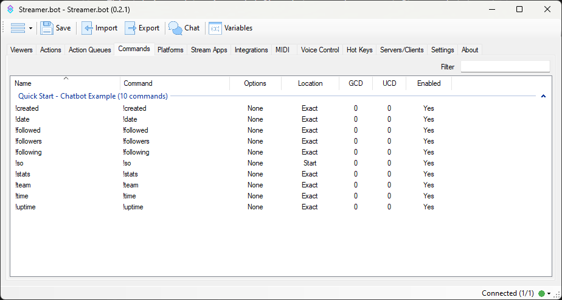
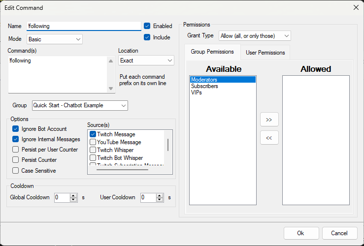

Chat commands in Streamer.bot are **platform-agnostic**, supporting Twitch, YouTube and Trovo.

Configuration options give you fine-grained control over command text parsing, cooldowns, and user permissions.

::collapsible{name="Video Tutorial"}
  ::warning
  This tutorial was created using an older version of Streamer.bot. Some details may differ from the current version.
  ::

  :youtube-embed{id="7NojzBM_Z-M"}
::

::navigate
To get started, navigate to **Commands** in Streamer.bot
::

To create your first command, :kbd{value="Right-Click"} in commands pane and select `Add` to open the configuration dialog.

## Configuration

::field-group
  ::field{name=Name type=Text required}
    Enter a friendly name for this command

    ::warning
    This can be any label to recognize your command with. The actual text used for command execution will be defined in the `Commands` field.
    ::
  ::

  ::field{name=Enabled type=Toggle default=true}
    Toggle this command on or off
  ::

  ::field{name=Include type=Toggle default=true}
    Include this command in the [Get Commands](/api/sub-actions/core/commands/get-commands) sub-action
  ::

  ::field{name=Mode type=Select required}
    Select a text matching mode for this command:

    - `Basic` - Match at least one of the strings entered, based on the configured `Location` option
    - `Regex` - Match based on Regular Expression
  ::

  ::field{name=Location type=Select}
    Modify the text matching behavior when using the `Basic` mode:

    - `Start` - Match chat messages that **begin with** at least one command alias
    - `Exact` - Match chat messages that are **exactly** the same text as at least one command alias
    - `Anywhere` - Match chat messages that **contain** at least one command alias
  ::

  ::field{name="Commands" type=Text required}
    Enter the text from chat used to execute this command

    ::tip
    You can enter multiple trigger strings or aliases by adding one item per line
    ::
    ::warning
    Command cooldowns are **shared across all configured aliases** within a command entity. You should create separate commands if you need exclusive cooldowns for each.
    ::
  ::

  ::field{name=Group type=Text}
  Optionally type or select a group for this command
  ::
::

### Options
::field-group
  ::field{name="Ignore Bot Account" type=Toggle default=true}
    Ignore messages from the bot account, if it is configured for the respective chat [platform](/guide/platforms/twitch)
  ::
  ::field{name="Ignore Internal Messages" type=Toggle default=true}
    Ignore messages from the internal Streamer.bot chat loopback.

    ::tip
    Disabling this option is useful if you want to trigger commands internally, such as inside the **Streamer.bot Chat Window**
    ::
  ::
  ::field{name="Persist per User Counter" type=Toggle default=false}
    Persist the `User Counter` data for this command across restarts of Streamer.bot

    ::read-more{to=/api/triggers/core/commands/command-triggered}
    Refer to the `userCounter` variable returned by the **Command Triggered** trigger
    ::
  ::
  ::field{name="Persist Counter" type=Toggle default=false}
    Persist the `Counter` data for this command across restarts of Streamer.bot

    ::read-more{to=/api/triggers/core/commands/command-triggered}
    Refer to the `counter` variable returned by the **Command Triggered** trigger
    ::
  ::
  ::field{name="Case Sensitive" type=Toggle default=false}
    Require command aliases to be matched using the exact casing specified
  ::
  ::field{name=Source(s) type=Toggle}
    You can select any combination of chat sources to watch for execution of this command:

    - `Twitch Message` - Accept commands from the chat of the configured [Twitch Broadcaster](/guide/platforms/twitch) account
    - `YouTube Message` - Accept commands from the chat of the configured [YouTube Broadcaster](/guide/platforms/youtube) account
    - `Twitch Whisper` - Accept commands from whispers sent to the configured [Twitch Broadcaster](/guide/platforms/twitch) account
    - `Twitch Subscription Message` - Accept commands included in the Twitch sub message
    - `Twitch Re-subscription Message` - Accept commands incldued in the Twitch re-sub message
  ::
::

### Cooldowns
To prevent spam or generally restrict usage of your command, you can configure cooldown options:

::field-group
  ::field{name="Global Cooldown" type="Number" default=0}
  Enter a minimum time, in seconds, before the command can be used by **anyone** again after it is executed

  - Set to `0` to disable global cooldowns
  ::
  ::field{name="User Cooldown" type="Number" default=0}
  Enter a minimum time, in seconds, before the command can be used by **a specific user** again after it is executed by that user

  - Set to `0` to disable user cooldowns
  ::
::

::warning
**The Broadcaster Account is always exempt from cooldowns.** If you are testing this feature, ensure you use a different account.
::

### Permissions
::warning
By default, commands can be executed by **anyone** in chat.
::

You can restrict access to your commands by configuring permissions options:

::field-group
  ::field{name="Grant Type" type=Select}
  Modify the grant type for all configured permissions within this command:

  - `Allow` - Only the specified groups or users can execute this command
  - `Deny` - Everyone **except** the specified groups or users can execute this command
  ::

  ::warning
    If the `Allowed` or `Denied` fields are left empty, the permission applies to **everyone**.
    - Grant type `Allow`, with an empty `Allowed` field will **allow all users** access
    - Grant type `Deny` with an empty `Denied` field will **deny all users** access
  ::
::

::warning
**The Broadcaster Account is always exempt from permission settings.** If you are testing this feature, ensure you use a different account.
::

## Context Menu

From the **Commands** tab, :kbd{value="Right-Click"} any existing command to reveal the context menu.

Options are outlined below:

#### `Add`
Create a new command

#### `Edit`
Open the command configuration dialog.

This is the same as :kbd{value="Double-Click"} the entry

#### `Delete`
Delete the selected command

#### `Rename Group`
Quickly rename the current group of the selected command

#### `Set Group`
Quickly assign the selected command to another group

#### `Enabled`
Quickly toggle this command on or off

#### `Reset Counters`
Reset stored counter data for the selected command

#### `Reset User Counters`
Reset stored user counter data for the selected command

#### `Add to Export`
Add this command to the current export

::read-more{to=/guide/import-export}
Read more about [Importing & Exporting](/guide/import-export)
::

#### `Copy Command Id`
Copy the unique ID string for the selected command to your clipboard

## Usage
Once you have configured your commands, you can assign them to actions with triggers!

:read-more{to=/api/sub-actions/core/commands}
:read-more{to=/api/triggers/core/commands}
:read-more{to=/api/csharp/methods/core/commands}