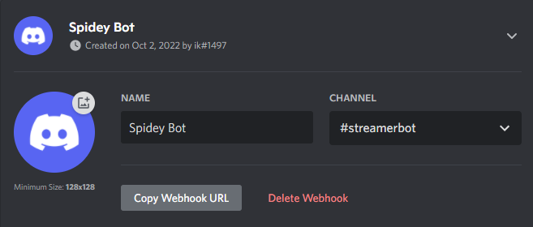

Webhooks allow you to send messages to your [Discord](https://discord.gg) servers with ease.

::warning
You must have the proper permissions to create webhooks on a given server/channel
::

## Configuration

::steps{level=3}

### Create Discord Webhook URL

:::navigate
In Discord, :kbd{value="Right-Click"} on a channel you have permissions to manage, and select `Edit Channel`
:::

1. Navigate to the `Integrations` tab
2. Click `Create Webhook` to create a new webhook for the selected channel:

   

3. Configure the `Name` and `Avatar` as you wish
4. Click the `Copy Webhook URL` button to get your Webhook URL

:::success{to=/api/sub-actions/integrations/discord/basic-webhook}
You can now use the copied Webhook URL with the [Discord Webhook](/api/sub-actions/integrations/discord/basic-webhook) sub-action!
:::

::

## Usage

:read-more{to="/api/sub-actions/integrations/discord/basic-webhook"}
