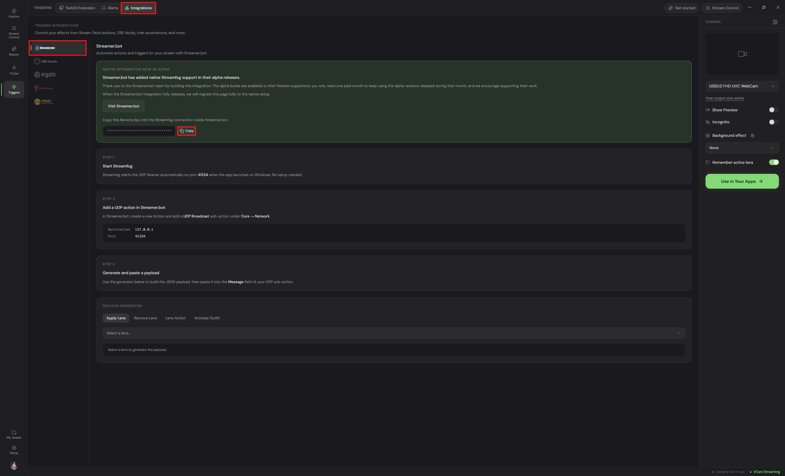
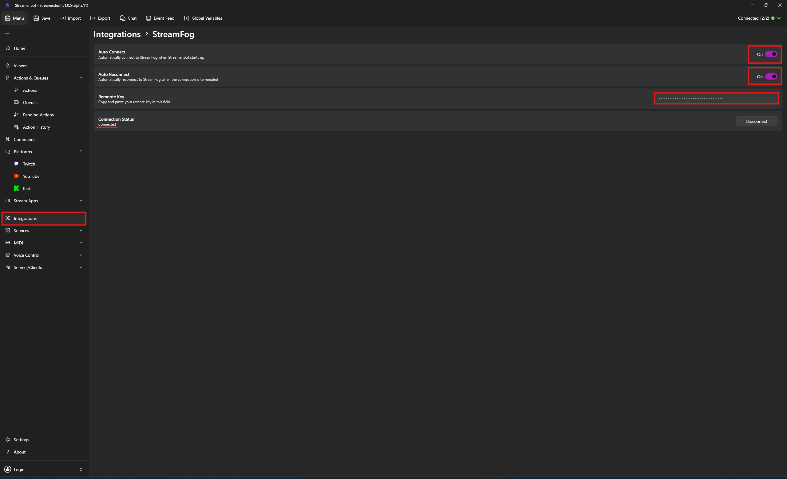

Integrate Streamer.bot with [StreamFog](https://streamfog.com){target=\_blank}

## Configuration

::steps{level=3}

### Sign in to the StreamFog App

1. Follow the instructions on the StreamFog app and login with your preferred OAuth provider

### Navigate to the StreamFog Integrations Page

1. Open the StreamFog app
1. Click on the `Streamer.bot` integration from the left-hand menu
1. Press the `"Copy"` button to copy your unique Streamer.bot Remote Key - _you will need this for the next step when configuring StreamFog!_

- Copying the Remote Key
  

### Setup the Connection in Streamer.bot

:::navigate
In Streamer.bot, navigate to **Integrations > StreamFog**
:::

1. Enable `Auto Connect` to automatically connect to StreamFog when Streamer.bot starts up
1. Enable `Auto Reconnect` to automatically reconnect to StreamFog if the connection is disrupted
1. Paste your StreamFog Remote Key into the `Remote Key` input
1. Click `Connect` to start the Connection for the first time (You will notice the word `'Connected'` under the `Connection Status` if the connection is successful)

- Setting up the Connection in Streamer.bot
  

:::success
StreamFog is now connected to Streamer.bot!
:::

## Usage

:read-more{to="/api/sub-actions/integrations/streamfog"}