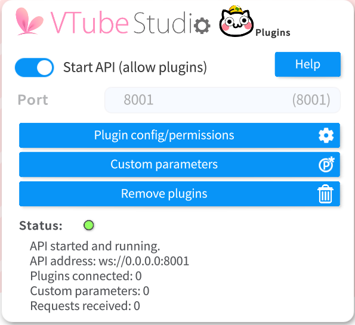
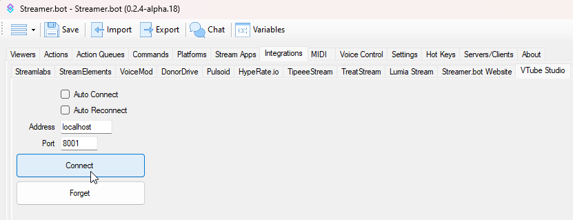
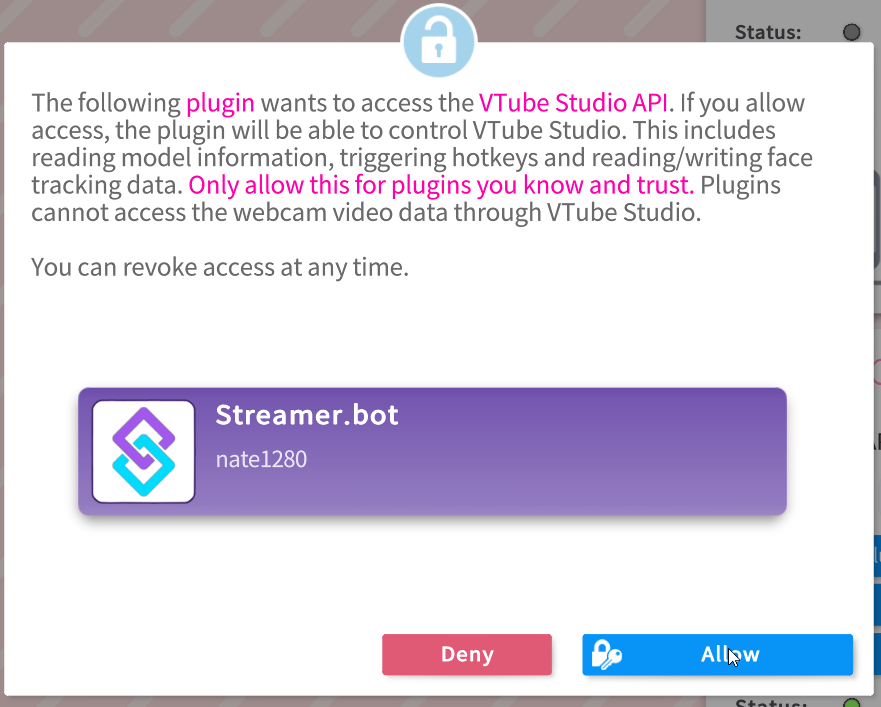

## Configuration

::steps{level=3}

### Enable the VTube Studio API

:::navigate
Navigate to **Settings** in VTube Studio
:::

- Enable the `Start API` toggle
  

### Configure Streamer.bot

:::navigate
Navigate to **Integrations > VTube Studio** in Streamer.bot
:::

- Match the settings to those configured in VTube Studio
  - `Host` defaults to `localhost`
  - `Port` defaults to `8001`
- Check `Auto Connect` and `Auto Reconnect` if you want (optional).
- Hit `Connect`

### Allow the connection

Quickly return VTube Studio and allow the connection.

:::success
Streamer.bot and VTube Studio are now connected!
:::
::

## Usage

:read-more{to="/api/sub-actions/integrations/vtube-studio"}
:read-more{to="/api/triggers/integrations/vtube-studio"}
