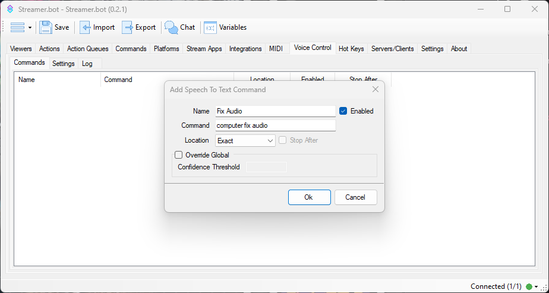

Leveraging the Microsoft Speech Recognition built into Windows, you can configure **Speech-to-Text** commands to execute actions with your own voice.

::warning
This feature relies on the **Microsoft Voice Recognition** engine. Check out the [resources](#additional-resources) for useful information.
::

## Commands

::navigate
To get started, navigate to **Voice Control > Commands** in Streamer.bot
::

::field-group
  ::field{name=Name type=Text required}
    Enter a friendly name for this command
  ::

  ::field{name=Enabled type=Toggle default=true}
    Toggle this command on or off
  ::

  ::field{name=Command type=Text required}
    Enter the command phrase Streamer.bot should listen for
  ::

  ::field{name=Location type=Select default=Exact}
    Modify command detection behavior:

    - `Exact` - Detect the phrase as a full sentence. Require a pause **before and after** the phrase.
    - `Start` - Detect the phrase at the beginning of a sentence. Require a pause **before** the phrase.
    - `Anywhere` - Commands can trigger even if the phrase is detected in the middle of a sentence. **No pause required.**

    ::tip
    If a command is set to `Exact`, this will be an exact grammar match, usually resulting in a much higher confidence over using dictation and the `Start` or `Anywhere` location.
    ::

    ::tip
    The `Stop After` toggle will stop processing any further dictation checks immediately after a phrase is detected, rather than waiting for the next pause.
    ::
  ::

  ::field{name="Override Global" type=Toggle default=false}
  Override the global confidence level settings

  - Unlocks the `Confidence Threshold` field for this command
  ::

  ::field{name="Confidence Threshold" type="Number" default=0}
  Enter the new value, from `0` to `100`
  ::
::

## Settings
::navigate
Navigate to **Voice Control > Settings** in Streamer.bot
::

::warning
If controls are unavailable, make sure a supported display language is installed and available in the Speech Recognition control panel applet
::

::field-group
  ::field{name="Start Listening" type=Button}
  Manually start the voice monitoring service
  ::

  ::field{name="Stop Listening" type=Button}
  Manually stop the voice monitoring service
  ::

  ::field{name="Auto Start Listen" type=Toggle default=false}
  Automatically enable voice monitoring when Streamer.bot starts up
  ::

  ::field{name=Locale type=Select required}
  Set the locale of the speech recognition engine.

  - Defaults to the detected system locale
  ::

  ::field{name="Confidence Threshold" type=Number required}
  Set the minimum confidence value from `0` to `100`

  Any spoken phrases with a confidence value less than the configured value will be ignored.
  ::

  ::field{name="Log Speech to Text Dictation" type=Toggle default=false}
  Enabling [Logging](#logger) of Speech-to-Text
  ::

  ::field{name="Audio Input Device" type=Select}
  Select the input device to use for speech recognition.

  - This can be actively changed while the engine is listening
  ::
::

## Usage
Once you have configured voice control commands, they will be available to use as triggers for your actions.
:api-reference-cards{path=core/voice-control}

## Logger
The `Log` view will show you a live feed of dictation by the speech recognition engine.

Ensure you have enabled the `Log Speech To Text Dictation` option in [Settings](#settings)

::tip
This is useful for debugging!
::

## Additional Resources
::card-group
  ::card{icon=i-mdi-bookmark title="Voice Training Guide" to="https://support.microsoft.com/en-us/windows/use-voice-recognition-in-windows-83ff75bd-63eb-0b6c-18d4-6fae94050571" target=_blank rel=noopener}
  Follow the steps here to train your voice in Windows
  ::
  ::card{icon=i-mdi-bookmark title="Custom Dictionary" to="https://winaero.com/manage-speech-dictionary-words-windows-10/" target=_blank rel=noopener}
  Add your own words to the dictionary using the Windows Voice control application
  ::
  ::card{icon=i-mdi-bookmark title="Add Languages" to="https://www.tenforums.com/tutorials/114085-add-language-windows-10-a.html" target=_blank rel=noopener}
  Learn how to add additional languages to Windows Voice Recognition
  ::
  ::card{icon=i-mdi-bookmark title="Change Language" to="https://www.tenforums.com/tutorials/120631-change-speech-recognition-language-windows-10-a.html" target=_blank rel=noopener}
  Learn how to change the speech recognition language in Windows
  ::
::
