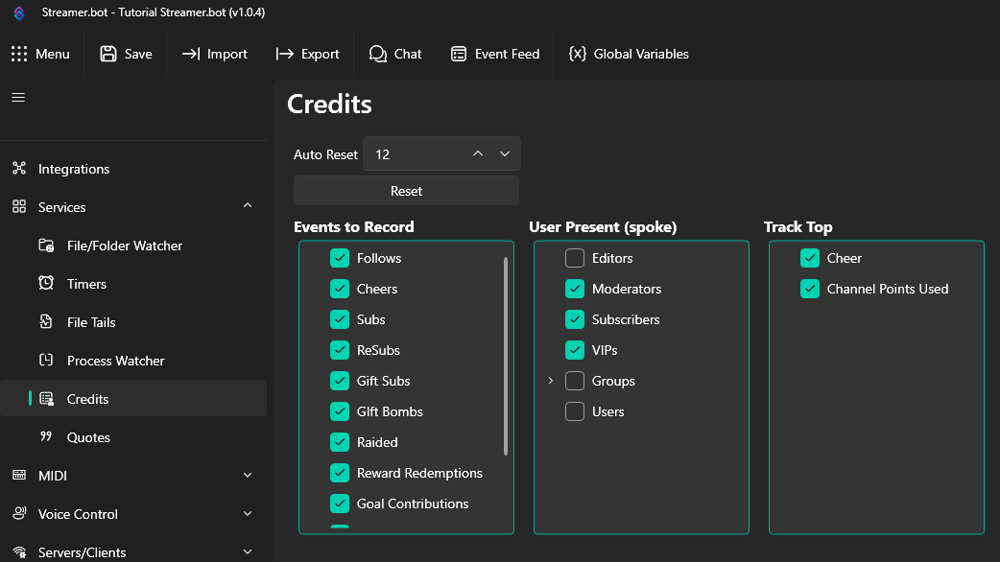

## Setup
In order to use the Credits, navigate to `Services -> Credits` and from there, check the events you want included.

In this tab, you will be able to see all of the available events to include in your end Credits.

## Events to Record
These are various events that happen during your stream, select the ones that you care to show off at the end, or perhaps use it as a way to give extra 'Thanks' to those who supported you.

::tip
You can select one, all, or any event that you wish to include. There are no minimum or maximum number of events required to make the credits work.
::

 * Follows
 * Cheers
 * Subs
 * ReSubs
 * Gift Subs
 * Gift Bombs
 * Raided
 * Reward Redemptions
 * Goal Contributions
 * Game Updates
 * Pyramids
 * Hype Trains

## Users Present (spoke)
This is where you can recognize viewers based on their Role and/or Group for talking in your stream.

 * Editors
 * Moderators
 * VIPs
 * Groups
  * You can select the 'Groups' check mark to include ALL groups, or expand it to only select certain groups
 * Users

## Track Top
This will show top viewers in the respective categories

 * Cheer
 * Channel Points Used

## Auto Reset
By default, the credits will reset after 12 hours since it has been last closed.  You can change the `12` to a shorter or longer number based on the needs of your stream.

::tip
You can either manually reset the Credits at any point in time by pressing the `Reset` button, or even reset the credits on a Stream Online trigger by using the [Reset Credits](/api/sub-actions/settings/reset-credits) sub-action.
::
