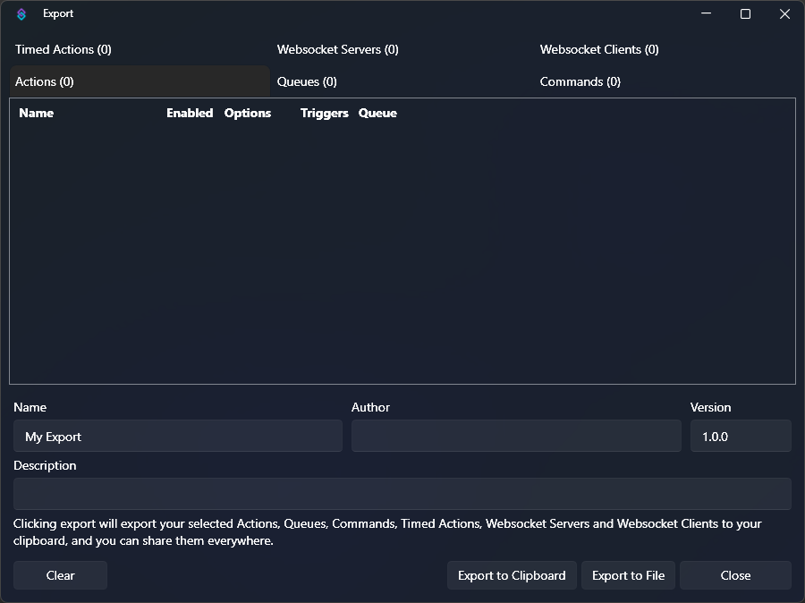

## Introduction
Streamer.bot includes the ability to import & export collections of preconfigured functionality to easily share your creations with others, or between multiple instances of the application.

An export may include any combination of the following:

- [Actions & Sub-Actions](/guide/actions)
- [Triggers](/guide/triggers)
- [Action Queues](/guide/actions#action-queues)
- [Commands](/guide/commands)
- Timed Actions
- WebSocket Clients
- WebSocket Servers

::card{icon=i-mdi-bookmark title="Streamer.bot Extensions" to="https://extensions.streamer.bot" target=_blank}
Check out the community extensions site for a large collection of ready-to-import features!
::

## Import

A Streamer.bot import code is a UUEncoded string such as the following example:

:streamerbot-import{help="false" code="U0JBRR+LCAAAAAAABADtnUlvJclxx+8C9B0IGvBJ0cglctPNGmBkwzpZwlwEHSKXmCHMZcRFMwNBgA8+9FUcQB+wP4mzuLQe+VjFYr16r7LoBgKN5stasrLiV5HLPzP/+stfHB0dn5VrOv710V+7P+qf53RW6p/HV9eXpf738kO8uD7+1UMi3Vx/d3HZJZ/TdZHKi89JfymXVycX512a/CA+/DMhl6t0efL99UPi5rUu/uvm/N/SQ8r5zenpY9rZyfnJ2c3ZN5+v2SV2aX+7O+I405M80901ruovf7z/5egx6S75JHc3JluUZVJQkneAziiIWRYoGFE4bZMs5TFzd6f9+abclKcZu/u9nFM8Ld01ry9vypOUH9PpTS5fX16c/fvJ1fXF5U/1IKbTqydHPZbw7x9L+DcX10dfXZydlfPro99eUj7p/vPDyfV3R7+7+PbiSZ6+vby4+X6zGO+f//QH+umqFuZLt7uk83xx9rmYt9LTxXm6ubys93wp9fry5Ntv62voyvZPT+65XebPyv3eLej0rhCPP/3j4xf7YtNs09sfnPb0/jv0L6SMqzA+P+Ce+SSCV9ZICJ4MYPEZgnMGkvCKhEAXs9069Ydy8u13HQz1K/Y87fqn7ztvlkKE50mPaD77XAx/Mu7zep7Lj939Nn//26/GY/X30ba/gz+f8vHgWRp2ngULYWR+FivMAawCmdyLVXZJqcIaSLsCaH0FrAQC7SiL4CyRoHawkrth9b+f/vE//f8+K/YZD352yscDZmm8Cy1SCANYNVGYA1h5Y5lFD1Yie2GTkGBTlICMAaLRGWQwyikpSBO3g5WaA6sJX7O+E0de+VVPGJmlvoMnO/ksbO5SCK9iNUthvvhoo97vAFbOOWLVgxVm6VJwApKxNVoJzRBsxcppQTUtBgrbgW4xrPR8WI2sXb964vABb/KECdl4FavxLvTqRSaX0u5YTS7MHV/fEFbWe8u6Byty0qFlCTqWBGi0gcgxQVZspTNSWWoIKzxItNoRq1k+sM+yNAsRM7L5puztjlXfdSY/8gxYmRA0m75KoE8O0VSOQm1RoS4KQnYSnNQWpdQkdGwHK3OQttVkrJpoDuwBqwbbVjs+8gxYIZFg11cJVILI+gLSJwuYPAEZL2rckpK4UpZeIHIxrOx+egLnwmrkp3XZaLWdmZEXmSV7b8Vq5CtbACtNlDj0YSWN9EJKQBnqP1oF8FRCrQQ65bNKwXrZDlZuKlbj3+BcB+x+5cl3edOVZ7nI5EKY8FJawUrF6Hm7l/yhbRULKUwGvDMRECmBZ8Ugi7WGrS4lbhO5GFZ+DdFqzCd393BweKxmyd6LJ04omcm9NLNhJUvSnHqwiiKXokMCEypMmDVDTMKBMEZmqQtF3VC0Cm23rfo86sDNpdmxmiV7408cc+tdcjsTVipl7hsO1sWa6BICqnTXwZ6BsmRQoQat4oVg2dC4lTyMzGK73Ccc8Opd3pSl8XcZk+cxj7Cn7I05cfytp+X2De93gCvhsuFtOO65CkiSbGawNjvA6BBiDh6iC8yiJBviduf8clxN1ll8sS82xYa4Ejn2cxWFZ+8ThBwsoFUBIrIFzsroiFGj2pZoLMfVNKHFW79/79h+HmGLZ7Ihm6q2tVnEaLQFH7qe9VCbVyQ8QrKsJQev2Gx3zy/H1TSlxfKv57B2e2f3kHx8ysztCNs8/uPWuYs/3UFtSG7LJvRyFZmsIWHBpQoXqloPpEQKfOUNs/YoBTbE1TSpxfKvZ5/2GYaPewZgm9X3j9kQV2FAxh6jdUI5BTraWLkqrnIVNRBjDVheq/KCVHc5rqZpLZZ/PXPbbQNh5HYrG4sXy/w2xJUz/HS65AZXORCriBo8EwOmVLmSxUNIpTLmkUi11B84TWyx/OuZwzaDUoNO3Hj2JtoQV2hlL1dCsjFFaGDs+tkpZfCWLMggFYlYopYNzWaU09QWy7+e3Wx2f719qe9rRhjeD2BD867Yml6uyOlYcrZgbDfvKlsDpLQDi8kUjDHopuLVNLnF8q9nkt3uwTtfJGpPdP19A7DFC3OiDXGVrSt9/eyOU8qBC6TazAKU3kPMops1LDgRO+uoIRWTnKa3WP71THLHeV38VaL2R9ftfp7oEDaZK6EDcrIgig6AQlkgFAnQO51TZhSlIRmTmqa3WP71jLbFidofXXt6uv3aEFdkQy9Xvlb1inYOgkoM6KyAaGwAphw5+KhMS3NE1DS9xfKvZ5zPzd4gmUzUF7oebHhdi9zLleYQo0MDOUkLNXIxEAcCFlZRslrZ6Bvi6l3qLRaMUZ/How5fM1xHu2uIKz2wXgzV+p9UVBtU0WCNV1pCiEWByoKiFYaZG+oPVO9Mb7EP9xpP1OZZC9LVdOAa4ko42ctVSqxsjU2g0FJtX2EAn2u1MCMjRRlSSA2NC6v3pLeYPUxNI2o7Swemq+nANbQQU3SmlysVhBamZLDKJkBpLFDOGrz02RaDOpiW+i3ejd5iXmfanahNOzxd93dc/KW8YENcBed5G46HeEVKkXQJXEmyxqvAEHQpEEMJxdY0JRvqZ1fvQ28xI1TzErVpB6ar0c6MqVwhYRJMCJpqZRBJUzcuzFCy8bHUiJV4e0h5Oa7egd5iLqhux7n+jvc6JF0tNreGuLKOerkK2qPrdmJwNlauMhJEVB6EiZy9zKWk7Rn8y3G1dr3FLFDtL0b12cHoag6tIa6kK71cOZQsSNWKn6itKswlgfeqg0s7rdFQig3NE1Gr1lvs7uuHJ2rTDkNXW22toZVu2YveBaSFiC6VFCtSVAB96KaIhARSyBrHhPXJNNTPrtert9jRXfZE1IQ5Jgeg62M7aA1xlbwa4kqKmBO4FBgQBUPsFr0NhY0zJDmYhvot9Er1FjtWb2ZvR71I6ZuuMJKuySXWSm1wiCvnbS9X0gnqZttDIlO5sgUhBDagPHOKMsicG1pCWq9Ub7FL3WyMB4+/2qtx70353B9at42ErCGujPe9Ox4EllhYGZCma1/pbp2zblVOF2vLypNRpTS0HpNeo95idxeZpd71Jq3gq3SNvNqOtcHlx4unclWbVQaDVKBJK8BUG1nRo4USZawp1hXfUH+gXqPeYpbWwi6tmsnq2xfd+mB9J010YAxxpTz1cqXISxLRg9eUa/vKOIiGNLCOxNJQjLIlrtaot5ixqTCNrpFnjSTk1avNGGRmLLqJNrRFT/allyuRS9ZS5RqvuvZVKBYiRgbpUq0T+uDMC1L45bhand5iH+2EGem6nVWnO3u1bfmq4BBXMQjeHoS658oozzZ1FT/Z6S2Kt+AdMnRrXpTIkVRpaP1AvTq9xf4qMzvS9ez3Henak/d/XLwqOMSVD6qXq+xEZDYIwtYqILqOKy4emOvvgZOWqSHdrV6d3mLfnjHvaNKy4859T7fg6xvkSgfbu1WjChiiNgKK7dZj8kUDyaTAC+0zBWuDa0hvoVentzjMF/e90tU2VzKEFyYn3nNVOHjOWoD0nd7CpQDBWALjjXPGsaPcULzC1ektDlmTeX90Nc0VlhB7uZI2BhWsA0tKQLeZMPgQMkRbWMkgo7UN9Qfi6vQW+/OM2x7PnkbX5qqaL95lFlbfak23r9CHlybTP/RbsE6RyUNE18Ur9uCTF6DIMgmS5FxD48K4Or3FPvoDx6iQxtM15mpLxa5DtuVetiGuLMnePbulKYqdTuCUStBthgVBGQ1ScgqheJ/U9tLuy3G1Or3FvBMf3qpCmnfk6vB07S8SjrUhrjTpXq5yNkGSliCKDICxG7/igsCCmDF6dtiQnh1XqrdYds7VZLq+6C2GuNKFXC9XKrIuJjkIQWvAJBVQbXCBTU4lVf8JLemYcI16i8PoA1/14zfR9UUf+GBDXCUKvL0I4MP6gRglEmug5BwgsoToyYGgmIXA4FRLultcnd5idxeZV88+rwppf1FrBXr2Qa5UcYzc9VZo3+3bjZ0+MOduJyyrUw11FBuaf4Wr01vM4iWz17t2VyGNjFe7PPLywerTMFeBYn+8YhFSt5Fcp1zv5uF341fCQMwqOCcZvWhp/Gp1eotnrjz59L3OF35TbW1kfXIXKppoWd3bEFe1njdUD/TRMYNAbQCLyUDGIdTqoU/Bdps5tsTV6vQWm7b7N3jZsdrD3L2tpWOGuFJR8nZl7p4rlo4tcwAWsdb+nFNATmowxfngEL1vaT8Rszq9xTObxekPT9fBRofbgurTMFdygCsrfIhkHTjta7xSQUCUJYL20ZjipQmxoXkiZnV6i22by+MPQ9eX9QN7uVIp2l6ugvElYKk0Wd2NC0eCbgfU+qczWYtUUDa0T49Znd6iz3vaX+/2wAqmFqH6NMyVj8TUt460EJIsO8iRBCAiQ6wcgkrGyGwRm9oH1axOb9FnLdfTDq8JbBSqT9O5krWBRbGCxC5VrrI0EIJBcNYmTTIa9C21r9aot+izBvcTWURl21Dv37YNcWVi6uXKccC7feUUdf3sVBzEYhwoaTN7S8mahvQWZo16iwFrZ/+rRYhawe5yQ1yJbmeDvvlXhSOW2r6SwQZAFxRQ9AmKZlekCAXN9tKDy3G1Ur3FsC24X+P49S32tBvq4oX/ig1wJUtSvL245kM/u1aFZbK19pcSoFK1faVchFoJNImEcU63FK9Wqrd41fb05Z68wtkBiGqxNbVtQ1zFhL1coaTsdDf/ynWLtCuSEHMmMEW5TqchREv7oJr16i3GWGt0/b8m6t6GuLLJ93KVEykfKlc5JgPoU41XRtR6IEtpS3ZCqpb62Vettxhpt/tx6zfR9YWoBxviChPxdmXucf3AGs6UQfDoa7yiWhn0kTXYIFMJhTj7bQnUYlzZtestJvjigXs19tQzsT6i7m0qV0raEDqkslFdfyDnbh3pBFmrYNCjjdTQ+JV9B3qLCa45O2Av0rWPHv+14vTZhrhSKfZyZStELtoIFkUA5G6LHpUTyCK9U0rYFBpa58y+A73FZNsEbEaVw4yu37fo54ptgCuRE/dylZBCCYK63bo73W1WEMhkCKE2rJKNElVD/ez23egtdrF7wGZnbNU52ZcNcUVZ8fbiL4/jwt3+BrpAFj4BipzBVw4hcUCbtLJZbQ99LcfVe9JbzGW3G4Hi57lD0LMbHexerdgQVy5jL1dFGOMwyU5qYWq8MqlyFTJIch5diK7Gsoa4emd6i33YM+//+BhSPmMwxn7eCESbF3nnFG3bEFcqey597atgKTJWrjh7QE0JIioLRDJJrMSp0tC4sH2XeouD2c9vscVz24QNcSVy5O1OvQe9hc3JeCWBAhfAYhHIMYIMSTmBVovYUj/7FL3FV5cln1xfHf366HflN6c3P/7hm6N/PfqP/xwosa+/FsKLvhE/4UsN5RKUCQpQBgO+m3Dd7csSWKTom6o5Px1J/+cff9o445jS9cnF+W+7u13Vk/74JLGWyyl9f1XyRvpj8sMFH48//vNNuSlPLlFPPzuj8/z0xx9KvLpI/12uf18u/1IuexK/Oj0p59dPE69Pzh6P736594Hj7hr1Ce6K8f6X8uP3F5fXJX99eXF2N6D0QX146IE7Pjs5Pzm7Ofvm80n3qRDLNX2wx7/8xd/+D0fMDFX35wAA"}

To add an import to your bot follow the instructions below:

::navigate
In Streamer.bot, **open the Import Dialog** by clicking `Import` on the top toolbar
::

In the **Import Dialog**, paste your Streamer.bot import string into the `Import String` input.

::tip
You can also drag & drop any file containing an import code onto the input box
::

Once you have loaded an import, you will be presented with all its included items:

You can customize which items you would like to import by `Right-Clicking` an item and toggling the `Include in Import` option.

::warning
By default, **imported items will overwrite existing items with the same name**
::

You can modify the overwrite functionality by `Right-Clicking` an item and toggling the `Overwrite` option.

::success
Click the `Import` button when you are ready to complete your import
::

## Export

::navigate
In Streamer.bot, **open the Export Dialog** by clicking `Export` on the top toolbar
::

::success
You should now see the **Export Dialog**
::

The **Export Dialog** shows the status of your current export.

At any time, in the main Streamer.bot application window, you can add exportable items to the current export by `Right-Clicking` them and choosing `Add to Export`.

You can drag the **Export Dialog** off to the side while you construct your export, or you can choose to close it. Your export will continue to be built in the background as you continue adding items.

### Configuration

When you are ready to create your export, there are several configurable options:

::field-group
  ::field{name=Name type=Text required}
  Descriptive name for the export
  ::
  ::field{name=Author type=Text}
  Name or username of the export creator
  ::
  ::field{name=Version type=SemVer}
  Version of this release of the export, useful for extension creators, e.g. `1.0.0`
  ::
  ::field{name=Description type=Text}
  Description of the functionality or features provided by this export.

  May also include important info or setup instructions.
  ::

  ::field{name=Clear type=Button}
  Reset the current export, removing all items that have currently been added
  ::
  ::field{name="Export to Clipboard" type=Button}
  Copy the resulting export UUEncoded string to your system clipboard
  ::
  ::field{name="Export to File" type=Button}
  Save the export to a file
  ::
::

### Notes

- Exported actions will retain any custom JSON or [C# code](/guide/csharp) and will retain their respective [sub-actions](/guide/actions#sub-actions), group names, [triggers](/guide/triggers), [commands](/guide/commands), as well as any custom [queues](/guide/actions#action-queues) an action was associated with.
- When actions are re-imported, Streamer.bot will attempt to rebuild connections with OBS objects that match but these sub-actions may require opening up to confirm they are pointing at the intended sources.

