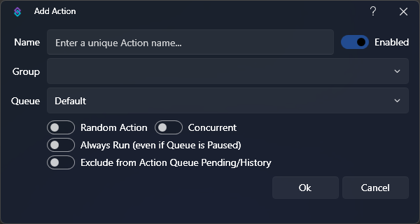

# Actions
Configuration of actions and sub-actions

## Introduction
Perhaps the most important piece of Streamer.bot, actions are at the center of everything you do.

You can configure actions for anything from basic alerts and shoutouts to extremely complex interations such as TerrierDart's [Leaderboard Points System](https://extensions.streamer.bot/docs?topic=67){target=_blank}

Actions consist of configurable sets of [sub-actions](#sub-actions) that can be executed by Streamer.bot's event sources, such as [Triggers](/guide/triggers), [Commands](/guide/commands), various integrations such as [Elgato Stream Deck](/guide/integrations/elgato-stream-deck), and even [your own voice](/guide/voice-control)!

Sub-actions even have the ability to trigger other actions, giving you the ability to **organize** significant pieces of your setup into consolidated sections, and share logic across multiple event sources.

As sub-actions are executed, another important feature of Streamer.bot comes into play, the **argument stack**, which consists of all [variables](/guide/variables) available at a given time.

Each sub-action has the ability to populate new variables for upcoming sub-actions, read existing variables from earlier sub-actions, or even modify them on the fly!

## Actions

::callout{icon=i-mdi-navigation}
To get started, navigate to **Actions** in Streamer.bot
::

The actions tab is split into 3 main parts:

1. `Actions` - All of your configured actions are listed here, sorted by group
2. `Triggers` - All triggers configured for the selected action will be listed here
3. `Sub-Actions` - All sub-actions configured for the selected action will be listed here

::callout{icon=i-mdi-bookmark color=green :to=/guide/import-export}
Explore the [Import & Export Guide](/guide/import-export) to learn how to import actions shared by the community!
::

To create your first action, <kbd>Right-Click</kbd> in the actions pane and select `Add` to open the configuration dialog

### Configuration

::field-group
  ::field{name=Name type=Text required}
    The friendly name the action will be referred as throughout the bot
  ::
  ::field{name=Group type=Text default=None}
    Optionally type or select a group name.

    This is used to organize similar actions into collapsible sections to keep the interface clean if you have a large number of actions
  ::
  ::field{name=Queue type=Select required default=Default}
    Assign this action to an [Action Queue](#action-queues)

    ::callout{icon=i-mdi-alert color=amber}
    The `Default` queue is configured as a **non-blocking** queue, meaning actions will execute immediately on request and are allowed to run concurrently.
    ::
    ::callout{icon=i-mdi-bookmark color=green to=#action-queues}
    Learn more about [Action Queues](#action-queues) below
    ::
  ::
  ::field{name=Enabled type=Toggle default=true}
    Toggle this action on or off
  ::
  ::field{name="Random Action (RA)" type=Toggle default=true}
    Randomly execute a single sub-action from within this action
    ::callout{icon=i-mdi-alert color=amber}
    Sub-action groups will be treated as a **single entity** and will execute as if they were a standalone action.
    ::
    ::callout{icon=i-mdi-lightbulb color=amber}
    This option enables the `Weight` configuration on sub-actions, allowing you to adjust the probability that specific sub-actions will be chosen.
    ::
  ::
  ::field{name="Concurrent (CC)" type=Toggle default=true}
    Execute all sub-actions in this action simultaneously, rather than waiting for the each step to complete.
    ::callout{icon=i-mdi-alert color=amber}
    This will also **ignore** the [Delay](/api/sub-actions/core/delay) sub-action
    ::
  ::
  ::field{name="Always Run" type=Toggle default=true}
    Force this action to execute even if the queue is in a `Paused` state
  ::
  ::field{name="Exclude from Action Queue Pending/History" type=Toggle default=true}
    Exclude this action from being logged to the action history.
    ::callout{icon=i-mdi-lightbulb color=amber}
    This option is recommended for frequently executed actions to improve performance of your bot
    ::
  ::
::

### Context Menu
<Kbd>Right-Click</kbd> any existing action to reveal the context menu.

Many of the configuration options outlined above can be quickly modified here.

Additional context menu options are outlined below:

#### `Add`
Create a new action

#### `Edit`
Open the [configuration](#configuration) dialog for the selected action

#### `Delete`
Delete the selected action

::callout{icon=i-mdi-lightbulb color=amber}
You can reinstate delete confirmations in the `Settings` tab
::

#### `Duplicate`
Create a copy of the selected action, including all of its sub-actions.

::callout{icon=i-mdi-alert color=amber}
Editing C# code within a duplicated action **will not affect the original code**.
::

#### `Copy Action ID`
Copy the unique `ID` of the selected action to your clipboard.

#### `Collapse All`
Collapse all action groups in the action pane

#### `Expand All`
Expand all action groups in the action pane

## Sub-Actions

To activate the sub-actions pane, you must first **select an action** by clicking on it in the main actions pane.

<kbd>Right-Click</kbd> anywhere in the sub-actions pane to browse sub-actions and add them to your selected action.

::callout{icon=i-mdi-bookmark color=green color=green to=/api/sub-actions}
Explore all available sub-actions and their configuration options in the [Sub-Actions API References](/api/sub-actions)
::

### Context Menu

<Kbd>Right-Click</kbd> any existing sub-action to reveal additional context menu options:

#### `Favorite Sub-Actions`
Opens the list of your favorited sub-actions.

To add something to this list go to the Sub-Action e.g. YouTube --> Send Message to Channel and right click on it, now it should appear in the favorite Sub-Actions list. To remove one go to Favorite Sub-Actions and right click on the one that you'd like to remove.

#### `Edit Sub-Action`
Open the configuration dialog for the selected sub-action

This is the same as <kbd>double-clicking</kbd> on the sub-action

#### `Copy Sub-Action`
Copy the selected sub-action to the clipboard

::callout{icon=i-mdi-lightbulb color=amber}
This creates a `Base64` string intended to be pasted into other actions but it can also be sent to notepad or any other computer to be imported into another instance of Streamer.bot
::

#### `Paste Sub-Action`
Paste a copied sub-action into the selected action

#### `Duplicate Sub-Action`
Clones the selected sub-action into the currently open action

#### `Delete Sub-Action`
Delete the selected sub-action

This will show a confirmation dialog by default

#### `Add Group`
Create a sub-action group

If the action contains any groups the `Move to Group` sub menu will show below this

#### `Delete Group`
Delete the selected group

Only shows if selction is a group folder

#### `Rename Group`
Rename the selected group

Only shows if selction is a group folder

#### `Enabled`
Boolean flag for disabling a sub-action for diagnostic purposes

Disabled sub-actions will be highlighted with Red text

#### `Random`
Boolean flag to set a group folder as `Random Execution`

This will only execute a single, random sub-action from within the group.

#### `Weight`
The weight of the Sub-Action when the Action/Group is set on Random.

::callout{icon=i-mdi-lightbulb color=amber}
Setting a group to Random will also enable the `Weight` options on sub-actions inside that group.
Weighting is used to make a sub-action more or less likely to be chosen
::

#### `Delete all sub-actions`
Remove all sub-actions from this action

This will show a confirmation dialog by default

#### `Move`
Change the order of your sub-actions

This has the same effect as keybaord shortcuts <kbd>Ctrl + ↑</kbd> and <kbd>Ctrl + ↓</kbd>

Valid options are `Up`, `Down`, `Top`, `Bottom`

::callout{icon=i-mdi-lightbulb color=amber}
You can also drag and drop items both up and down the list and into and out of group folders
::

## Action Queues

::wip
Action Queue documentation needed
::