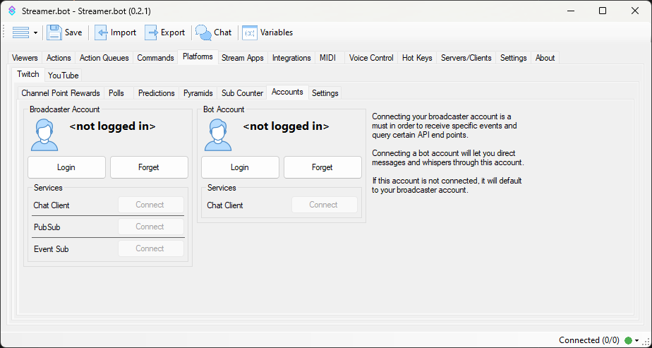

## Channel Point Rewards
::callout{icon=i-mdi-navigation}
Navigate to **Platforms > Twitch > Channel Point Rewards**
::
:wip

## Polls
::callout{icon=i-mdi-navigation}
Navigate to **Platforms > Twitch > Polls**
::
:wip

## Predictions
::callout{icon=i-mdi-navigation}
Navigate to **Platforms > Twitch > Predictions**
::
:wip

## Pyramids
::callout{icon=i-mdi-navigation}
Navigate to **Platforms > Twitch > Pyramids**
::
:wip

## Accounts
Connect your Twitch account to Streamer.bot

::callout{icon=i-mdi-navigation}
Navigate to **Platforms > Twitch > Accounts**
::

### Broadcaster Account
The `Broadcaster Account` is your primary Twitch account where you host your stream. This connection is **required** for Streamer.bot to monitor your chat and receive Twitch events.

1. Press `Login` to launch the Twitch OAuth screen
2. Review all permissions granted to Streamer.bot and allow access

::callout{icon=i-mdi-check color=green}
Streamer.bot will automatically connect to this account on startup.
::

### Bot Account
The `Bot Account` is an **optional** second connection if you wish to send chat messages from another account.

1. Press `Login` to launch the Twitch OAuth screen
2. Review all permissions granted to Streamer.bot and allow access

::callout{icon=i-mdi-alert color=amber}
The `Bot Account` has limited permission scope and can only send chat messages or whispers.
::

## Settings
::callout{icon=i-mdi-navigation}
Navigate to **Platforms > Twitch > Settings**
::
:wip