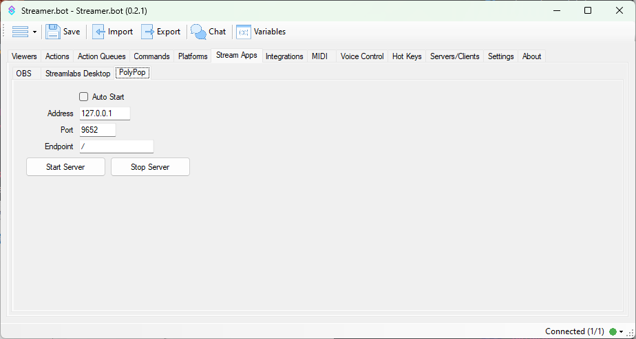

PolyPop integration is made possible via the community-made Websocket plugin available here:

::card-group
  ::card{title="PolyPop WebSocket Plugin" icon=i-mdi-github to=https://github.com/Jabbey92/PolyPopWebsocketPlugin/releases/tag/1.0 target=_blank rel=noopener}
  Enable control of PolyPop via WebSockets
  ::
::

---

::callout{icon=i-mdi-navigation}
Navigate to **Stream Apps > PolyPop**
::

## Configuration
::field-group
  ::field{name="Auto Start" type=Toggle}
  Automatically connect to PolyPop when Streamer.bot starts up
  ::

  ::field{name=Address type=Text required default="127.0.0.1"}
  Enter the host address of your PolyPop Websocket Plugin

  - Default: `127.0.0.1`
  ::

  ::field{name=Port type=Number required default="9652"}
  - Default: `9652`
  ::

  ::field{name=Endpoint type=Text required default="/"}
  - Default: `/`
  ::
::

## Usage
::callout{icon=i-mdi-bookmark color=green to=/api/sub-actions/broadcasters/polypop/trigger-alert}
Explore all **PolyPop sub-actions** and their variables at [API References > Sub-Actions > PolyPop](/api/sub-actions/broadcasters/polypop/trigger-alert)
::