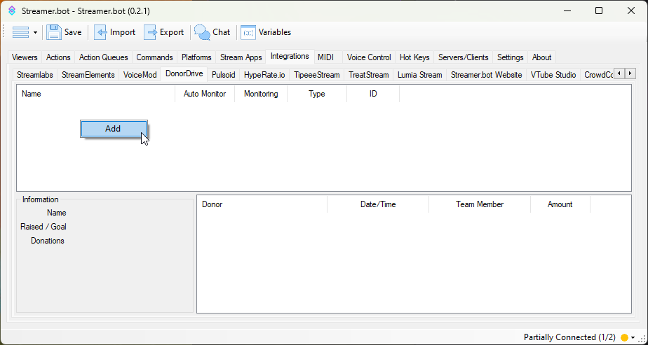
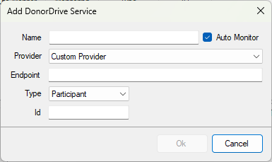

Integrate Streamer.bot with [DonorDrive](https://donordrive.com)

## Configuration
::callout{icon=i-mdi-navigation}
Navigate to **Integrations > DonorDrive**
::

1. <kbd>Right-Click</kbd> anywhere in the panel and select `Add`

1. Enter a name for this DonorDrive service
2. Select a charity provider, or enter a custom API endpoint

::wip
Remaining setup documentation needed
::

## Usage

::callout{icon=i-mdi-bookmark color=green to=/api/triggers/integrations/donordrive/donation}
Explore the [DonorDrive Triggers](/api/triggers/integrations/donordrive/donation) API references
::