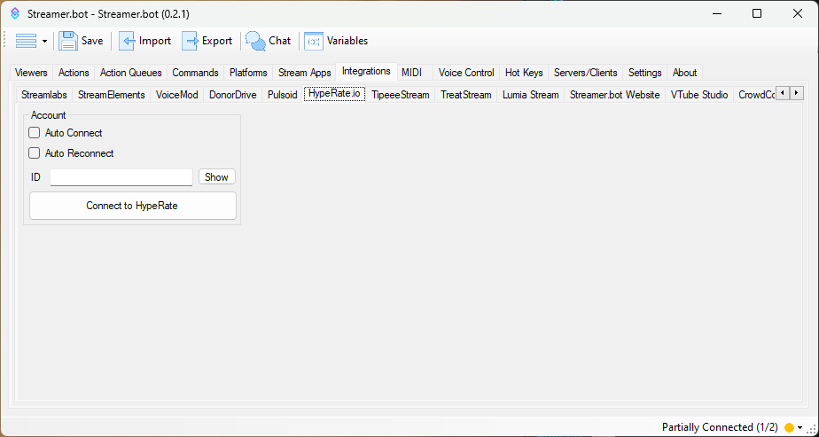

Receive heart rate events from [HypeRate.io](https://hyperate.io){target=_blank}

## Configuration

::callout{icon=i-mdi-navigation}
Navigate to **Integrations > HypeRate.io**
::

### `ID`
Enter your HypeRate.io ID

::callout{icon=i-mdi-lightbulb color=amber}
You can enter `internal-testing` in this field to have fake testing data sent to Streamer.bot
::

### `Auto Connect`
Enable to automatically connect to HypeRate.io when Streamer.bot starts up

### `Auto Reconnect`
Enable to automatically reconnect to HypeRate.io when the connection is disrupted

## Usage
::callout{icon=i-mdi-bookmark color=green to=/api/triggers/integrations/hyperate/heart-rate-pulse}
Explore the [HypeRate Triggers](/api/triggers/integrations/hyperate/heart-rate-pulse) API references
::