## Global

The keyboard shortcut listed below can be used anywhere within the UI and do not require you to click within a certain region.

 * <kbd>F1</kbd> - Open docs site
 * <kbd>Ctrl</kbd> + <kbd>S</kbd> - Save Settings
 * <kbd>Ctrl</kbd> + <kbd>Alt</kbd> + <kbd>I</kbd> - Open Import Window
 * <kbd>Ctrl</kbd> + <kbd>Alt</kbd> + <kbd>E</kbd> - Open Export Window
 * <kbd>Ctrl</kbd> + <kbd>Alt</kbd> + <kbd>C</kbd> - Open Chat Window
 * <kbd>Ctrl</kbd> + <kbd>Alt</kbd> + <kbd>V</kbd> - Open Global Variables Window
 * <kbd>Ctrl</kbd> + <kbd>Alt</kbd> + <kbd>L</kbd> - Open Log Folder
  * <kbd>Ctrl</kbd> + <kbd>V</kbd> - Paste, depending on contents of clipboard will paste triggers, actions, sub-action group
   
## Actions Tab

The keyboard shortcuts listed below are broken into different sections, based on which area of the UI is "in focus" (meaning that is the section that you are actively working in).
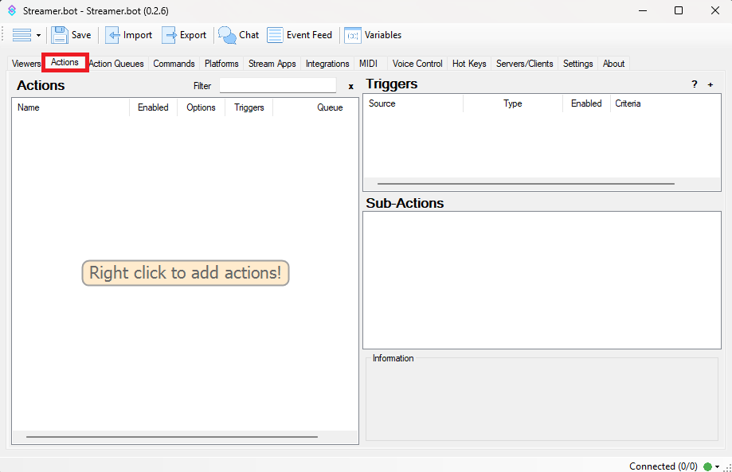

### Sub-Actions

While the `Sub-Actions` Section is "in focus" (depcited in the image), you will have access to the following shortcut keys.
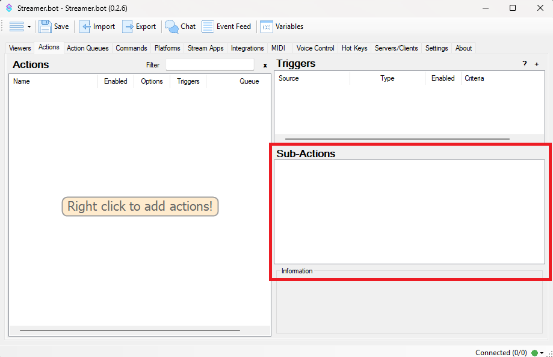

 * <kbd>Delete</kbd> - Delete Sub-Action
 * <kbd>Ctrl</kbd> + <kbd>D</kbd> - Duplicate Sub-Action
 * <kbd>Ctrl</kbd> + <kbd>C</kbd> - Copy Sub-Action
 * <kbd>Ctrl</kbd> + <kbd>O</kbd> - Toggle Sub-Action Enabled
 * <kbd>Ctrl</kbd> + <kbd>R</kbd> - Rename Group
 * <kbd>Ctrl</kbd> + <kbd>Up</kbd> - Move Sub-Action Up
 * <kbd>Ctrl</kbd> + <kbd>Down</kbd> - Move Sub-Action Down
 * <kbd>Ctrl</kbd> + <kbd>Home</kbd> - Move Sub-Action to Top
 * <kbd>Ctrl</kbd> + <kbd>End</kbd> - Move Sub-Action to Bottom
   
### Actions

While the `Actions` Section is "in focus" (depcited in the image), you will have access to the following shortcut keys.
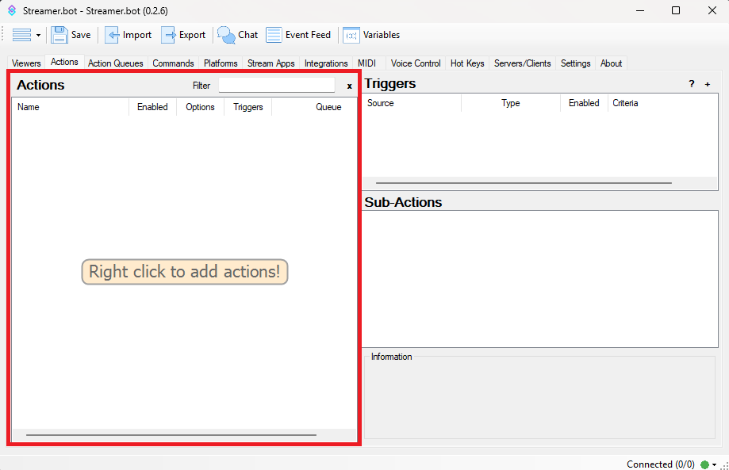

 * <kbd>Delete</kbd> - Delete Action
 * <kbd>Ctrl</kbd> + <kbd>D</kbd> - Duplicate Action
 * <kbd>Ctrl</kbd> + <kbd>C</kbd> - Copy Action
 * <kbd>Ctrl</kbd> + <kbd>O</kbd> - Toggle Action Enabled

#### With Multiple Selected
 * <kbd>Delete</kbd> - Delete Multiple Actions

### Triggers

While the `Triggers` Section is "in focus" (depcited in the image), you will have access to the following shortcut keys.
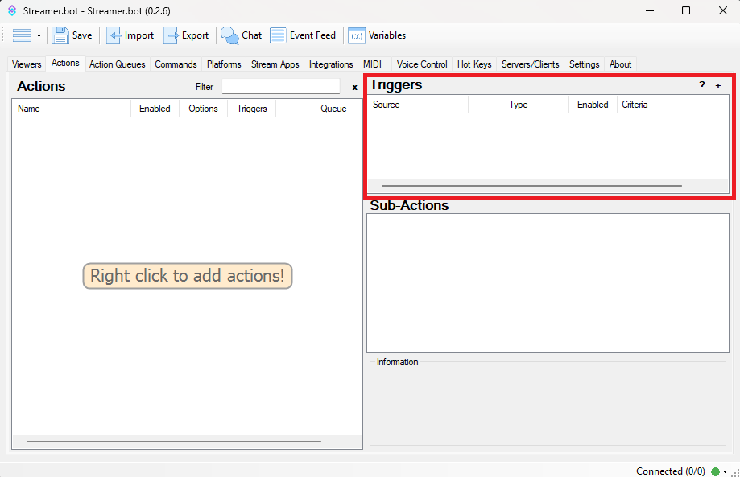

 * <kbd>F5</kbd> - Test Trigger
 * <kbd>Ctrl</kbd> + <kbd>O</kbd> - Toggle Trigger Enabled

#### With Multiple Selected
 * <kbd>Delete</kbd> - Delete Multiple Triggers
 * <kbd>Ctrl</kbd> + <kbd>C</kbd> - Copy Multiple Triggers
   
## Commands Tab

While working in the `Commands` tab, the following keyboard shortcuts are available
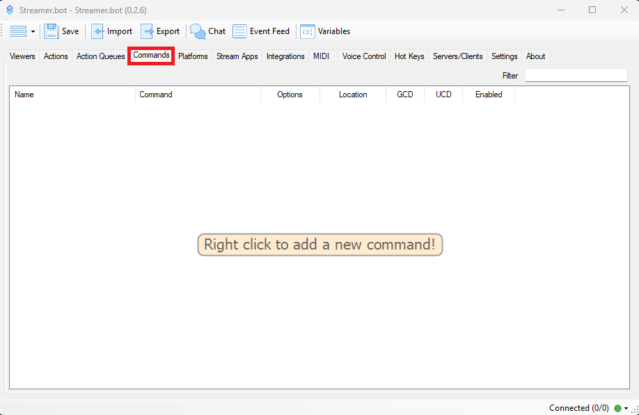

 * <kbd>Delete</kbd> - Delete Command
 * <kbd>Ctrl</kbd> + <kbd>R</kbd> - Rename Group
 * <kbd>Ctrl</kbd> + <kbd>C</kbd> - Copy Command Id
 * <kbd>Ctrl</kbd> + <kbd>*</kbd> - Expand All
 * <kbd>Ctrl</kbd> + <kbd>-</kbd> - Collapse All
 * <kbd>Ctrl</kbd> + <kbd>O</kbd> - Toggle Command Enabled
   
### Timers

While working in the `Timers` tab, the following keyboard shortcuts are available

::callout{icon=i-mdi-alert color=amber}
To navigate to the `Timers` tab, you must first click on the `Settings` tab.
::

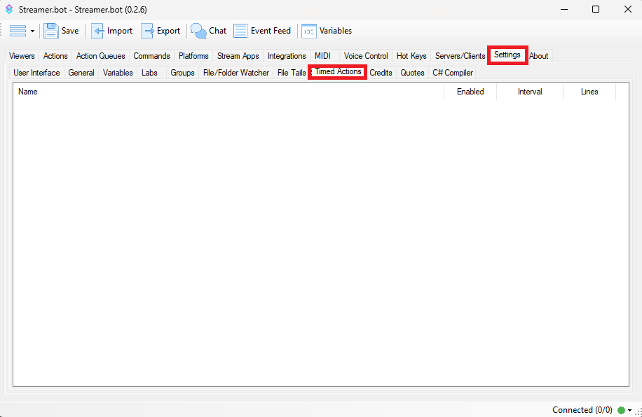

 * <kbd>Delete</kbd> - Delete Timer
 * <kbd>Ctrl</kbd> + <kbd>O</kbd> - Toggle Timer Enabled

## MIDI Tab

The keyboard shortcuts listed below are broken into different sections, based on which area of the UI is "in focus" (meaning that is the section that you are actively working in).

### Midi In Devices

While the `MIDI In - Devices` Section is "in focus" (depcited in the image), you will have access to the following shortcut key.
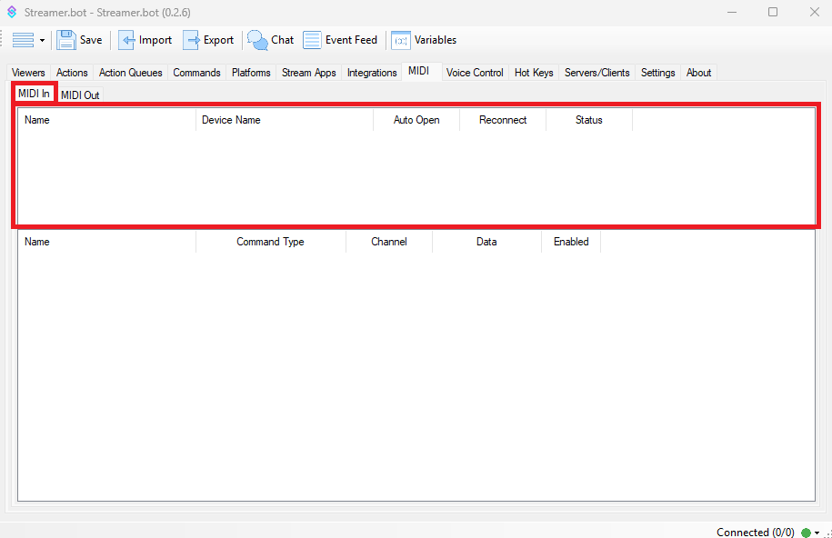

 * <kbd>Delete</kbd> - Delete Midi In Device

#### Midi In Device Events

While the `MIDI In - Device Events` Section is "in focus" (depcited in the image), you will have access to the following shortcut keys.
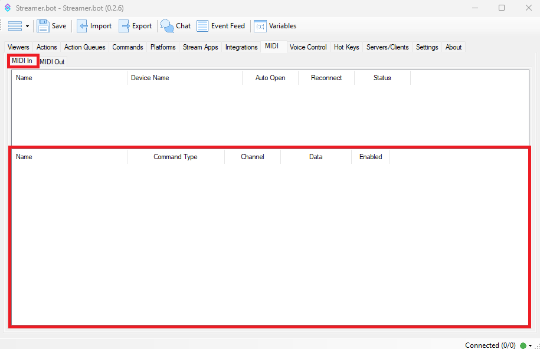

 * <kbd>Delete</kbd> - Delete Midi In Device Event
 * <kbd>Ctrl</kbd> + <kbd>O</kbd> - Toggle Midi In Device Event Enabled

#### Midi Out Devices

While the `MIDI Out - Devices` Section is "in focus" (depcited in the image), you will have access to the following shortcut key.
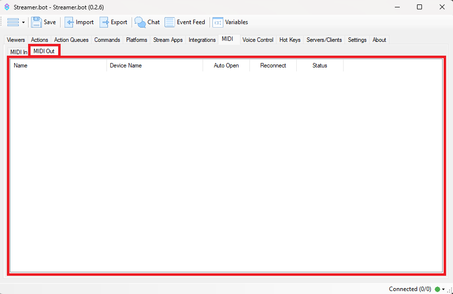

 * <kbd>Delete</kbd> - Delete Midi Out Device

### Speech Commands

While working in the `Speech Commands` tab, the following keyboard shortcuts are available

::callout{icon=i-mdi-alert color=amber}
To navigate to the `Speech Commands` tab, you must first click on the `Voice Control` tab.
::

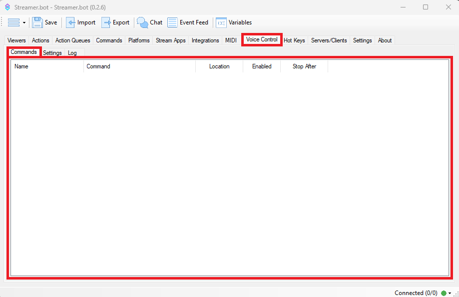

 * <kbd>Delete</kbd> - Delete Speech Command
 * <kbd>Ctrl</kbd> + <kbd>Up</kbd> - Move Speech Command Up
 * <kbd>Ctrl</kbd> + <kbd>Down</kbd> - Move Speech Command Down
 * <kbd>Ctrl</kbd> + <kbd>Home</kbd> - Move Speech Command to Top
 * <kbd>Ctrl</kbd> + <kbd>End</kbd> - Move Speech Command to Bottom

### Quotes

While working in the `Quotes` tab, the following keyboard shortcut is available

::callout{icon=i-mdi-alert color=amber}
To navigate to the `Quotes` tab, you must first click on the `Settings` tab.
::

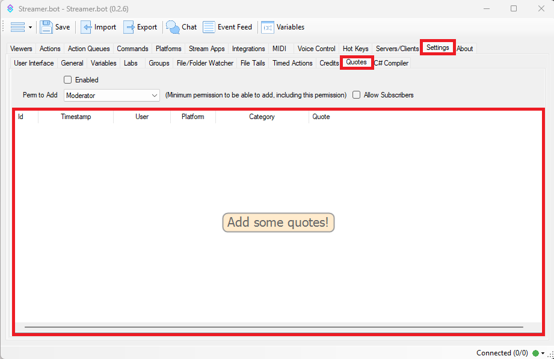

 * <kbd>Delete</kbd> - Delete Quote

### Twitch Channel Rewards

While working in the `Channel Point Rewards` tab, the following keyboard shortcuts are available

::callout{icon=i-mdi-alert color=amber}
To navigate to the `Channel Point Rewards` tab, you must first click on the `Platforms` tab, and then the `Twitch` tab.
::

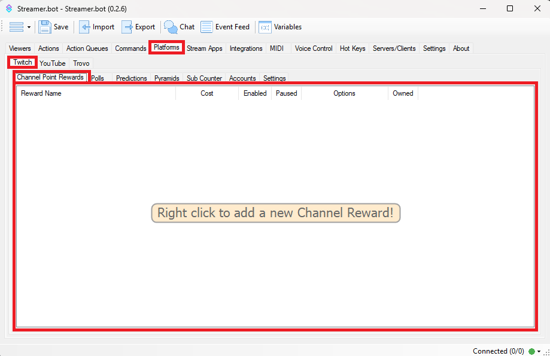

 * <kbd>Delete</kbd> - Delete Twitch Channel Reward
 * <kbd>Ctrl</kbd> + <kbd>A</kbd> - Add Twitch Channel Reward
 * <kbd>Ctrl</kbd> + <kbd>D</kbd> - Duplicate Twitch Channel Reward
 * <kbd>Ctrl</kbd> + <kbd>O</kbd> - Toggle Twitch Channel Reward Enabled

## Hot Keys Tab

While working in the `Hot Keys` tab, the following keyboard shortcut is available

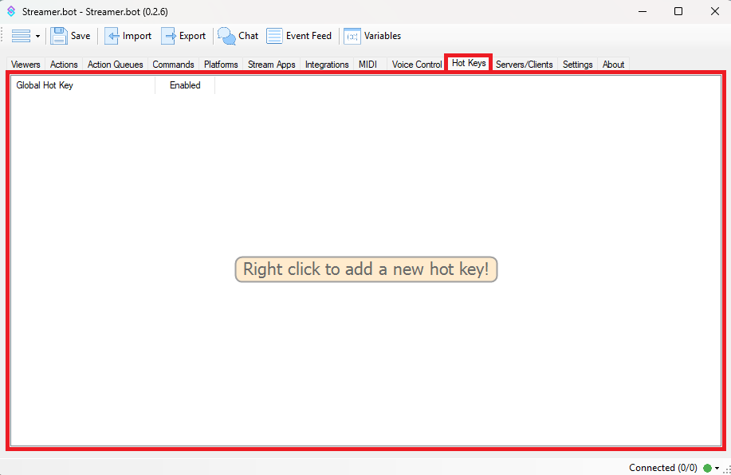

 * <kbd>Delete</kbd> - Delete Hot Key
