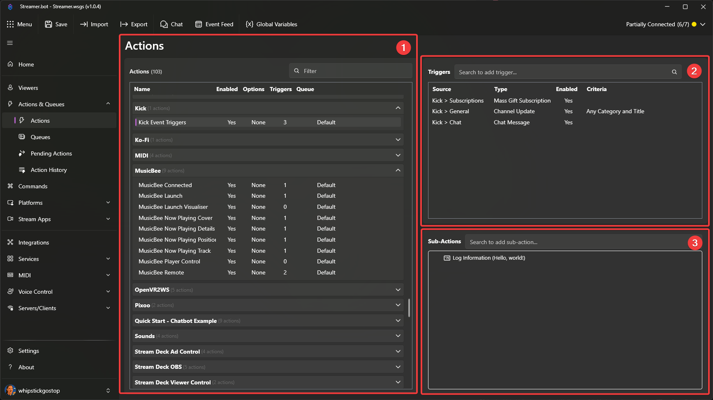
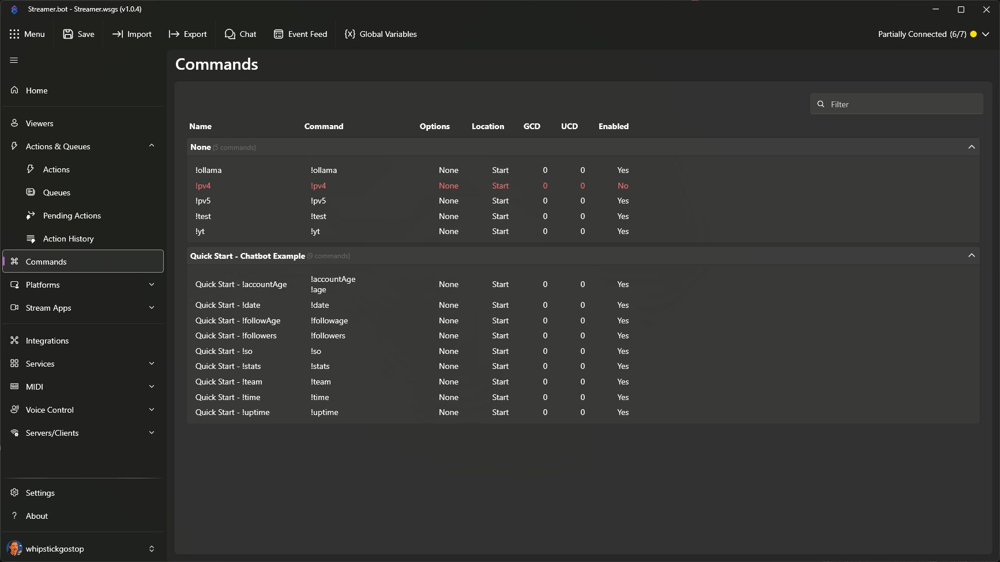
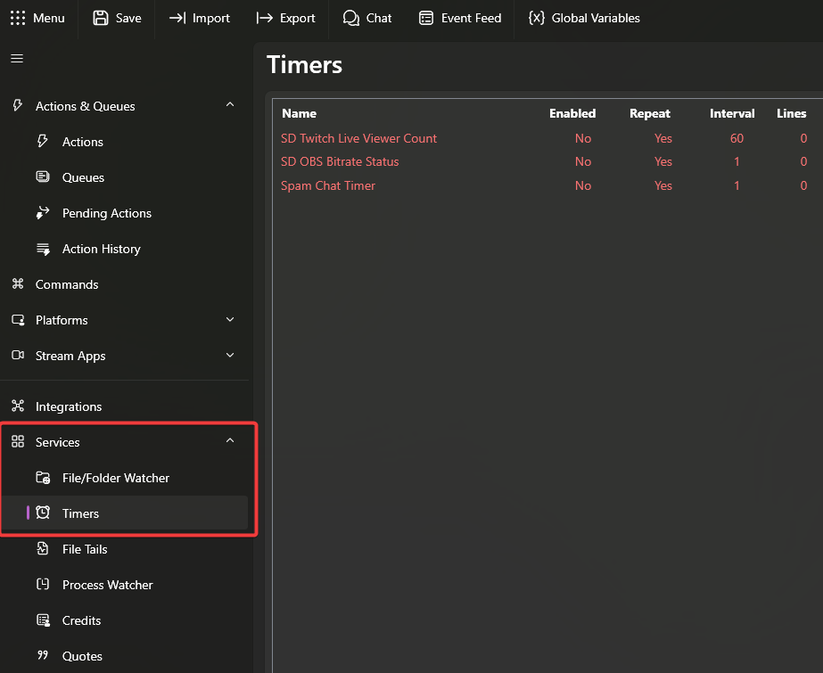
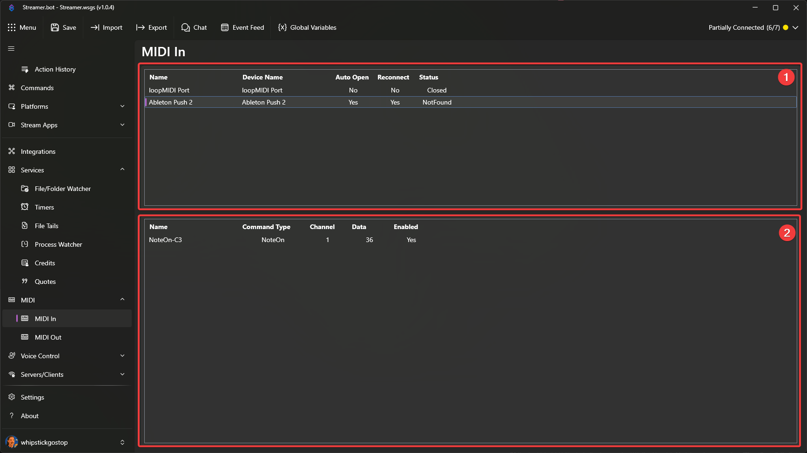
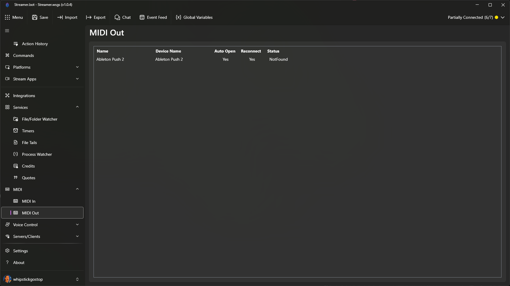

## Global

::note
The global shortcuts listed below can be used from **anywhere within the Streamer.bot application**
::

| Shortcut                                                 | Description                                                                              |
| -------------------------------------------------------- | ---------------------------------------------------------------------------------------- |
| :kbd{value="F1"}                                         | Open docs web page                                                                       |
| :kbd{value="meta"} + :kbd{value="S"}                     | Save Settings                                                                            |
| :kbd{value="meta"} + :kbd{value="Alt"} + :kbd{value="I"} | Open Import Window                                                                       |
| :kbd{value="meta"} + :kbd{value="Alt"} + :kbd{value="E"} | Open Export Window                                                                       |
| :kbd{value="meta"} + :kbd{value="Alt"} + :kbd{value="C"} | Open Chat Window                                                                         |
| :kbd{value="meta"} + :kbd{value="Alt"} + :kbd{value="V"} | Open Global Variables Window                                                             |
| :kbd{value="meta"} + :kbd{value="Alt"} + :kbd{value="L"} | Open Log Folder                                                                          |
| :kbd{value="meta"} + :kbd{value="V"}                     | Paste, depending on contents of clipboard will paste triggers, actions, sub-action group |

## Actions View

::note
All shortcuts listed below are broken into different sections, based on which area of the UI is "in focus" (meaning that is the section that you are actively working in).
::

::steps{level=3}

### Actions

While the `Actions` area is "in focus" (section `1` in the image above), you will have access to the following shortcut keys:

| Shortcut                             | Description           |
| ------------------------------------ | --------------------- |
| :kbd{value="Delete"}                 | Delete Action         |
| :kbd{value="meta"} + :kbd{value="D"} | Duplicate Action      |
| :kbd{value="meta"} + :kbd{value="C"} | Copy Action           |
| :kbd{value="meta"} + :kbd{value="O"} | Toggle Action Enabled |

#### With Multiple Selected

| Shortcut             | Description             |
| -------------------- | ----------------------- |
| :kbd{value="Delete"} | Delete Multiple Actions |

### Sub-Actions

While the `Sub-Actions` Section is "in focus" (section `2` in the image above), you will have access to the following shortcut keys:

| Shortcut                                | Description               |
| --------------------------------------- | ------------------------- |
| :kbd{value="Delete"}                    | Delete Sub-Action         |
| :kbd{value="meta"} + :kbd{value="D"}    | Duplicate Sub-Action      |
| :kbd{value="meta"} + :kbd{value="C"}    | Copy Sub-Action           |
| :kbd{value="meta"} + :kbd{value="O"}    | Toggle Sub-Action Enabled |
| :kbd{value="meta"} + :kbd{value="R"}    | Rename Group              |
| :kbd{value="meta"} + :kbd{value="Up"}   | Move Sub-Action Up        |
| :kbd{value="meta"} + :kbd{value="Down"} | Move Sub-Action Down      |
| :kbd{value="meta"} + :kbd{value="Home"} | Move Sub-Action to Top    |
| :kbd{value="meta"} + :kbd{value="End"}  | Move Sub-Action to Bottom |

### Triggers

While the `Triggers` Section is "in focus" (section `3` in the image above), you will have access to the following shortcut keys:

| Shortcut                             | Description            |
| ------------------------------------ | ---------------------- |
| :kbd{value="F5"}                     | Test Trigger           |
| :kbd{value="meta"} + :kbd{value="O"} | Toggle Trigger Enabled |

#### With Multiple Selected

| Shortcut                             | Description              |
| ------------------------------------ | ------------------------ |
| :kbd{value="Delete"}                 | Delete Multiple Triggers |
| :kbd{value="meta"} + :kbd{value="C"} | Copy Multiple Triggers   |

::

## Commands View

While working in the `Commands` view, the following keyboard shortcuts are available:

| Shortcut                              | Description            |
| ------------------------------------- | ---------------------- |
| :kbd{value="Delete"}                  | Delete Command         |
| :kbd{value="meta"} + :kbd{value="R"}  | Rename Group           |
| :kbd{value="meta"} + :kbd{value="C"}  | Copy Command Id        |
| :kbd{value="meta"} + :kbd{value="\*"} | Expand All             |
| :kbd{value="meta"} + :kbd{value="-"}  | Collapse All           |
| :kbd{value="meta"} + :kbd{value="O"}  | Toggle Command Enabled |

## Timers View

While working in the `Timers` view, the following keyboard shortcuts are available:

| Shortcut                             | Description          |
| ------------------------------------ | -------------------- |
| :kbd{value="Delete"}                 | Delete Timer         |
| :kbd{value="meta"} + :kbd{value="O"} | Toggle Timer Enabled |

## MIDI Views

### MIDI In

::note
The keyboard shortcuts listed below are broken into different sections, based on which area of the UI is "in focus" (meaning that is the section that you are actively working in).
::

::steps{level=4}

#### Devices

While the `MIDI In - Devices` Section is "in focus" (labeled `1` in the image above), you will have access to the following shortcut key.

| Shortcut             | Description           |
| -------------------- | --------------------- |
| :kbd{value="Delete"} | Delete Midi In Device |

#### Events

While the `MIDI In - Device Events` Section is "in focus" (labeled `2` in the image above), you will have access to the following shortcut keys.

| Shortcut                             | Description                         |
| ------------------------------------ | ----------------------------------- |
| :kbd{value="Delete"}                 | Delete Midi In Device Event         |
| :kbd{value="meta"} + :kbd{value="O"} | Toggle Midi In Device Event Enabled |

::

### MIDI Out

While the `MIDI Out - Devices` Section is "in focus" (depcited in the image), you will have access to the following shortcut key.

| Shortcut             | Description            |
| -------------------- | ---------------------- |
| :kbd{value="Delete"} | Delete Midi Out Device |

## Voice Control Commands

::navigate
Navigate to **Voice Control > Commaands** in Streamer.bot
::

While working in the `Voice Control > Commands` view, the following keyboard shortcuts are available:

| Shortcut                                | Description                   |
| --------------------------------------- | ----------------------------- |
| :kbd{value="Delete"}                    | Delete Speech Command         |
| :kbd{value="meta"} + :kbd{value="Up"}   | Move Speech Command Up        |
| :kbd{value="meta"} + :kbd{value="Down"} | Move Speech Command Down      |
| :kbd{value="meta"} + :kbd{value="Home"} | Move Speech Command to Top    |
| :kbd{value="meta"} + :kbd{value="End"}  | Move Speech Command to Bottom |

## Quotes

::navigate
Navigate to **Services > Quotes** in Streamer.bot
::

While working in the `Quotes` view, the following keyboard shortcut is available:

| Shortcut             | Description  |
| -------------------- | ------------ |
| :kbd{value="Delete"} | Delete Quote |

## Twitch Channel Point Rewards

::navigate
Navigate to **Platforms > Twitch > Channel Point Rewards** in Streamer.bot
::

While working in the `Channel Point Rewards` tab, the following keyboard shortcuts are available:

| Shortcut                             | Description                          |
| ------------------------------------ | ------------------------------------ |
| :kbd{value="Delete"}                 | Delete Twitch Channel Reward         |
| :kbd{value="meta"} + :kbd{value="A"} | Add Twitch Channel Reward            |
| :kbd{value="meta"} + :kbd{value="D"} | Duplicate Twitch Channel Reward      |
| :kbd{value="meta"} + :kbd{value="O"} | Toggle Twitch Channel Reward Enabled |
