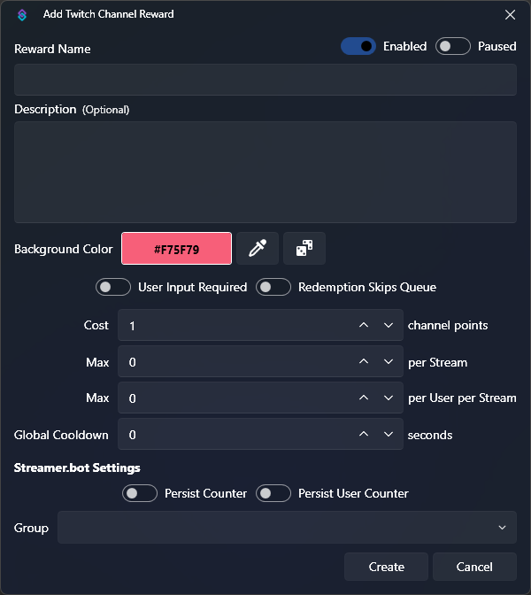
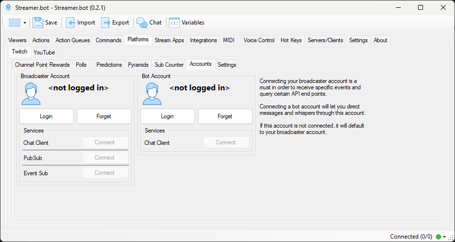

## Channel Point Rewards
Streamer.bot can automatically execute your actions when a Channel Point Reward is redeemed by a user.

When the Broadcaster account is connected, Streamer.bot will automatically pull a list of currently configured rewards from the account, making them immediately available as [Reward Redemption](/api/triggers/twitch/channel-reward/reward-redemption) triggers.

You can also `Add` or `Delete` rewards directly from Streamer.bot, with all changes immediately reflected on Twitch.

::callout{icon=i-mdi-alert color=amber}
**It is highly recommended to recreate your existing rewards through Streamer.bot**  
:icon{name=i-mdi-chevron-right} This grants reward ownership to your bot, which is required to enable all functionality.
::

### Configuration
::callout{icon=i-mdi-navigation}
In Streamer.bot, navigate to **Platforms > Twitch > Channel Point Rewards**
::

To create a new Channel Point Reward, :shortcut{value="Right-Click"} anywhere in the rewards pane and select `Add`

::field-group
  ::field{name=Title type="Text" required}
  The name of this reward on Twitch
  ::

  ::field{name=Enabled type=Toggle}
  Toggle reward as enabled or disabled
  - A disabled reward cannot be redeemed and will not be visible on Twitch
  ::

  ::field{name=Paused type=Toggle}
  Toggle reward paused state
  - A paused reward will not trigger a redemption, but is still visible on Twitch if `Enabled`
  ::

  ::field{name=Cost type=Number required}
  The number of channel points needed to redeem this reward
  ::

  ::field{name="User Input Required" type=Toggle}
  Require user input when redeemed on Twitch
  - User input can be read by your sub-actions with the `%rawInput%` variable
  ::

  ::field{name=Prompt type=Text}
  Enter the text prompt shown to the user when `User Input Required` is enabled
  ::

  ::field{name="Background Color" type=Color required}
  Select the color for the redemption button on Twitch
  ::

  ::field{name="Redemption Skips Queue" type=Toggle}
  Tells the executed action to ignore the `Blocking` flag on its [action queue](/guide/actions#action-queues)
  ::

  ::field{name="Max # per stream" type=Number}
  Limit total redemptions for this reward, per stream
  - Set to `0` for no limit
  ::

  ::field{name="Max # per user, per stream" type=Number}
  Limit user redemptions for this reward, per stream
  - Set to `0` for no limit
  ::

  ::field{name="Global Cooldown" type=Number}
  Define the minimum time, in seconds, before this reward can be redeemed again
  ::

  ::field{name="Persist Counter" type=Toggle}
  Persist the total redemption counter for this reward across restarts of Streamer.bot
  - Variable `%counter%`
  ::

  ::field{name="Persist per User Counter" type=Toggle}
  Persist the user redemption counters for this reward across restarts of Streamer.bot
  - Variable `%userCounter%`
  ::

  ::field{name="Group" type="Combobox"}
  Select or enter a group for this reward in the Streamer.bot UI
  ::
::

### Context Menu
:shortcut{value="Right-Click"} any existing device to reveal the context menu options:

::field-group
  ::field{name=Add}
  Add a new channel point reward, opening the [configuration](#configuration) dialog outlined above
  ::

  ::field{name=Edit}
  Edit the selected channel point reward, opening the [configuration](#configuration) dialog outlined above
  ::

  ::field{name="Delete from Streamer.bot"}
  Delete the selected channel point reward from Streamer.bot
  - This option only appears on rewards that **are not owned** by Streamer.bot and **will not** affect the reward on Twitch
  ::

  ::field{name="Delete from Twitch"}
  Delete the selected channel point reward from Streamer.bot **and** Twitch
  - This option only appears on rewards that **are owned** by Streamer.bot and **will** affect the reward on Twitch
  ::

  ::field{name=Duplicate}
  Duplicate the selected channel point reward
  ::

  ::field{name="Rename Group"}
  Rename the group of the selected channel point reward
  ::

  ::field{name=Group type="Select"}
  Move the selected channel point reward to a new group
  ::

  ::field{name="Enable" type="Toggle"}
  Quickly toggle the `Enabled` state of the selected channel point reward
  ::

  ::field{name="Pause" type=Toggle}
  Quickly toggle the `Paused` state of the selected channel point reward
  ::

  ::field{name="Sub Only" type=Toggle}
  Quickly toggle the `Sub Only` state of the selected channel point reward
  ::

  ::field{name="Persist Counter" type=Toggle}
  Quickly toggle the `Persist Counter` option of the selected channel point reward
  ::

  ::field{name="Persist User Counter" type=Toggle}
  Quickly toggle the `Persist User Counter` option of the selected channel point reward
  ::

  ::field{name="Copy Reward ID"}
  Copy the UUID of the selected reward to your clipboard
  ::
::

### Usage
Your configured channel point rewards will be available as [triggers](/guide/triggers) to execute your actions in Streamer.bot

::callout{icon=i-mdi-bookmark color=green to=/api/triggers/twitch/channel-reward/reward-redemption}
Explore the [Reward Redemption](#) trigger API Reference
::

## Polls
::callout{icon=i-mdi-navigation}
Navigate to **Platforms > Twitch > Polls**
::
:wip

## Predictions
::callout{icon=i-mdi-navigation}
Navigate to **Platforms > Twitch > Predictions**
::
:wip

## Pyramids
::callout{icon=i-mdi-navigation}
Navigate to **Platforms > Twitch > Pyramids**
::
:wip

## Accounts
Connect your Twitch account to Streamer.bot

::callout{icon=i-mdi-navigation}
Navigate to **Platforms > Twitch > Accounts**
::

### Broadcaster Account
The `Broadcaster Account` is your primary Twitch account where you host your stream. This connection is **required** for Streamer.bot to monitor your chat and receive Twitch events.

1. Press `Login` to launch the Twitch OAuth screen
2. Review all permissions granted to Streamer.bot and allow access

::callout{icon=i-mdi-check color=green}
Streamer.bot will automatically connect to this account on startup.
::

### Bot Account
The `Bot Account` is an **optional** second connection if you wish to send chat messages from another account.

1. Press `Login` to launch the Twitch OAuth screen
2. Review all permissions granted to Streamer.bot and allow access

::callout{icon=i-mdi-alert color=amber}
The `Bot Account` has limited permission scope and can only send chat messages or whispers.
::

## Settings
::callout{icon=i-mdi-navigation}
Navigate to **Platforms > Twitch > Settings**
::
:wip