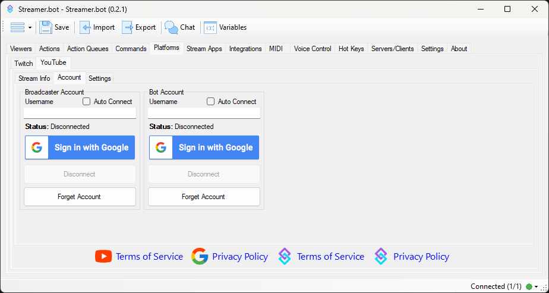

:api-reference-cards{path=youtube}

## Stream Info
View & modify attributes of your live YouTube broadcast

::navigate
Navigate to **Platforms > YouTube > Stream Info**
::

::field-group
  ::field{name=Title type=Text required}
  Modify the title of your YouTube broadcast
  ::

  ::field{name=Description type=Text}
  Modify the description of your YouTube broadcast
  ::

  ::field{name=Privacy type=Select}
  Modify the public status of your YouTube broadcast
  ::
::

## Accounts
Connect your YouTube account with Streamer.bot

::navigate
Navigate to **Platforms > YouTube > Accounts**
::

If asked, you must click `I Agree` to continue to the YouTube configuration screen.

### Broadcaster Account
The `Broadcaster Account` is your primary YouTube account where you host your stream. This connection is **required** for Streamer.bot to monitor your chat and receive YouTube events.

1. Click `Sign in with Google` to launch the Google OAuth screen
2. Review all permissions granted to Streamer.bot and allow access
3. Enable `Auto Connect` to automatically connect to your YouTube account when Streamer.bot starts up

::warning
**The username field is read-only**. Your authenticated username will display here once you have signed in.
::

::warning
**If you stream from a brand account:** the proper permissions will not be granted if you select the brand account on the first screen.
You must first sign in to the primary YouTube account which has **ownership** of the brand account.
You will then be able to select from owned brand accounts on the following screen.
::

### Bot Account
The `Bot Account` is an **optional** second connection if you wish to send chat messages from another account.

1. Click `Sign in with Google` to launch the Google OAuth screen
2. Review all permissions granted to Streamer.bot and allow access
3. Enable `Auto Connect` to automatically connect to your YouTube account when Streamer.bot starts up

## Settings
::navigate
Navigate to **Platforms > YouTube > Settings**
::

::field-group
  ::field{name="First Words Reset Cache" type=Number}
  Resets first words detection after the entered number of hours
  - You can also click `Reset` to immediately clear the first words cache
  ::

  ::field{name="Present Viewers" type=Slider}
  Modify the interval, in minutes, at which YouTube present viewers are updated
  - Executes the [YouTube Present Viewers Trigger](/api/triggers/youtube/general/present-viewers)
  ::
::