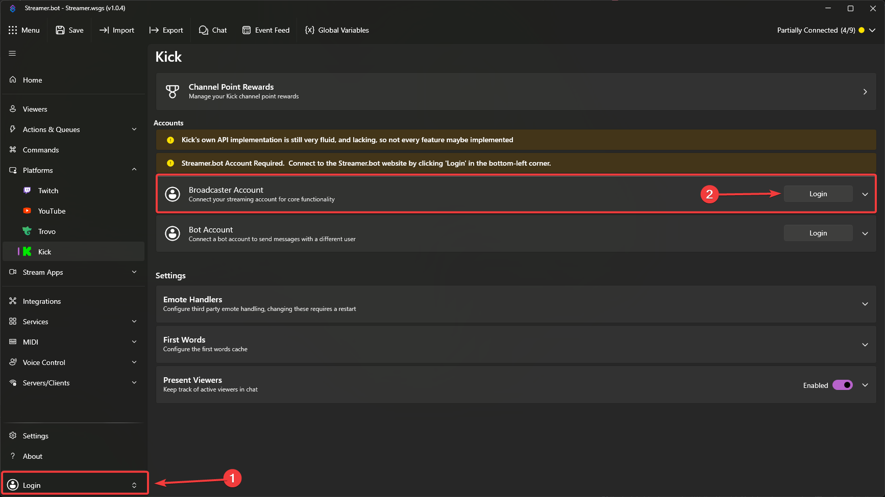
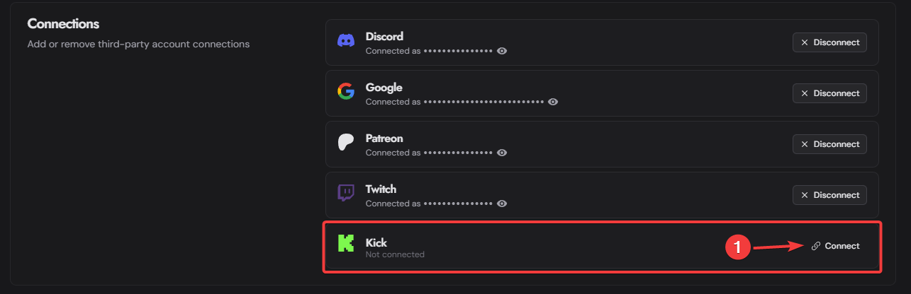

::read-more{to=/guide/integrations/streamerbot}
The Kick integration requires the [Streamer.bot Website Integration](/guide/integrations/streamerbot)
::

The [Kick API](https://docs.kick.com) delivers events via **webhooks**, which are forwarded to Streamer.bot through the [Streamer.bot Website Integration](/guide/integrations/streamerbot).

This allows for real-time triggers based on Kick events such as new followers, subscriptions, and more.

## Initial Setup

::warning
**Due to the webhook nature of the Kick API**, the setup process for Kick is different than other platforms, and requires a few additional steps to connect your Kick account to Streamer.bot.
::

Follow the instructions below to get started!

 

::steps{depth=3}

### Login to Streamer.bot

:::navigate
In Streamer.bot, ensure you are signed in at the **bottom-left of the application**
:::

This ensures your Streamer.bot instance is connected to the [Streamer.bot Website Integration](/guide/integrations/streamerbot), which is required to receive events from Kick.

### Configure Broadcaster Account

:::navigate
In Streamer.bot, navigate to **Platforms > Kick**
:::

1. Next to `Broadcaster Account`, click `Login` to launch the Kick OAuth screen
2. Review all permissions granted to Streamer.bot and allow access
   ::warning
   Streamer.bot requires all requested permissions to properly integrate with Kick.
    
   **If you deny any permissions, the integration may not work correctly.**
   ::

### Configure the Website Integration

:::navigate{to=https://streamer.bot/user/settings target=\_blank rel=noopener}
In your web browser, navigate to your [Account Settings](https://streamer.bot/user/settings) on the Streamer.bot website
:::

In the `Connections` section, connect your Streamer.bot account to the **same Kick account you used in Step 2 above**, by clicking `Connect`:

If it is connected successfully, you will instead see _"Connected as <your_kick_username>"_ with the option to disconnect:

:::success
**Your Kick account is now fully connected to Streamer.bot**, and you can start receiving Kick events!
:::

:::read-more{to="https://streamer.bot/user/integrations/kick" target=\_blank rel=noopener}
On the Streamer.bot Website, check the status of your Kick integration at [Account > Integrations > Kick](https://streamer.bot/user/integrations/kick)
:::

::

## Troubleshooting

If you are not receiving Kick events in Streamer.bot, please check the following:

- Ensure your Streamer.bot instance is online and signed into the Streamer.bot Website Integration
- Ensure your Kick account is connected in both Streamer.bot and the Streamer.bot Website Integration
- If you recently connected your Kick account, try restarting Streamer.bot to refresh the connection
- If you have not used the Kick integration for a while, try disconnecting and reconnecting your Kick account on the [Streamer.bot Website](https://streamer.bot/user/settings) to refresh the connection
- Check the [Kick Integration Status Page](https://streamer.bot/user/integrations/kick)
  - Ensure you are subscribed to events from Kick
  - Check the `Kick API Delay` to ensure that there are not currently any issues with the Kick API
