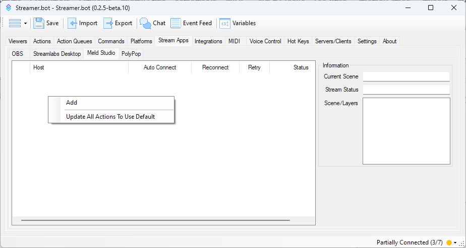
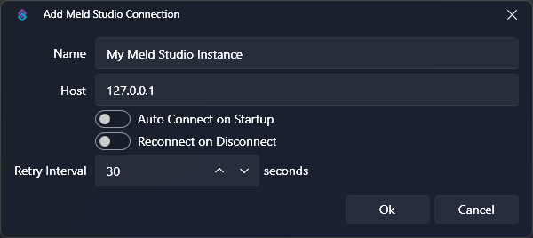

::warning{to=/get-started/setup#meld-studio}
You must enable **Allow remote connections** under Advanced. Check out the [Get Started Guide](/get-started/setup#meld-studio) for details.
::

::navigate
Navigate to **Stream Apps > Meld Studio** in Streamer.bot
::

{caption-alt}

## Configuration
To add a new connection, :kbd{value="Right-Click"} anyhere in the panel area and select `Add`:

{caption-alt}

Configuration options are outlined below:

::field-group
  ::field{name=Name type=Text required}
  Enter any name or label to describe this Meld Studio instance, e.g. `Local Meld Studio`
  ::

  ::field{name=Host type=Text required default="127.0.0.1"}
  Enter the host address of your PC

  If Meld Studio is running on the same machine as Streamer.bot, keep `127.0.0.1`

  For multi-pc setups you can configure this with another LAN IP address, e.g. `192.168.1.10`
  ::

  ::field{name="Auto Connect on Startup" type=Toggle}
  Automatically connect to this Meld Studio instance when Streamer.bot starts up
  ::

  ::field{name="Reconnect on Disconnect" type=Toggle}
  Automatically reconnect to this Meld Studio instance when the connection is disrupted
  ::

  ::field{name="Retry Interval" type=Number default=30}
  Change the interval of reconnection attempts when `Reconnect on Disconnect` is enabled
  ::
::

## Context Menu
:kbd{value="Right-Click"} on a configured connection to reveal the context menu:

::field-group
  ::field{name="Add" type=Action}
  Add a new Meld Studio connection
  ::

  ::field{name="Edit" type=Action}
  Edit the selected Meld Studio connection
  ::

  ::field{name="Delete" type=Action}
  Delete the selected Meld Studio connection
  ::

  ::field{name="Auto Connect" type=Toggle}
  Quickly toggle the `Auto Connect on Startup` configuration option for the selected connection
  ::

  ::field{name="Reconnect" type=Toggle}
  Quickly toggle the `Reconnect on Disconnect` configuration option for the selected connection
  ::

  ::field{name="Default" type=Toggle}
    Set this connection as the default when importing actions

    ::tip
    If no default is set, imported actions will default to the first connection in the list
    ::
  ::

  ::field{name="Force" type=Toggle}
    Temporarily override **all** Meld Studio connections to use the selected connection.

    ::warning
    This setting does **not** persist when you restart Streamer.bot
    ::
  ::

  ::field{name="Update All Actions To..." type=Action}
  Reconfigure all actions utilizing an Meld Studio connection to use the selected connection
  ::

  ::field{name="Connect" type=Action}
  Manually attempt to connect to the selected connection
  ::
::

## Status Panel
Selecting a connected Meld instance in the left panel will reveal additional realtime information about that instance on the right panel.

::field-group
  ::field{name="Current Scene" type=Text}
  Shows the name of the currently broadcasting scene on the selected connection
  ::

  ::field{name="Stream Status" type=Text}
  Shows the status of the current streaming and recording activity
  ::

  ::field{name="Scenes/Layers" type=List}
  Lists all layers present on the currently selected scene
  ::
::

## Usage
:api-reference-cards{path=meld-studio}