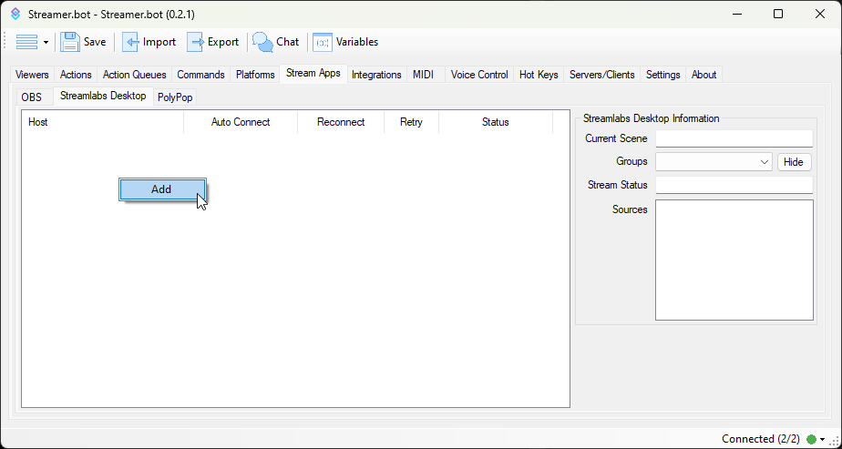

::navigate
Navigate to **Stream Apps > Streamlabs Desktop** in Streamer.bot
::

## Configuration
To add a new connection, <kbd>Right-Click</kbd> anyhere in the panel area and select `Add`:

::field-group
  ::field{name=Name type=Text required}
  Enter any name or label to describe this Streamlabs Desktop instance
  ::

  ::field{name=Host type=Text required default="127.0.0.1"}
  Enter the host address of your Streamlabs Desktop instance

  If Streamlabs is running on the same machine as Streamer.bot, keep `127.0.0.1`

  For multi-pc setups you can configure this with another LAN IP address, e.g. `192.168.1.10`
  ::

  ::field{name=Port type=Number required default=59650}
  Enter the port from your Streamlabs Desktop `Remote Control` settings
  - Default: `59650`
  ::

  ::field{name=Token type=Text required}
  Enter the token from your Streamlabs Desktop `Remote Control` settings
  ::

  ::field{name="Auto Connect on Startup" type=Toggle}
  Automatically connect to this Streamlabs Desktop instance when Streamer.bot starts up
  ::

  ::field{name="Reconnect on Disconnect" type=Toggle}
  Automatically reconnect to this Streamlabs Desktop instance when the connection is disrupted
  ::

  ::field{name="Retry Interval" type=Number default=30}
  Change the interval of reconnection attempts when `Reconnect on Disconnect` is enabled
  ::
::

## Status Panel
Selecting a connected Streamlabs instance in the left panel will reveal additional realtime information about that instance on the right panel:

#### `Current Scene`
Shows the name of the currently broadcasting scene on that connection

#### `Stream Status`
Shows the status of current streaming and recording activity

#### `Sources`
Lists all sources present on the currently selected scene

## Usage
:api-reference-cards{path=streamlabs-desktop}