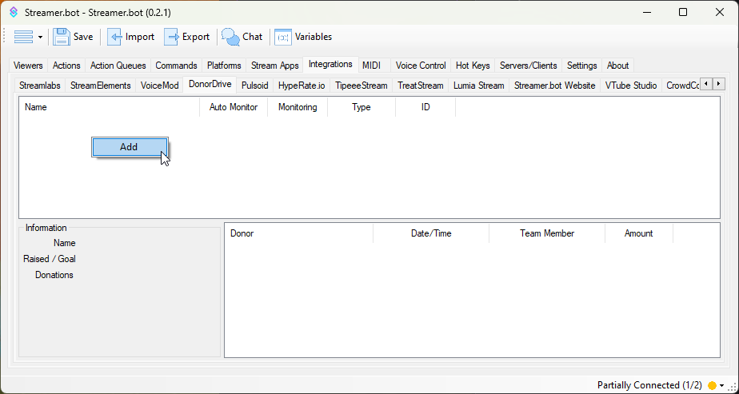
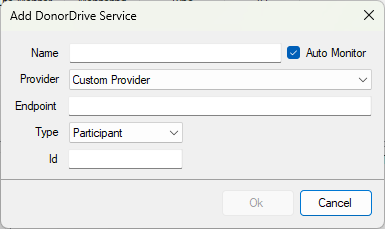

Integrate Streamer.bot with [DonorDrive](https://donordrive.com)

## Configuration

1. Add a DonorDrive service to Streamer.bot

    ::navigate
    Navigate to **Integrations > DonorDrive**
    ::

    

    - :kbd{value="Right-Click"} anywhere in the panel and select `Add`

    

    - Enter a name for this DonorDrive service
    - Select a charity provider, or enter a custom API endpoint

::wip
Remaining setup documentation needed
::

## Usage
:api-reference-cards{path=integrations/donordrive}