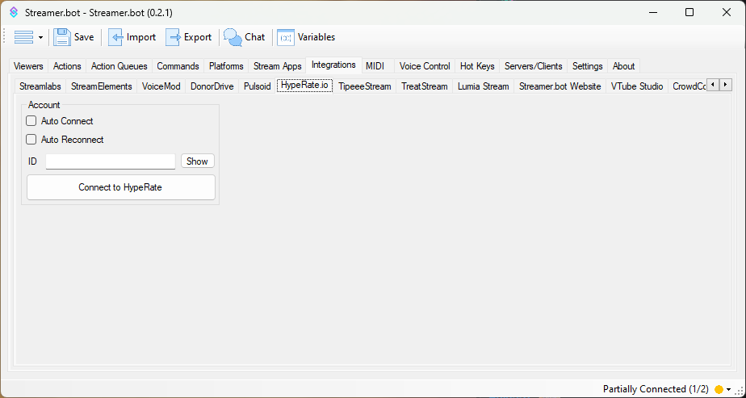

Receive heart rate events from [HypeRate.io](https://hyperate.io){target=_blank}

## Configuration

1. Add your HypeRate connection details

    ::navigate
    Navigate to **Integrations > HypeRate.io**
    ::

    

    1. Enter your HypeRate.io ID
      ::tip
      You can enter `internal-testing` in this field to have fake testing data sent to Streamer.bot
      ::
    2. Enable `Auto Connect` to automatically connect to HypeRate.io when Streamer.bot starts up
    3. Enable `Auto Reconnect` to automatically reconnect to HypeRate.io when the connection is disrupted

2. Done!

    ::success
    You will now receive events from HypeRate!
    ::

## Usage
:api-reference-cards{path=integrations/hyperateio manifest-path=hyperate.io}