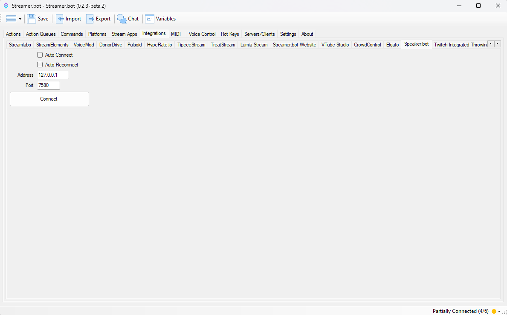

Give your bot a voice with [Speaker.bot](https://speaker.bot){target=_blank} TTS

## Configuration
::callout{icon=i-mdi-navigation}
Navigate to **Integrations > Speaker.bot**
::

### `Auto Connect`
Enable to automatically connect to Speaker.bot when Streamer.bot starts up

### `Auto Reconnect`
Enable to automatically reconnect to Speaker.bot when the connection is disrupted

### `Address`
The IP address where Speaker.bot is hosted.
* Defaults to `127.0.0.1`

### `Port`
The port Speaker.bot is listening for connections from Streamer.bot.
* Defaults to `7580`

## Usage
:api-reference-cards{path=speakerbot manifest-path="speaker.bot"}
