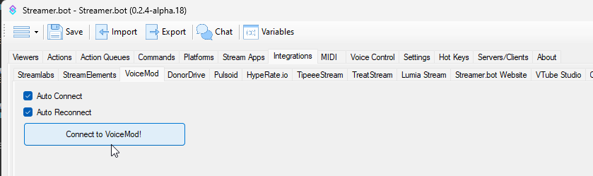

## Configuration
Connecting to VoiceMod is pretty straight forward. Make sure VoiceMod is up and running, then head over to Streamer.bot and into `Integrations -> VoiceMod`. Click "Connect" and you're all done already!

## Usage
:api-reference-cards{path=integrations/voicemod}
