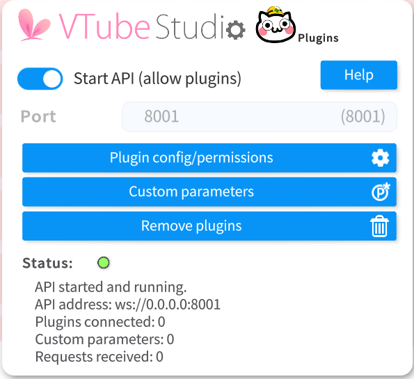
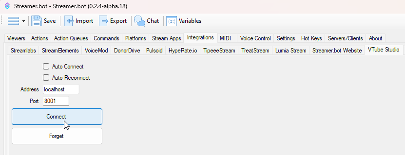
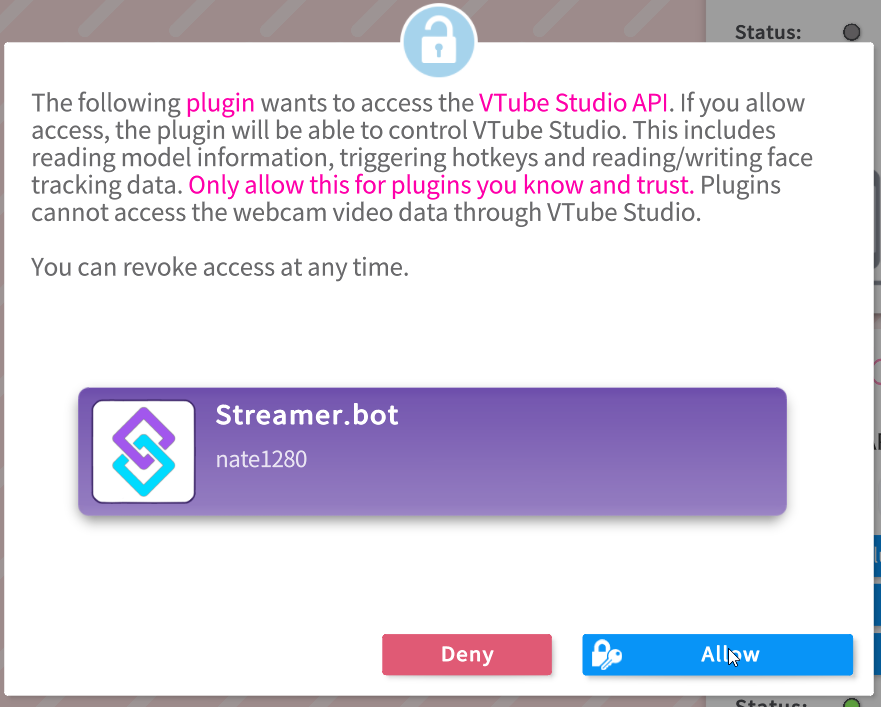

## Configuration
1. To connect StreamerBot with VTube Studio, open up VTube Studio and head to its settings.

2. Scroll down a bit and start the API
   
   

3. Now go into StreamerBot and navigate to `Integrations -> VTube Studio`. The default port is `8001` and should match the one in your VTube Studio settings. You can change that if you need to, just make sure they're the same on both ends.

   

4. Check `Auto Connect` and `Auto Reconnect` if you want (optional). Hit `Connect` afterwards.

5. Now quickly move back into VTube Studio and allow the connection.

   

6. All done! StreamerBot and VTube Studio are now connected. You can now make use of all triggers and subactions that you can find under `Integrations -> VTube Studio` in your Actions tab.

## Usage
:api-reference-cards{path=integrations/vtube-studio}
