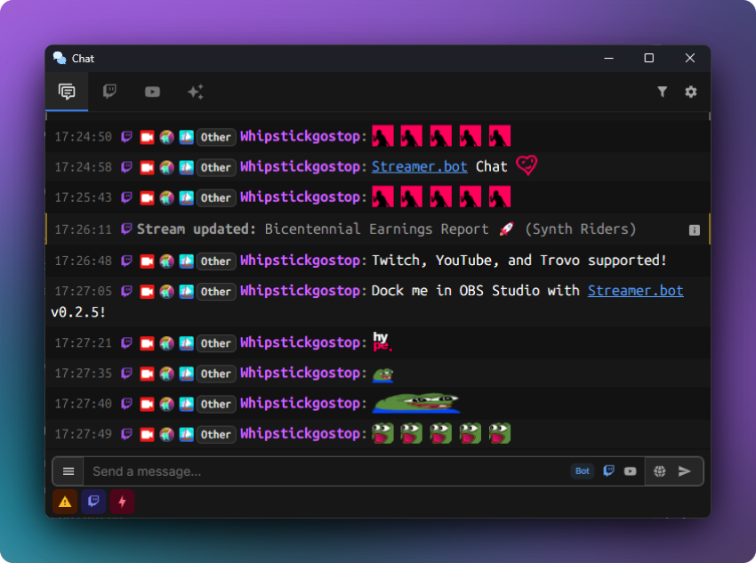
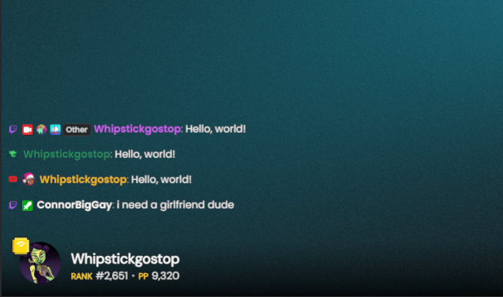

## Features
Streamer.bot ships with a built-in chat client to provide you with direct integration between chat and your bot's actions.

### Multi Stream Support

::tip
  Chat can connect to all supported streaming platforms in Streamer.bot itself:

  - :icon{name="i-mdi-twitch" class="text-violet-400 h-4 my-0 inline-block"} **Twitch**
  - :icon{name="i-simple-icons-youtube" class="text-red-400 h-4 my-0 inline-block"} **YouTube**
  - :icon{name="IconTrovo" class="text-emerald-400 h-4 my-0 inline-block"} **Trovo**

  To suggest a new platform, visit [Streamer.bot Ideas & Suggestions](https://ideas.streamer.bot)
  <br>
  Note: Kick and TikTok currently do not provide a public API, which is required for support
::

By default, the chat window will enable a tabbed view for all broadcaster accounts you have connected.

While on the combined chat view, you can toggle which chat(s) to send to:


#### Shortcuts
Keyboard shortcuts exist to easily direct your chat messages to/from different accounts:
| Keybind | Action |
|--------:| ------ |
| :kbd{value="Enter"} | Send to **selected** chat(s) |
| :kbd{value="Shift"} :kbd{value="Enter"} | Send to **all** chats |
| :kbd{value="meta"} :kbd{value="Enter"} | Send to **selected** chat(s) with the **bot account** |
| :kbd{value="meta"} :kbd{value="Shift"} :kbd{value="Enter"} | Send to **all** chats with the **bot account** |

### Command Menus
Autocomplete menus exist for the following options:

| Keybind | Menu |
|--------:| ---- |
| `/`     | Slash Commands |
| `:`     | Emote Autocomplete |
| `!`     | Streamer.bot [Commands](/guide/commands) |

#### Slash Commands
::note
You can open the slash command menu with :kbd{value="/"}
::

Slash commands contain a set of actions that are directly integrated with your Streamer.bot instance.

For example, you can type `/action` to reveal a menu with all actions in your Streamer.bot instance to directly execute.

Some commands support **Multi-Platform** execution, such as `/title` which can set the title of both Twitch and YouTube broadcasts simultaneously.

{width="500" caption-alt}


#### Streamer.bot Commands
::note
You can open the command menu with the :kbd{value="!"} prefix
::

For commands to appear in the command menu they must be configured with:
- Set `Location` to `Start`
- Start with the `!` prefix

When selecting a command, :kbd{value=Enter} will submit the command immediately to chat.

If you wish to add input for a command, use :kbd{value=Tab} to select the command and continue typing.

{width="500" caption-alt}

#### Emote Autocomplete
::note
You can open the emote menu with :kbd{value=":"}
::

Emote autocomplete can be triggered at any time and contains emotes from the following sources:

- Twitch
- YouTube
- 7TV (Twitch & YouTube)
- FFZ (Twitch)
- BTTV (Twitch & YouTube)

To select an emote and continue typing, you can use either :kbd{value="Enter"} or :kbd{value="Tab"}

{width="500" caption-alt}

### Quick Actions
In settings, you can configure **Quick Actions** for 3 different sources.

Quick Actions allow you to immediately execute any of your Streamer.bot actions with custom arguments.

#### Global
Global Quick Actions are displayed in the bottom-left of the chat window and can be executed at any time.

{caption-alt width="400"}

#### User
User Quick Actions are displayed in the `View User` popup windows that display when you click on a username in chat.

Additional arguments are populated with the usual user args for the respective platform.

{caption-alt width="400"}

#### Message
Per-message quick actions appear when you hover over a specific chat message.

Additional arguments are populated with the usual message args for the respective platform.

{caption-alt width="400"}

#### Event
Event quick actions appear when you hover any event message

### Highlights
Message and event highlights can be customized for a variety of events.

{caption-alt width="500"}

{caption-alt width="500"}

## OBS Browser Dock

You can dock the Streamer.bot chat in your OBS studio instance.

::tip
Streamer.bot v0.2.5 or later is required to be able to **send messages** from docked chat
<br><span class="ml-6">Earlier versions will be limited to **read-only** mode</span>
::

### Setup

::steps{level=4}
#### Enable WebSocket Server

    ::navigate
    In Streamer.bot, navigate to **Servers / Clients > WebSocket Server**
    ::

    - Enable `Auto-Start` to automatically start the server when Streamer.bot starts up
    - Enable `Authentication` and set a `Password` to allow **sending** messages
    - Start the server if it is not already started

#### Configure OBS Studio

    ::navigate
    In OBS Studio, navigate to **Docks > Custom Browser Docks** from the menu bar
    ::

    You can add any of the following URLs:

    | Name | URL |
    | ---- | --- |
    | Streamer.bot Chat | `https://chat.streamer.bot/feed/chat` |
    | Streamer.bot Event Feed | `https://chat.streamer.bot/feed/events` |

    

#### Configure Connection Details

    - Enter your Streamer.bot WebSocket Server details in the dialog:

    

#### Done!

    ::success
    You've got **Streamer.bot Chat** fully functioning as a browser dock in OBS Studio!
    ::
::

### Settings

All settings in OBS Studio docks and browser sources are shared with each other, but they are **separate** from the internal Streamer.bot chat window.


#### Sync from Streamer.bot

You can sync settings from the main Streamer.bot chat window in `Settings > General`

This is a one-way sync, from Streamer.bot to the docked chat and will override all existing settings on the docked chat.

### Limitations

Docked chat is limited in some ways due to requiring the WebSocket Server to function independently of Streamer.bot:

- Local Access `127.0.0.1` **might** be required
  - This depends on the security settings of your web browser or environment
      - i.e. modern web browsers will **block** connections to other IP Addresses
  - The recommended solution to work around this is with **secure tunnels**
      - e.g. Tailscale Serve, Cloudflare Tunnel, ngrok, etc...
- Built-in moderation actions are removed
  - Custom quick actions can be used as a workaround for most of these
- Most built-in slash commands are removed

## Overlay

::warning
**Overlay mode is currently experimental and is subject to active changes**
::



### Setup

::steps{level=4}
#### Enable WebSocket Server

    ::navigate
    In Streamer.bot, navigate to **Servers / Clients > WebSocket Server**
    ::

    - Enable `Auto-Start` to automatically start the server when Streamer.bot starts up
    - Start the server if it is not already started

#### Configure Chat Overlay

    ::navigate
    Navigate to **Settings > Overlay** in the Streamer.bot Chat window
    ::

    - Modify any overlay settings, which will then be persisted in the URL
    - Make sure that the `WebSocket Server Configuration` matches your Streamer.bot WebSocket Server settings

#### Add to OBS Studio

    - Click `Save & Copy Overlay URL` to save your settings and copy the URL to your clipboard
    - Add a new browser source in OBS Studio and paste the copied URL

#### Done!

    ::success
    You now have a Streamer.bot chat overlay source in OBS Studio!
    ::
::

## Custom Styles

::note
Future Streamer.bot Chat updates will be focused on improving customization options
::

Currently, customization of chat and overlay requires custom CSS overrides.

Some `data-attributes` have been added to the DOM for easier targeting of specific elements.

### Chat Messages
These attributes are available specifically on chat message rows.

::field-group
    ::field{name="data-platform" type="string"}
    The platform name for a given chat message row.
    :br
    Values: `twitch`, `youtube`, `kick`, `trovo`
    ::

    ::field{name="data-user-id" type="string"}
    The ID of the user who sent the chat message.
    ::

    ::field{name="data-username" type="string"}
    The canonical login name of the user who sent the chat message.
    ::

    ::field{name="data-display-name" type="string"}
    The display name of the user who sent the chat message.
    ::
::

### Events

::tip
You can use these event attributes to apply custom styles for any specific events, such as follows or subscriptions.
::

::read-more{to=/api/websocket/events}
For a full list of possible event source and types, refer to the **WebSocket Events** documentation.
::

These attributes are available on **all** rows visible in chat, *including chat messages*.

::field-group
    ::field{name="data-event-source" type="string"}
    The source of the event.
    :br
    Values: `Twitch`, `YouTube`, `Trovo`, etc...
    ::

    ::field{name="data-event-type" type="string"}
    The type of event.
    :br
    Values: `ChatMessage`, `Follow`, `Subscription`, etc...
    ::
::

### Examples

::tip
If you are using the chat overlay in OBS Studio, you can add custom CSS directly in your browser source settings!
::

```css [style.css]
/* Hide all rows originating from Twitch */
[data-platform="twitch"] {
  display: none !important;
}

/* Hide messages from a specific username */
[data-username="someannoyinguser69"] {
  display: none !important;
}

/* Highlight messages from a specific user */
[data-username="bestmodever"] {
  background-color: rgba(255, 215, 0, 0.2);
  border: 1px solid gold;
  border-radius: 4px;
}

/* Custom CSS for Twitch Follow events */
[data-event-source="Twitch"][data-event-type="Follow"] {
  background-color: rgba(100, 65, 165, 0.2);
  border: 1px solid rebeccapurple;
  border-radius: 4px;
}
```
