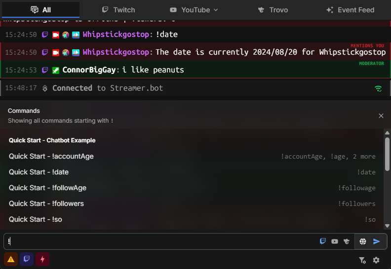

Streamer.bot ships with a built-in chat client to provide you with direct integration between chat and your bot's actions.

## Features

### Multi Stream Support
By default, the chat window will enable a tabbed view for all broadcaster accounts you have connected.

While on the combined chat view, you can toggle which chat(s) to send to:

{.rounded-md .shadow-xl}

#### Shortcuts
Keyboard shortcuts exist to easily direct your chat messages to/from different accounts:
| Keybind | Action |
|--------:| ------ |
| :shortcut{value="Enter"} | Send to **selected** chat(s) |
| :shortcut{value="Shift+Enter"} | Send to **all** chats |
| :shortcut{value="Ctrl+Enter"} | Send to **selected** chat(s) with the **bot account** |
| :shortcut{value="Ctrl+Shift+Enter"} | Send to **all** chats with the **bot account** |

{class="rounded-md shadow-xl" width="500"}

### Command Menus
Autocomplete menus exist for the following options:

| Keybind | Menu |
|--------:| ---- |
| `/`     | Slash Commands |
| `:`     | Emote Autocomplete |
| `!`     | Streamer.bot [Commands](/guide/commands) |

#### Slash Commands
::note
You can open the slash command menu with :shortcut{value="/"}
::

Slash commands contain a set of actions that are directly integrated with your Streamer.bot instance.

For example, you can type `/action` to reveal a menu with all actions in your Streamer.bot instance to directly execute.

Some commands support **Multi-Platform** execution, such as `/title` which can set the title of both Twitch and YouTube broadcasts simultaneously.

{class="rounded-md shadow-xl" width="500"}

#### Streamer.bot Commands
::note
You can open the command menu with the :shortcut{value="!"} prefix
::

For commands to appear in the command menu they must be configured with:
- Set `Location` to `Start`
- Start with the `!` prefix

::warning
Commands must have the`Ignore Internal Messages` option **disabled** to work in the chat window.
 
This setting forces those commands to ignore internal chat input, including from the built-in chat.
::

When selecting a command, :shortcut{value=Enter} will submit the command immediately to chat.

If you wish to add input for a command, use :shortcut{value=Tab} to select the command and continue typing.

{class="rounded-md shadow-xl" width="500"}

#### Emote Autocomplete
::note
You can open the emote menu with :shortcut{value=":"}
::

Emote autocomplete can be triggered at any time and contains emotes from the following sources:

- Twitch
- YouTube
- 7TV (Twitch & YouTube)
- FFZ (Twitch)
- BTTV (Twitch & YouTube)

To select an emote and continue typing, you can use either :shortcut{value="Enter / Tab"}

{class="rounded-md shadow-xl" width="500"}

### Quick Actions
In settings, you can configure **Quick Actions** for 3 different sources.

Quick Actions allow you to immediately execute any of your Streamer.bot actions with custom arguments.

#### Global
Global Quick Actions are displayed in the bottom-left of the chat window and can be executed at any time.

#### User
User Quick Actions are displayed in the `View User` popup windows that display when you click on a username in chat.

Additional arguments are populated with the usual user args for the respective platform.

#### Message
Per-message quick actions appear when you hover over a specific chat message.

Additional arguments are populated with the usual message args for the respective platform.

### Highlights
Message and event highlights can be customized for a variety of events.

::collapsible{name="configuration options preview"}

::

::collapsible{name="message highlighting preview"}

::

## OBS Browser Dock

You can dock the Streamer.bot chat in your OBS studio instance.

::tip
Streamer.bot v0.2.5 or later is required to be able to **send messages** from docked chat
 Earlier versions will be limited to **read-only** mode
::

### Setup

1. Enable WebSocket Server

    ::navigate
    In Streamer.bot, navigate to **Servers / Clients > WebSocket Server**
    ::

    - Enable `Auto-Start` to automatically start the server when Streamer.bot starts up
    - Enable `Authentication` and set a `Password` to allow **sending** messages
    - Start the server if it is not already started

2. Configure OBS Studio

    ::navigate
    In OBS Studio, navigate to **Docks > Custom Browser Docks** from the menu bar
    ::

    You can add any of the following URLs:

    | Name | URL |
    | ---- | --- |
    | Streamer.bot Chat | `https://chat.streamer.bot/feed/chat` |
    | Streamer.bot Event Feed | `https://chat.streamer.bot/feed/events` |

    {caption-alt}

3. Configure Connection Details

    - Enter your Streamer.bot WebSocket Server details in the dialog:

    {caption-alt}

4. Done!

    ::success
    You've got **Streamer.bot Chat** fully functioning as a browser dock in OBS Studio!
    ::

### Settings

All settings in OBS Studio docks and browser sources are shared with each other, but they are **separate** from the internal Streamer.bot chat window.

#### Sync from Streamer.bot

You can sync settings from the main Streamer.bot chat window in `Settings > General`

This is a one-way sync, from Streamer.bot to the docked chat and will override all existing settings on the docked chat.

### Limitations

Docked chat is limited in some ways due to requiring the WebSocket Server to function independently of Streamer.bot:

- Local Access `127.0.0.1` **might** be required
  - This depends on the security settings of your web browser or environment
      - i.e. modern web browsers will **block** connections to other IP Addresses
  - The recommended solution to work around this is with **secure tunnels**
      - e.g. Tailscale Serve, Cloudflare Tunnel, ngrok, etc...
- Built-in moderation actions are removed
  - Custom quick actions can be used as a workaround for most of these