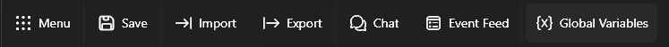
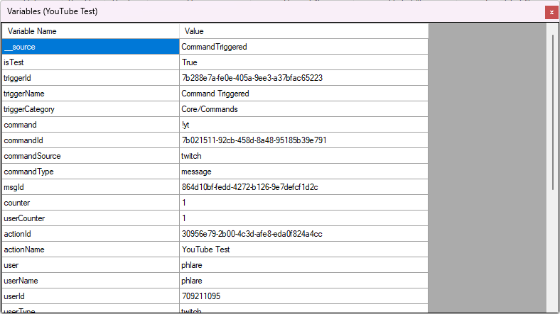

## Introduction
When a trigger executes an action, it will automatically generate a set of variables specific to that event source and make them available to that action via the **argument stack**. You can use subsequent sub-actions to populate additional arguments, or even manipulate existing arguments on the stack.

Arguments only persist until the called action finishes execution and can not be referenced by any other action. To share variables across multiple actions, or to persist them across restarts, you can store them as [Global Variables](#global).

::callout{icon=i-mdi-bookmark color=green to=/api/triggers}
Explore all available triggers and their variables in the [Triggers API References](/api/triggers)
::

::callout{icon=i-mdi-bookmark color=green to=/api/sub-actions}
Explore all available sub-actions and their variables in the [Sub-Actions API References](/api/sub-actions)
::

## Types
### Arguments
The argument stack contains all local variables accessible by an action and its sub-actions.

These variables can be utilized in most [sub-action](/guide/actions#sub-actions) configuration text fields.


To use a variable from the current argument stack, wrap the variable name with `%` symbols:

`%userName%`{lang=cs}

::tip{color=amber}
Variables are added onto the argument stack during sequential execution of each sub-action. If you are testing and a variable seems to be missing, ensure that you are testing at the correct point of execution!
::

::read-more{to=#inspecting-arguments}
Read more about how to **inspect arguments** after an action has executed
::

### Global Variables
Global variables allow you to share data between multiple actions, or even persist it across multiple restarts of Streamer.bot.

To quickly access a global variable, wrap the variable name with `~` symbols:

`~myGlobalVariable~`{lang=cs}

::callout{icon=i-mdi-alert color=amber}
This syntax currently only works for **persisted** global variables, and **not** user variables.
::

::read-more{to=#inspecting-arguments}
Read more about how to use the variable viewer to **view all of your global variables in one place!**
::

:read-more{to=/api/sub-actions/core/globals}

#### User Global Variables
User variables function as global variables, but store values **per user**.

::tip
User variables can be useful for creating per-user counters, leaderboards, or anything you can think of!
::

### Generic
The following variables are always available:

::field-group
  ::field{name=%date% type=DateTime}
  Get the current system date

  Formatting is supported, e.g. `%date:yyyy/MM/dd%`{lang=cs} or `%date:dddd, dd MMMM yyyy%`{lang=cs}
  ::

  ::field{name=%time% type=DateTime}
  Get the current system time

  Formatting is supported, e.g. `%time:HH-mm%`{lang=cs}
  ::

  ::field{name=%actionId% type=String}
  Get the unique ID of the action being executed
  ::

  ::field{name=%actionName% type=String}
  Get the name of the action being executed
  ::

  ::field{name=%runningActionId% type=String}
  Get the running ID of the action instance within the queue
  ::

  ::field{name=%actionQueuedAt% type=DateTime}
  Get the time the action was queued
  ::

  ::field{name=%__source% type=EventSource}
  Requires C# to access, [read more](/api/csharp/core#advanced)
  ::

  ::field{name=%eventSource% type=EventSource}
  Requires C# to access, [read more](/api/csharp/core#advanced)
  ::
::

## Formatting
Variables can be formatted inline using standard C# notation

### Numbers
For example, to format a numeric variable `%tipAmount%`{lang=cs} as a currency with 2 decimal places, we can use the following syntax: `%tipAmount:c2%`{lang=cs}

::callout{icon=i-mdi-bookmark to=https://learn.microsoft.com/en-us/dotnet/standard/base-types/standard-numeric-format-strings target=_blank rel=noopener}
Read more about all supported numeric format strings
::

### Date and Time
Similarly, `%time%`{lang=cs} can be formatted in short notation with AM/PM using the following syntax: `%time:t%`{lang=cs}

::callout{icon=i-mdi-bookmark to=https://learn.microsoft.com/en-us/dotnet/standard/base-types/standard-date-and-time-format-strings target=_blank rel=noopener}
Read more about all supported date and time format strings
::

## Inline Functions
Anywhere you can do a variable replacement, you can also execute **inline functions** to manipulate them.

### `math()`
Leveraging the [mXparser](https://mathparser.org/mxparser-math-collection/){target=_blank} library, you can evaluate mathematical equations directly inline with variable replacements.

```cs [Example]
// Expected output: 20
$math(10+10)$

// Multiply %x% by 1.25
$math(%x% * 1.25)$

// Multiply %tier% by 10
$math(%tier% * 10)$

// Divide %duration% by 1000
$math(%duration% / 1000)$
```

::callout{icon=i-mdi-bookmark to=https://github.com/mariuszgromada/MathParser.org-mXparser/wiki/All-built-in-tokens target=_blank rel=noopener}
Explore the **mXparser** documentation for all supported operations
::

### `length()`
Obtain the length of arbitrary text or a given variable.

```cs [Example]
// Expected output: 69
$length(Lorem ipsum dolor sit amet consectetur adipisicing elit. Commodi, ut.)$

// Obtain the length of %rawInput%
$length(%rawInput%)$
```

## Variable Viewer
The Variable Viewer in Streamer.bot provides a convenient location to **view, modify, and create** all types of global variables, including per-platform user variables.

You can open the variable viewer at any time by clicking `Variables` on the Streamer.bot toolbar:


You will be greeted with a popup window:


::tip
Variables are **updated in real-time**, making this view extremely useful while you create and test your actions!
::

### Options
#### Add/Edit Variables
Selecting `Add` or `Edit` from the [context menu](#variables-context-menu) will greet you with the following options:


::field-group
  ::field{name="Variable Name" type="Text" required}
  Enter the name for your new variable
  ::
  ::field{name="Value" type="Text" required}
  Enter a new value for this variable
  ::
  ::field{name="Auto Type" type="Toggle"}
  By default, all values are treated as text, or `string`{lang=cs} variables.

  Enable `Auto Type` to automatically determine the type for the entered value.

  For example:
  - `0`{lang=cs} can be auto-typed to a numeric type such as `int`{lang=cs} or `long`{lang=cs}
  - `true`{lang=cs} or `false`{lang=cs} can be auto-typed to a `bool`{lang=cs}
  ::
::

#### Variables Context Menu
The :shortcut{value=Right-Click} context menu provides the following options:

::field-group
  ::field{name="Add Variable"}
  Create a new variable of the current category type (e.g. persisted, non-persisted)
  ::
  ::field{name="Edit Variable"}
  Edit the selected variable, see configuration options above
  ::
  ::field{name="Delete Variable"}
  Remove the selected variable
  ::
  ::field{name="Copy Variable Name"}
  Copy the selected variable name to your clipboard
  ::
  ::field{name="Delete all Variables"}
  Remove **all** variables from the current category type (e.g. persisted, non-persisted)
  ::
::

## Inspecting Arguments
::navigate
Navigate to `Action Queues > Action History` in Streamer.bot
::

From the `Action History` view, you can :shortcut{value=Right-Click} an action execution to inspect all variables on the argument stack:


::field-group
  ::field{name="Inspect Variables When Queued"}
  View all variables on the argument stack **before** the action has started
  ::
  ::field{name="Inspect Variables After Run"}
  View all variables on the argument stack **after** the action has completed
  ::
::

#### Variables Dialog
When you select one of these options, you will be greeted with a dialog containing the respective variables:



::tip
You can use this dialog any time you want to know what variables are populated by a trigger
::