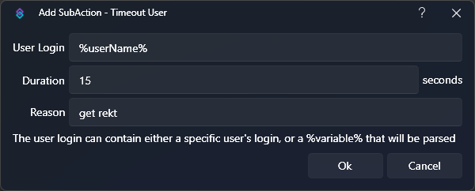

## Introduction
When a trigger executes an action, it will automatically generate a set of variables specific to that event source and make them available to that action via the **argument stack**. You can use subsequent sub-actions to populate additional arguments, or even manipulate existing arguments on the stack.

Arguments only persist until the called action finishes execution and can not be referenced by any other action. To share variables across multiple actions, or to persist them across restarts, you can store them as [Global Variables](#global).

::callout{icon=i-mdi-bookmark color=green to=/api/triggers}
Explore all available triggers and their variables in the [Triggers API References](/api/triggers)
::

::callout{icon=i-mdi-bookmark color=green to=/api/sub-actions}
Explore all available sub-actions and their variables in the [Sub-Actions API References](/api/sub-actions)
::

## Types
### Arguments
The argument stack contains all local variables accessible by an action and its sub-actions.

These variables can be utilized in most [sub-action](/guide/actions#sub-actions) configuration text fields.



To use a variable from the current argument stack, wrap the variable name with `%` symbols:

`%userName%`{lang=cs}

::tip{color=amber}
Variables are added onto the argument stack during sequential execution of each sub-action. If you are testing and a variable seems to be missing, ensure that you are testing at the correct point of execution!
::

### Global
Global variables allow you to share data between multiple actions, or even persist it across multiple restarts of Streamer.bot.

To quickly access a global variable, wrap the variable name with `~` symbols:

`~myGlobalVariable~`{lang=cs}

::callout{icon=i-mdi-alert color=amber}
This method currently only works for **persisted** global variables, and **not** user variables.
::

### User
User variables function as global variables, but store data **per user**.

::callout{icon=i-mdi-bookmark color=green to=/api/sub-actions/core/globals/global-get}
Read more about Global and User Variables in the [Core Sub-Actions](/api/sub-actions/core/globals/global-get) API References
::

### Generic
The following variables are always available:

::field-group
  ::field{name=%date% type=DateTime}
  Get the current system date

  Formatting is supported, e.g. `%date:yyyy/MM/dd%`{lang=cs} or `%date:dddd, dd MMMM yyyy%`{lang=cs}
  ::

  ::field{name=%time% type=DateTime}
  Get the current system time

  Formatting is supported, e.g. `%time:HH-mm%`{lang=cs}
  ::

  ::field{name=%actionId% type=String}
  Get the unique ID of the action being executed
  ::

  ::field{name=%actionName% type=String}
  Get the name of the action being executed
  ::

  ::field{name=%runningActionId% type=String}
  Get the running ID of the action instance within the queue
  ::

  ::field{name=%actionQueuedAt% type=DateTime}
  Get the time the action was queued
  ::

  ::field{name=%__source% type=EventSource}
  Requires C# to access, [read more](/api/csharp/core#advanced)
  ::

  ::field{name=%eventSource% type=EventSource}
  Requires C# to access, [read more](/api/csharp/core#advanced)
  ::
::

## Formatting
Variables can be formatted inline using standard C# notation

### Numbers
For example, to format a numeric variable `%tipAmount%`{lang=cs} as a currency with 2 decimal places, we can use the following syntax: `%tipAmount:c2%`{lang=cs}

::callout{icon=i-mdi-bookmark to=https://learn.microsoft.com/en-us/dotnet/standard/base-types/standard-numeric-format-strings target=_blank rel=noopener}
Read more about all supported numeric format strings
::

### Date and Time
Similarly, `%time%`{lang=cs} can be formatted in short notation with AM/PM using the following syntax: `%time:t%`{lang=cs}

::callout{icon=i-mdi-bookmark to=https://learn.microsoft.com/en-us/dotnet/standard/base-types/standard-date-and-time-format-strings target=_blank rel=noopener}
Read more about all supported date and time format strings
::

## Inline Functions
Anywhere you can do a variable replacement, you can also execute **inline functions** to manipulate them.

### `math()`
Leveraging the [mXparser](https://mathparser.org/mxparser-math-collection/){target=_blank} library, you can evaluate mathematical equations directly inline with variable replacements.

```cs [Example]
// Expected output: 20
$math(10+10)$

// Multiply %x% by 1.25
$math(%x% * 1.25)$

// Multiple %tier% by 10
$math(%tier% * 10)$

// Divice %duration% by 1000
$math(%duration% / 1000)$
```

::callout{icon=i-mdi-bookmark to=https://mathparser.org/mxparser-math-collection/ target=_blank rel=noopener}
Explore the **mXparser** documentation for all supported operations
::

### `length()`
Obtain the length of arbitrary text or a given variable.

```cs [Example]
// Expected output: 69
$length(Lorem ipsum dolor sit amet consectetur adipisicing elit. Commodi, ut.)$

// Obtain the length of %rawInput%
$length(%rawInput%)$
```

## Variable Viewer

::wip
Add variable viewer details and info about inspecting variables in action history
::